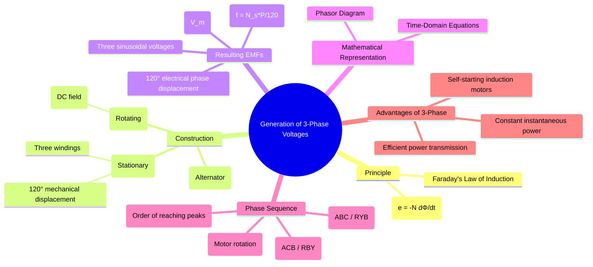

---
tags:
  - three-phase
  - ac-circuits
  - electrical-machines
  - alternator
  - power-generation
created: 2025-08-02
aliases:
  - Three-Phase Voltage Generation
  - Alternator Principle
subject: "[[Electric Circuits]]"
parent: "[[Three-Phase Circuits]]"
confidence: 9
---

---
### Generation of Three-Phase Voltages
#three-phase-generation #alternator #faradays-law

> Three-phase voltages are generated by a **synchronous generator** (or **alternator**) based on [[Faraday's Law of Induction]]. The fundamental principle involves rotating a magnetic field at a constant speed within a set of three stationary windings. The key to creating the three-phase nature is the physical placement of these windings **120° apart** from each other in space.

#### Principle of Generation
#faradays-law #electromagnetic-induction

The generation of voltage relies on Faraday's Law, which states that an electromotive force (EMF) is induced in a conductor when the magnetic flux linking it changes.
$$e = -N \frac{d\Phi}{dt}$$
In an alternator, a DC-powered electromagnet on the **rotor** creates a magnetic field of constant strength. As the rotor turns at a constant angular velocity ($\omega$), the flux linking the stationary **stator** windings changes sinusoidally with time, inducing a sinusoidal EMF in each winding.

#### Synchronous Generator (Alternator) Construction
#alternator #synchronous-generator

A practical three-phase generator consists of two main parts:
1.  **Stator**: The stationary outer part which houses three sets of windings or coils (e.g., A-A', B-B', C-C'). These windings are physically displaced from each other by **120 mechanical degrees** around the stator's inner periphery.
2.  **Rotor**: The rotating inner part which acts as a field magnet. It is supplied with a DC current (called the excitation current) to create a strong, constant magnetic field.

As the rotor turns, its magnetic poles sweep past the three windings in sequence, inducing voltages in them one after another.

#### The Generated EMFs
#phasor-diagram #phase-sequence

Because the windings are displaced by 120° in space, the induced EMFs are also displaced by **120 electrical degrees** in time. Assuming the rotor rotates counter-clockwise and the voltage in phase A is taken as the reference, the three phase voltages can be expressed as:

*   **Time-Domain Equations**:
    $$\begin{align}
    v_{AA'}(t) &= V_m \sin(\omega t) \\
    v_{BB'}(t) &= V_m \sin(\omega t - 120^\circ) \\
    v_{CC'}(t) &= V_m \sin(\omega t - 240^\circ) = V_m \sin(\omega t + 120^\circ)
    \end{align}$$
    Where $V_m$ is the peak voltage and $\omega = 2\pi f$ is the angular frequency.

*   **Phasor Representation**:
    These three balanced voltages can be represented by three phasors of equal magnitude, displaced by 120°.
    $$\begin{align}
    \mathbf{V}_{AN} &= V_{ph} \angle 0^\circ \\
    \mathbf{V}_{BN} &= V_{ph} \angle -120^\circ \\
    \mathbf{V}_{CN} &= V_{ph} \angle -240^\circ \text{ or } V_{ph} \angle +120^\circ
    \end{align}$$
    For a balanced system, the phasor sum of the three voltages is zero: $\mathbf{V}_{AN} + \mathbf{V}_{BN} + \mathbf{V}_{CN} = 0$.

#### Phase Sequence
#phase-sequence

The **phase sequence** is the order in which the voltages in the three phases reach their maximum positive values.
1.  **Positive Sequence (ABC or RYB)**: This is the standard sequence where phase B follows phase A, and phase C follows phase B. This corresponds to the equations given above ($0^\circ, -120^\circ, -240^\circ$).
2.  **Negative Sequence (ACB or RBY)**: This occurs if the direction of rotation is reversed or if two of the supply leads are swapped. The phase order is A, then C, then B. ($0^\circ, -240^\circ, -120^\circ$).

The phase sequence is critically important as it determines the direction of rotation of three-phase induction motors.

---
### Related Concepts
#three-phase-generation/related-concepts

> [[Three-Phase Circuits]] (Parent topic)

[[Star and Delta Connections]] (How the generated windings are connected)
[[Electrical Machines]] (The broader subject for generators and motors)
[[Phasor Diagrams]] (The tool for representing these voltages)
[[Faraday's Law of Induction]] (The fundamental physical principle)