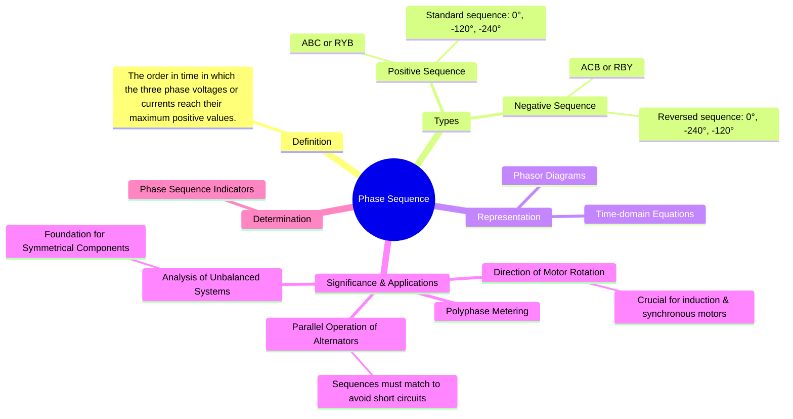

---
tags:
  - three-phase
  - ac-circuits
  - power-systems
  - phase-sequence
  - electrical-machines
created: 2025-08-03
aliases:
  - Phase Rotation
subject: "[[Electric Circuits]]"
parent: "[[Three-Phase Circuits]]"
confidence: 9
---

---
### Phase Sequence
#phase-sequence #three-phase

> The **phase sequence** (or phase rotation) of a three-phase system is the order in which the voltages (or currents) of the three phases attain their peak or maximum positive values. This time-based order is determined by the direction of rotation of the generator and is a critical parameter for the correct operation of three-phase equipment, especially motors.

There are only two possible phase sequences for a three-phase system.

#### Types of Phase Sequence
#positive-sequence #negative-sequence

1.  **Positive Phase Sequence (ABC or RYB)**
    This is the standard sequence. The voltage in phase A reaches its peak first, followed by phase B after 120°, and then by phase C after another 120°. If we observe the rotating phasors passing a fixed point, the order will be A-B-C.
    *   **Phasor Representation**:
        $$\boxed{\quad \mathbf{V}_{AN} = V_{ph} \angle 0^\circ, \quad \mathbf{V}_{BN} = V_{ph} \angle -120^\circ, \quad \mathbf{V}_{CN} = V_{ph} \angle -240^\circ \quad}$$

2.  **Negative Phase Sequence (ACB or RBY)**
    This is the reverse sequence. The voltage in phase A reaches its peak first, followed by phase C after 120°, and then by phase B after another 120°. This sequence can be obtained by swapping any two of the three line conductors.
    *   **Phasor Representation**:
        $$\boxed{\quad \mathbf{V}_{AN} = V_{ph} \angle 0^\circ, \quad \mathbf{V}_{CN} = V_{ph} \angle -120^\circ, \quad \mathbf{V}_{BN} = V_{ph} \angle -240^\circ \quad}$$
    Notice that the phase angles for B and C are swapped compared to the positive sequence.

#### Importance and Applications
#phase-sequence/applications

The phase sequence is not just a theoretical concept; it has critical practical implications:

*   **Direction of Motor Rotation**: The direction of rotation of three-phase [[Induction Motors]] and [[Synchronous Motors]] is determined by the phase sequence of the supply. The interaction of the stator currents creates a rotating magnetic field (RMF), and reversing the phase sequence reverses the direction of this RMF, causing the motor to spin in the opposite direction.
*   **Parallel Operation of Alternators**: When connecting two three-phase generators in parallel to a power grid, their phase sequences **must be identical**. Connecting sources with mismatched sequences will create a massive short-circuit, potentially causing severe damage to the equipment.
*   **Analysis of Unbalanced Systems**: The concept of phase sequence is the foundation for the method of **Symmetrical Components**. This powerful analytical tool allows any unbalanced set of three-phase phasors to be resolved into three balanced sets: a positive sequence set, a negative sequence set, and a zero sequence set. This is essential for fault analysis in [[Power System|power systems]].
*   **Metering**: Some three-phase power and VAR meters are sensitive to phase sequence and will give incorrect readings if connected to the wrong sequence.

#### Determination of Phase Sequence
#phase-sequence-indicator

In practice, the phase sequence can be determined using a **phase sequence indicator**. This is a small device that typically uses either an unbalanced R-C network with neon lamps or a miniature three-phase induction motor with a rotating disc to indicate the A-B-C or A-C-B sequence.

---
### Related Concepts
#phase-sequence/related-concepts

> [[Three-Phase Circuits]] (Parent topic)

[[Generation of Three-Phase Voltages]] (Where the sequence is established)
[[Induction Motors]] (A key application where sequence determines rotation)
[[Symmetrical Components]] (An advanced analysis technique based on sequence components)
[[Power System]] (Where parallel operation and fault analysis are crucial)
[[Phasor Diagrams]] (The primary method for visualizing phase sequence)