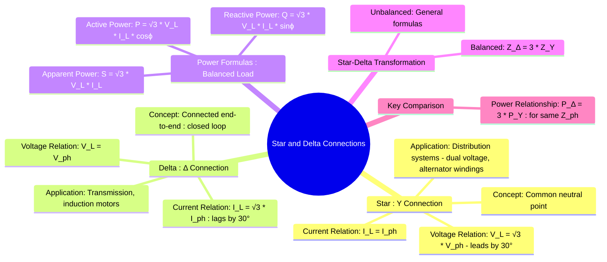

---
tags:
  - three-phase
  - ac-circuits
  - power-systems
  - star-connection
  - delta-connection
created: 2025-08-02
aliases:
  - Wye Connection
  - Mesh Connection
  - Star Connection
  - Delta Connection
  - Y-Δ Transformation
subject: "[[Electric Circuits]]"
parent: "[[Three-Phase Circuits]]"
confidence: 9
---
###### Mind Map

---
### Star and Delta Connections
#star-connection #delta-connection #three-phase

> **Star (Y)** and **Delta (Δ)** are the two fundamental ways to connect the three phase windings of a source (like an alternator) or the three impedances of a load in a three-phase system. The choice of connection determines the relationship between the line and phase quantities.

> [!important] Important
> ==Unless explicitly stated otherwise, 3-phase generators in GATE problems are star-connected==
> $$\text{Line current} = \text{Phase current}$$

---
#### Star (Wye or Y) Connection
#star-connection

In a star connection, one end of each of the three phase windings (or impedances) are connected to a common point called the **neutral** or **star point**. The other three ends are brought out as the line terminals.

*   **Current Relationship**: The current flowing out of each line terminal is the same as the current flowing through its corresponding phase winding.
    $$\boxed{\quad I_L = I_{ph} \quad}$$
*   **Voltage Relationship**: The voltage between any two line terminals ($V_L$) is the phasor sum of two phase voltages. For a balanced system, the magnitude of the line voltage is $\sqrt{3}$ times the magnitude of the phase voltage.
    $$\boxed{\quad V_L = \sqrt{3} V_{ph} \quad}$$
    The line voltage phasor **leads** the corresponding phase voltage phasor by **30°**.

---
#### Delta (Mesh or Δ) Connection
#delta-connection

In a delta connection, the three phase windings (or impedances) are connected end-to-end to form a closed loop or mesh. The three line terminals are taken from the three junctions of the connection.

*   **Voltage Relationship**: The voltage between any two line terminals is the same as the voltage across the phase winding connected between those two terminals.
    $$\boxed{\quad V_L = V_{ph} \quad}$$
*   **Current Relationship**: The current in any line ($I_L$) is the phasor difference of the currents in the two phases connected to that line. For a balanced system, the magnitude of the line current is $\sqrt{3}$ times the magnitude of the phase current.
    $$\boxed{\quad I_L = \sqrt{3} I_{ph} \quad}$$
    The line current phasor **lags** the corresponding phase current phasor by **30°**.

---
#### Power in Balanced 3-Phase Systems
#three-phase-power

For a balanced system, the total three-phase power formulas are the same regardless of whether the connection is Star or Delta. Let $\phi$ be the phase angle of the load (angle between $V_{ph}$ and $I_{ph}$).

*   **Active Power (P)**:
    $$\boxed{\quad P = 3 V_{ph} I_{ph} \cos(\phi) = \sqrt{3} V_L I_L \cos(\phi) \quad \text{(Watts)}}$$
*   **Reactive Power (Q)**:
    $$\boxed{\quad Q = 3 V_{ph} I_{ph} \sin(\phi) = \sqrt{3} V_L I_L \sin(\phi) \quad \text{(VAR)}}$$
*   **Apparent Power (S)**:
    $$\boxed{\quad S = 3 V_{ph} I_{ph} = \sqrt{3} V_L I_L \quad \text{(VA)}}$$

> [!pyq]- PYQ : 2018
> ![[ee_2018#^q51]]

---
#### Star-Delta (Y-Δ) Transformation
#star-delta-transformation

This technique is used to convert a network of three impedances from one configuration to an equivalent one in the other configuration.

*   **Balanced System**: If the three impedances are equal ($Z_Y$ in star, $Z_\Delta$ in delta), the conversion is simple:
    $$\boxed{\quad Z_\Delta = 3 Z_Y \quad \text{and} \quad Z_Y = \frac{Z_\Delta}{3} \quad}$$

*   **Unbalanced System**:
    *   **Delta to Star Conversion**: The impedance of any arm of the star network is the product of the two adjacent delta impedances divided by the sum of all three delta impedances.
    *   **Star to Delta Conversion**: The impedance of any side of the delta network is the sum of the two adjacent star impedances plus the product of the same two divided by the third star impedance.

---
#### Comparison and Key Relationships
#star-vs-delta

*   **Power Relationship**: For the same set of three impedances ($Z_{ph}$) connected to the same three-phase supply voltage ($V_L$), a delta connection will draw **three times** the power of a star connection.
    $$\begin{align}
    P_Y &= \frac{V_L^2}{|Z_{ph}|} \cos(\phi) \\
    P_\Delta &= 3 \frac{V_L^2}{|Z_{ph}|} \cos(\phi)
    \end{align}$$
    $$\boxed{\quad P_\Delta = 3 P_Y \quad}$$

*   **Applications**:
    *   **Star Connection**: Preferred in distribution networks as it provides a neutral point for single-phase loads and protective relays. It gives two voltage levels ($V_L$ and $V_{ph} = V_L/\sqrt{3}$).
    *   **Delta Connection**: Commonly used for high-torque induction motors and in transmission systems where a neutral is not required.

---
### Related Concepts
#star-delta/related-concepts

> [[Three-Phase Circuits]] (Parent topic)

[[AC Power Analysis]] (Defines P, Q, S, and power factor)
[[Phasor Diagrams]] (Used to derive the voltage and current relationships)
[[Power Factor]]
[[Power System]] (Primary application area for these concepts)