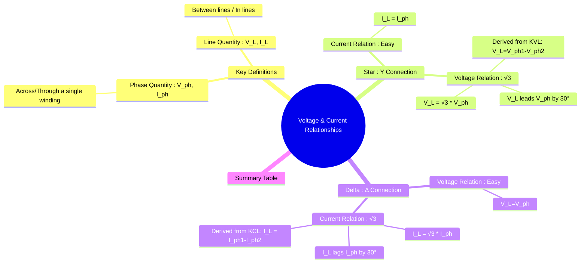

---
tags:
  - three-phase
  - ac-circuits
  - star-connection
  - delta-connection
  - phasor-diagrams
created: 2025-08-03
aliases:
  - Line and Phase Quantities
  - Star Delta Relationships
subject: "[[Electric Circuits]]"
parent: "[[Star and Delta Connections]]"
confidence: 9
---

---
### Voltage and Current Relationships in Star and Delta
#line-phase-relationship #star-connection #delta-connection

> Understanding the relationship between **line quantities** and **phase quantities** is fundamental to analyzing any three-phase circuit. These relationships are different for Star (Y) and Delta (Δ) connections and are derived using Kirchhoff's Laws and phasor diagrams.

#### Key Definitions
#line-quantity #phase-quantity

*   **Phase Voltage ($V_{ph}$)**: The voltage across a single phase winding or load impedance (e.g., $V_{AN}$ in a star connection, $V_{AB}$ in a delta connection).
*   **Phase Current ($I_{ph}$)**: The current flowing through a single phase winding or load impedance (e.g., $I_{A}$ in a star connection, $I_{AB}$ in a delta connection).
*   **Line Voltage ($V_L$)**: The voltage between any two line conductors (e.g., $V_{AB}, V_{BC}, V_{CA}$).
*   **Line Current ($I_L$)**: The current flowing in any of the line conductors (e.g., $I_A, I_B, I_C$).

---
#### Star (Y) Connection Relationships
#star-connection

In a star connection, the three phases are connected to a common neutral point.

*   **Current Relationship**:
    The line conductor is a direct extension of the phase winding. Therefore, the line current is identical to the phase current.
    $$\boxed{\quad I_L = I_{ph} \quad}$$

*   **Voltage Relationship**:
    The line voltage is the phasor difference between two phase voltages. For example, the voltage between line A and line B is given by KVL: $V_{AB} = V_{AN} - V_{BN}$.

    **Phasor Derivation**:
    1.  Start with the three phase voltage phasors ($V_{AN}, V_{BN}, V_{CN}$) which are 120° apart.
    2.  To find $V_{AB}$, we compute $V_{AN} + (-V_{BN})$. The phasor $-V_{BN}$ is 180° opposite to $V_{BN}$.
    3.  The angle between $V_{AN}$ and $-V_{BN}$ is 60°.
    4.  Adding these two phasors (which have equal magnitude $V_{ph}$) using the parallelogram law gives a resultant phasor $V_{AB}$ with a magnitude of:
        $|V_{AB}| = \sqrt{V_{ph}^2 + V_{ph}^2 + 2V_{ph}V_{ph}\cos(60^\circ)} = \sqrt{3}V_{ph}$.
    5.  The resultant phasor $V_{AB}$ leads the phase voltage phasor $V_{AN}$ by 30°.
    
    $$\boxed{\quad V_L = \sqrt{3} V_{ph} \quad \text{(Magnitude)}}$$
    $$\boxed{\quad \text{Line voltage leads phase voltage by 30°} \quad}$$

---
#### Delta (Δ) Connection Relationships
#delta-connection

In a delta connection, the three phases are connected end-to-end in a closed loop.

*   **Voltage Relationship**:
    Each phase winding is connected directly between two line conductors. Therefore, the line voltage is identical to the phase voltage.
    $$\boxed{\quad V_L = V_{ph} \quad}$$

*   **Current Relationship**:
    The line current is the phasor difference between two phase currents. For example, the current in line A is given by KCL at the node: $I_A = I_{AB} - I_{CA}$.

    **Phasor Derivation**:
    1.  The derivation is mathematically identical to the voltage derivation for a star connection.
    2.  Start with the three phase current phasors ($I_{AB}, I_{BC}, I_{CA}$) which are 120° apart (for a balanced load).
    3.  To find $I_A$, we compute $I_{AB} + (-I_{CA})$. The angle between $I_{AB}$ and $-I_{CA}$ is 60°.
    4.  Adding these two phasors (with magnitude $I_{ph}$) gives a resultant phasor $I_A$ with a magnitude of $\sqrt{3}I_{ph}$.
    5.  The resultant phasor $I_A$ lags the phase current phasor $I_{AB}$ by 30°.

    $$\boxed{\quad I_L = \sqrt{3} I_{ph} \quad \text{(Magnitude)}}$$
    $$\boxed{\quad \text{Line current lags phase current by 30°} \quad}$$

---
#### Summary Table
#summary-table

| Connection Type | Voltage Relationship | Current Relationship |
| :--- | :--- | :--- |
| **Star (Y)** | $V_L = \sqrt{3} V_{ph}$   ($V_L$ leads $V_{ph}$ by 30°) | $I_L = I_{ph}$ |
| **Delta (Δ)** | $V_L = V_{ph}$ | $I_L = \sqrt{3} I_{ph}$   ($I_L$ lags $I_{ph}$ by 30°) |

---
### Related Concepts
#star-delta-relationships/related-concepts

> [[Star and Delta Connections]] (Parent topic)

[[Phasor Diagrams]] (The essential tool for deriving these relationships)
[[Three-Phase Power]] (Where these relationships are used to calculate total power)
[[Kirchhoff's Laws]] (The foundation for the phasor derivations)