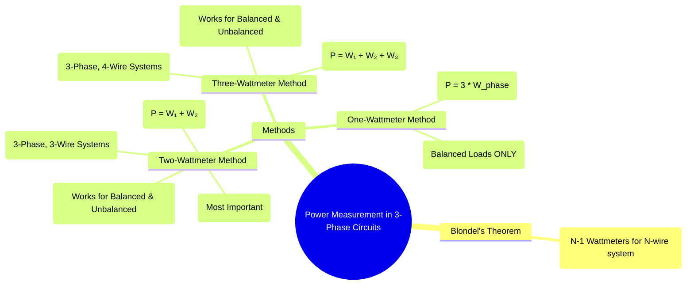

---
tags:
  - electrical-measurements
  - power-measurement
  - three-phase
  - ac-circuits
  - wattmeter
  - blondels-theorem
created: 2025-08-05
aliases:
  - 3-Phase Power Measurement
subject: "[[Electrical and Electronics Measurements]]"
parent: "[[Power Measurement]]"
confidence: 9
---

---
### Power Measurement in Three-Phase Circuits
#power-measurement #three-phase #wattmeter

> Measuring power in three-phase circuits is a common requirement in power systems and industry. The method used depends on the type of load (balanced or unbalanced) and the system configuration (3-wire or 4-wire). The selection of the appropriate method is governed by **Blondel's Theorem**.

#### Blondel's Theorem
#blondels-theorem

This fundamental theorem provides the theoretical basis for power measurement in polyphase systems.

**Statement**: The total power supplied to a system of `N` conductors can be measured by summing the readings of `N-1` wattmeters, where each wattmeter's current coil is in one of the `N` conductors, and its potential coil is connected between that conductor and a common point on the remaining conductor.

*   **For a 3-Phase, 3-Wire System (Y or Δ)**: N=3, so **N-1 = 2 wattmeters** are required.
*   **For a 3-Phase, 4-Wire System (Y with Neutral)**: N=4, so **N-1 = 3 wattmeters** are required.

---
#### Two-Wattmeter Method
#two-wattmeter-method

This is the most versatile and important method. For a deep dive, see [[Two-Wattmeter Method for Power Measurement]].

*   **Applicability**: 3-Phase, 3-Wire systems.
*   **Load Type**: Works perfectly for **both balanced and unbalanced** loads.
*   **Connection**: Current coils are placed in any two lines. The potential coils are connected from their respective lines to the third line, which acts as the common point.
*   **Total Active Power**: The total power is the algebraic sum of the two wattmeter readings.
    $$\boxed{\quad P_{3\phi} = W_1 + W_2 \quad}$$
*   **For Balanced Loads**: It can also be used to find reactive power and power factor.
    $$\boxed{\quad Q_{3\phi} = \sqrt{3}(W_1 - W_2) \quad}$$
    $$\boxed{\quad \phi = \tan^{-1}\left(\sqrt{3} \frac{W_1 - W_2}{W_1 + W_2}\right) \quad}$$

---
#### Three-Wattmeter Method
#three-wattmeter-method

*   **Applicability**: 3-Phase, 4-Wire systems (Star-connected load with a neutral wire).
*   **Load Type**: Works for **both balanced and unbalanced** loads.
*   **Connection**: Three wattmeters are used. Each wattmeter's current coil is connected in one of the three phases (R, Y, B), and its potential coil is connected between its respective phase and the common neutral wire.
*   **Total Active Power**: The total power is the simple arithmetic sum of the three wattmeter readings.
    $$\boxed{\quad P_{3\phi} = W_1 + W_2 + W_3 \quad}$$
    This method has the advantage of measuring the power in each phase individually.

---
#### One-Wattmeter Method
#one-wattmeter-method

This method is less common due to its significant limitation.

*   **Applicability**: Can **only** be used for **perfectly balanced** loads.
*   **Connection (Y-Load)**: A single wattmeter is connected to measure the power in one phase (current coil in the line, potential coil across that phase, i.e., between the line and the neutral). The total power is three times this reading.
    $$\boxed{\quad P_{3\phi} = 3 \times W_{phase} \quad}$$
*   **Connection (Δ-Load or unknown)**: If the neutral is not available, an artificial neutral can be created. Alternatively, the wattmeter can be connected sequentially as in the two-wattmeter method (measuring $W_1$ and $W_2$ separately with the same meter), and the readings are summed.

#### Summary of Methods

| Method | System Type | Load Type | Total Power Formula |
| :--- | :--- | :--- | :--- |
| **Three-Wattmeter** | 3-Phase, 4-Wire | Balanced or Unbalanced | $P = W_1 + W_2 + W_3$ |
| **Two-Wattmeter** | 3-Phase, 3-Wire | Balanced or Unbalanced | $P = W_1 + W_2$ |
| **One-Wattmeter** | 3-Phase, 3-Wire or 4-Wire| **Balanced ONLY** | $P = 3 \times W_{phase}$ |

---
### Related Concepts
#power-measurement/related-concepts

> [[Two-Wattmeter Method for Power Measurement]] (Detailed analysis of the most important method)

[[Three-Phase Circuits]] (The systems being measured)
[[AC Power Analysis]] (Defines the quantities P, Q, S, and pf)
[[Wattmeter]] (The instrument used for measurement)
[[Star and Delta Connections]]