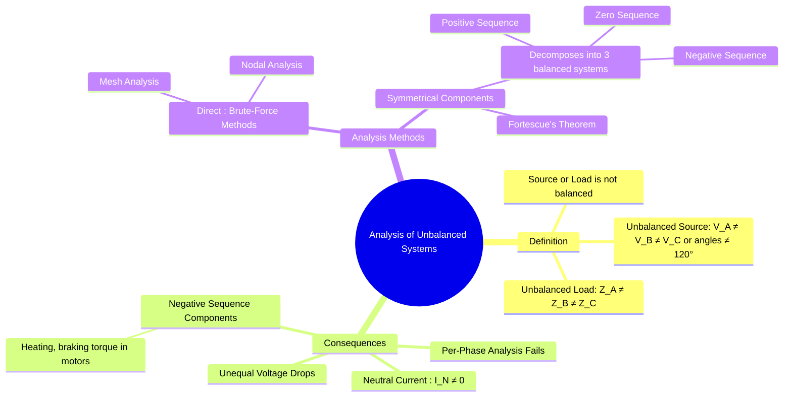

---
tags:
  - three-phase
  - unbalanced-systems
  - power-systems
  - symmetrical-components
  - network-analysis
created: 2025-08-04
aliases:
  - Unbalanced 3-Phase
  - Asymmetrical Systems
  - What Constitutes an Unbalanced System?
  - Three-Phase Unbalanced Load Analysis
subject: "[[Electric Circuits]]"
parent: "[[Three-Phase Circuits]]"
confidence: 9
---
###### Mind Map

---
### Analysis of Unbalanced Three-Phase Systems
#unbalanced-systems #three-phase #symmetrical-components

> ==An unbalanced three-phase system is one in which either the source voltages or the load impedances (or both) are not equal in all three phases.== In such a system, the inherent symmetry of a balanced circuit is lost, and the powerful simplification of [[Analysis of Balanced Three-Phase Circuits|per-phase analysis]] is **no longer valid**. This necessitates the use of more general, and often more complex, analytical methods.

#### What Constitutes an Unbalanced System?
#unbalanced-systems/definition

A system is considered unbalanced if one or both of the following conditions are met:
1.  **Unbalanced Source**: ==The three-phase source voltages are not equal in magnitude or are not displaced from each other by exactly 120°.== This is rare in modern power systems but can occur during fault conditions.
2.  **Unbalanced Load**: ==The phase impedances of the load are not identical ($Z_A \neq Z_B \neq Z_C$).== This is a very common scenario, for example, when a three-phase system supplies a mix of three-phase and single-phase loads.

---
#### Consequences of Unbalance
#unbalanced-systems/consequences

The loss of symmetry has several significant practical and analytical consequences:
* **Failure of Per-Phase Analysis**: The neutral point of a star-connected load is no longer at the same potential as the source neutral. This means we cannot analyze one phase independently.
* **Presence of Neutral Current**: In a 4-wire star-connected system, the phasor sum of the line currents is no longer zero, resulting in a current flowing through the neutral wire ($I_N = I_A + I_B + I_C \neq 0$). This neutral current can cause overheating if the wire is not sized appropriately.
* **[[Concept of Symmetrical Components#2. Negative Sequence Components (Subscript 2)|Negative Sequence Components]]**: ==Unbalanced currents produce a **negative sequence** component in the rotating magnetic field of motors and generators.== ==This component rotates in the opposite direction to the main field, creating a braking torque, reducing efficiency, and causing significant additional heating.==
* **Unequal Voltage Drops**: Unequal line currents flowing through equal line impedances will cause unequal voltage drops, leading to unbalanced phase voltages at the load terminals even if the source is perfectly balanced.

---
#### Methods of Analysis
#unbalanced-systems/analysis-methods

Since per-phase analysis is not applicable, one of the following methods must be used.

##### 1. Direct Application of Fundamental Methods

These "brute-force" methods can solve any circuit but can become mathematically intensive.
*   **[[Mesh Analysis]]**: KVL is applied to each mesh in the circuit. This typically results in a system of two or three simultaneous equations with complex coefficients that must be solved for the mesh currents.
*   **[[Nodal Analysis]]**: KCL is applied at each independent node. This is often more straightforward than mesh analysis, especially in 4-wire systems where the neutral node is a convenient reference.

> [!pyq]- PYQ : 2018
> ![[ee_2018#^q47]]

---
##### 2. Method of Symmetrical Components

This is the most powerful and widely used method for analyzing unbalanced systems, especially in [[Fault Calculations|Fault Analysis]].
*   **Principle (Fortescue's Theorem)**: This theorem states that any unbalanced set of three-phase phasors (voltages or currents) can be resolved into three sets of balanced phasors, known as the symmetrical components.
*   **The Components**:
    *   **Positive Sequence ($V_1, I_1$)**: A balanced set with the same phase sequence as the original system (e.g., ABC). This is the "useful" component that drives motors correctly.
    *   **Negative Sequence ($V_2, I_2$)**: A balanced set with the opposite phase sequence (e.g., ACB). This is the "harmful" component that causes braking torque and heating.
    *   **Zero Sequence ($V_0, I_0$)**: Consists of three phasors that are equal in magnitude and in phase with each other. These components only exist if there is a path for them to flow, such as a neutral wire or a ground connection.
The key advantage is that the network can be analyzed separately for each sequence component (where per-phase analysis *is* valid), and the final results are found by superposing the component results.

---
### Related Concepts
#unbalanced-systems/related-concepts

> [[Concept of Symmetrical Components|Symmetrical Components]] (The primary advanced method for this analysis)

[[Three-Phase Circuits]] (Parent Topic)
[[Analysis of Balanced Three-Phase Circuits]] (The simplified case that this method contrasts with)
[[Mesh Analysis]] and [[Nodal Analysis]] (The fundamental methods applicable here)
[[Induction Machines|Induction Motor]] (Devices highly sensitive to the effects of unbalance)
[[Power System Fault Analysis]] (The main application area for this topic)
