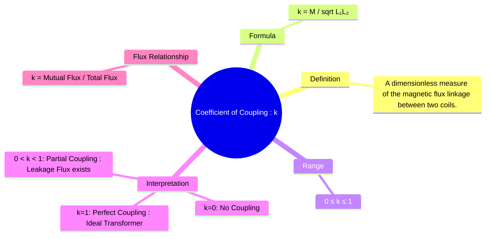

---
tags:
  - electric-circuits
  - magnetic-circuits
  - transformer
  - mutual-inductance
  - coupling-coefficient
created: 2025-08-09
aliases:
  - Coupling Coefficient
  - k
subject: "[[Electric Circuits]]"
parent: "[[Concept of Mutual Inductance]]"
confidence: 9
---

---
### Coefficient of Coupling (k)
#coupling-coefficient #magnetic-coupling #leakage-flux

> The **coefficient of coupling (k)** is a dimensionless factor that quantifies the degree of magnetic coupling between two inductors. It represents the fraction of the total magnetic flux produced by one coil that links with the second coil. The value of `k` ranges from 0 (no coupling) to 1 (perfect coupling).

#### Defining Formula
#coupling-coefficient/formula

The coefficient of coupling is defined by the relationship between the mutual inductance (M) and the self-inductances ($L_1$ and $L_2$) of the two coils.
$$\boxed{\quad k = \frac{M}{\sqrt{L_1 L_2}} \quad}$$
From this, the mutual inductance can be expressed as:
$$\boxed{\quad M = k\sqrt{L_1 L_2} \quad}$$

#### Physical Interpretation and Range
#coupling-coefficient/interpretation

The value of `k` provides direct insight into the physical arrangement and effectiveness of the magnetic coupling.

1.  **$k = 0$ (No Coupling)**
    *   This implies that $M=0$.
    *   No flux from one coil links the other. This occurs when the coils are very far apart or are oriented perpendicularly to each other. They are magnetically isolated.

2.  **$k = 1$ (Perfect or Tight Coupling)**
    *   This is the maximum possible value, where $M = \sqrt{L_1 L_2}$.
    *   All of the flux generated by one coil links with the other. There is **zero [[Ideal and Practical Transformers#^leakage-flux|leakage flux]]**.
    *   This is a key assumption for the [[Ideal Transformer]]. It is achieved in practice by winding the coils very close together on a highly permeable magnetic core.

3.  **$0 < k < 1$ (Partial, Loose, or Tight Coupling)**
    *   This is the practical case for all real transformers and coupled circuits.
    *   Only a fraction of the flux from one coil links the other. The flux that does not link is called **[[Ideal and Practical Transformers#^leakage-flux|leakage flux]]**. The flux that links both coils is called **mutual flux** or main flux.
    *   Total Flux ($\Phi_1$) = Leakage Flux ($\Phi_{1,leakage}$) + Mutual Flux ($\Phi_{12}$)
    *   The coefficient `k` can also be defined in terms of these fluxes:
        $$\boxed{\quad k = \sqrt{\left(\frac{\Phi_{12}}{\Phi_1}\right) \left(\frac{\Phi_{21}}{\Phi_2}\right)} \quad}$$
        Where $\Phi_{12}$ is the flux from coil 1 linking coil 2, and $\Phi_1$ is the total flux from coil 1. For a linear system, this simplifies to $k = \Phi_{12} / \Phi_1$.

#### Relationship to Stored Energy
#energy-storage

The total energy stored in a coupled-coil system must always be non-negative ($W \ge 0$). The formula for total stored energy is:
$$W = \frac{1}{2} L_1 i_1^2 + \frac{1}{2} L_2 i_2^2 \pm M i_1 i_2$$
For this quadratic form to be non-negative for all possible currents, the determinant must be greater than or equal to zero. This leads to the mathematical constraint:
$$L_1 L_2 - M^2 \ge 0 \implies M^2 \le L_1 L_2$$
Taking the square root gives $|M| \le \sqrt{L_1 L_2}$, which confirms that the maximum value of the coupling coefficient `k` is 1.

---
### Related Concepts
#coupling-coefficient/related-concepts

> [[Concept of Mutual Inductance]] (The core concept that `k` quantifies)

[[Linear Transformer]] (The circuit model for partially coupled coils)
[[Ideal Transformer]] (The special case where k=1)
[[Magnetic Circuits]] (The study of magnetic flux, which is central to this concept)
[[Inductor]] (Self-inductance, L, is a key parameter in the formula)