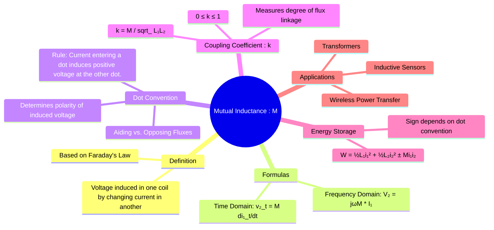

---
tags:
  - electric-circuits
  - magnetic-circuits
  - mutual-inductance
  - transformer
  - electromagnetism
created: 2025-08-09
aliases:
  - Mutual Inductance
  - M
subject: "[[Electric Circuits]]"
parent:
  - Magnetic Circuits
confidence: 9
formula:
  - "Coefficient of Coupling : $$k = \\frac{M}{\\sqrt{L_1 L_2}} \\quad \\implies \\quad M = k\\sqrt{L_1 L_2}$$"
  - "Energy in Coupled Coils : $$W_{total} = \\frac{1}{2} L_1 i_1^2 + \\frac{1}{2} L_2 i_2^2 \\pm M i_1 i_2$$"
---
###### Mind Map

---
### Concept of Mutual Inductance
#mutual-inductance #magnetic-coupling #faradays-law

> **Mutual inductance (M)** is the phenomenon where a changing current in one inductor (or coil) produces a changing magnetic flux that links with a second inductor, thereby inducing a voltage across the second inductor. It is the fundamental principle that enables the operation of transformers and other magnetically coupled devices. While self-inductance relates the voltage in a coil to the changing current *in that same coil*, mutual inductance relates the voltage in one coil to the changing current *in another coil*.

#### Defining Equations
#mutual-inductance/formulas

The voltage $v_2(t)$ induced in coil 2 due to a changing current $i_1(t)$ in coil 1 is given by:
$$\boxed{\quad v_2(t) = M \frac{di_1(t)}{dt} \quad}$$
Symmetrically, the voltage $v_1(t)$ induced in coil 1 due to a changing current $i_2(t)$ in coil 2 is:
$$\boxed{\quad v_1(t) = M \frac{di_2(t)}{dt} \quad}$$
The unit of mutual inductance (M) is the **Henry (H)**, the same as for self-inductance.

In the **frequency (phasor) domain**, these relationships become:
$$\boxed{\quad \mathbf{V}_2 = (j\omega M)\mathbf{I}_1 \quad \text{and} \quad \mathbf{V}_1 = (j\omega M)\mathbf{I}_2 \quad}$$

---
#### Coefficient of Coupling (k)
#coupling-coefficient

The amount of mutual inductance between two coils depends on their self-inductances ($L_1$ and $L_2$) and how tightly they are coupled. This is quantified by the **coefficient of coupling (k)**.
$$\boxed{\quad k = \frac{M}{\sqrt{L_1 L_2}} \quad \implies \quad M = k\sqrt{L_1 L_2} \quad}$$
*   `k` is a dimensionless value where $0 \le k \le 1$.
*   **k = 0**: There is no magnetic coupling between the coils. The flux from one does not link the other. $M=0$.
*   **0 < k < 1**: This is the case for practical, non-ideal transformers, known as [[Linear Transformer|loosely or tightly coupled coils]].
*   **k = 1**: Perfect coupling. All of the flux produced by one coil links with the other. This is an assumption for the [[Ideal Transformer]].

---
#### The Dot Convention
#dot-convention

The [[Dot Convention]] is a notation used to determine the polarity (sign) of the mutually induced voltage. A dot is placed on one terminal of each coupled coil.
*   **Rule**: A current **entering** the dotted terminal of one coil induces a voltage in the second coil that is **positive** at the dotted terminal of the second coil.
*   **Application in KVL**: This rule is critical when writing [[Analysis of Circuits with Magnetic Coupling|mesh equations]]. The sign of the mutual voltage term ($\pm j\omega M I$) depends on whether the mesh currents are entering or leaving the dotted terminals.

---
#### Energy in Coupled Coils
#energy-storage

When two coils are magnetically coupled, the total energy stored in the magnetic field is not just the sum of the energies in each coil individually. It also includes a term due to the mutual inductance.
$$\boxed{\quad W_{total} = \frac{1}{2} L_1 i_1^2 + \frac{1}{2} L_2 i_2^2 \pm M i_1 i_2 \quad}$$
The sign of the mutual energy term depends on the direction of the fluxes produced by the two currents:
*   **Positive (+) Sign**: If the fluxes are **aiding** (e.g., both currents enter or both leave the dotted terminals).
*   **Negative (-) Sign**: If the fluxes are **opposing** (e.g., one current enters a dot and the other leaves a dot).

For the stored energy to always be non-negative, it must be that $L_1 L_2 \ge M^2$, which reinforces the condition that $k \le 1$.

---
### Related Concepts
#mutual-inductance/related-concepts

> [[Linear Transformer]] (The circuit model based on this concept)

[[Faraday's Law in Integral and Point Form|Faraday's Law of Induction]] (The fundamental physical law)
[[Magnetic Circuits]] (The study of flux, MMF, and reluctance)
[[Inductors]] (Self-inductance is the counterpart to mutual inductance)
[[Dot Convention]] (The rule for determining polarity)
[[Analysis of Circuits with Magnetic Coupling]] (Applying the concept to solve circuits)