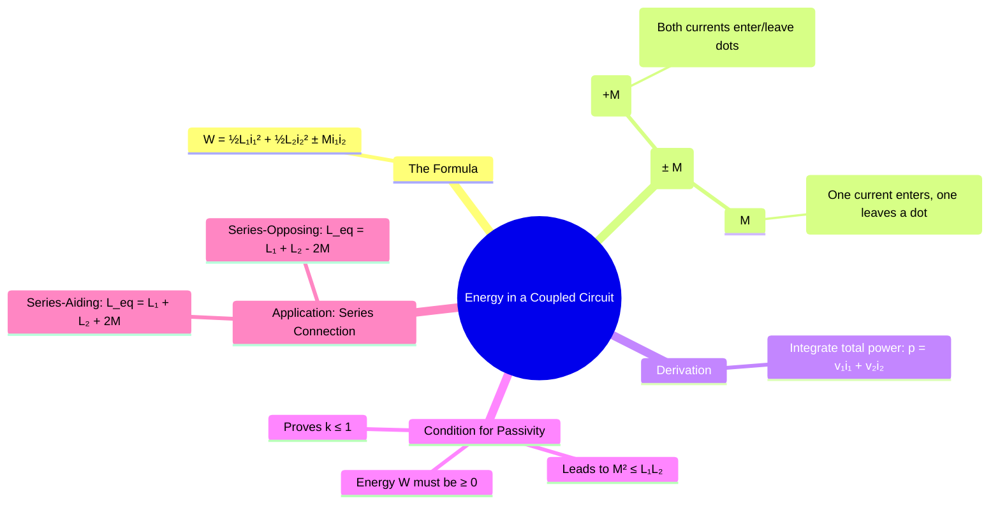

---
tags:
  - electric-circuits
  - magnetic-circuits
  - mutual-inductance
  - energy-storage
  - transformer
created: 2025-08-10
aliases:
  - Energy in Coupled Coils
  - Coupled Circuit Energy
subject: "[[Electric Circuits]]"
parent: "[[Concept of Mutual Inductance]]"
confidence: 9
---
###### Mind Map

---
### Energy in a Coupled Circuit
#energy-storage #mutual-inductance #magnetic-coupling

> The total energy stored in a magnetically coupled circuit is not simply the sum of the energies stored by each inductor individually. An additional energy term arises from the **mutual inductance (M)**, representing the energy stored in the mutual magnetic flux that links the coils. The sign of this mutual energy term depends on the relative direction of the currents with respect to the [[Dot Convention]].

#### The Energy Storage Formula
#energy-storage/formula

For two magnetically coupled coils with currents $i_1$ and $i_2$, the total instantaneous energy stored in the magnetic field is:
$$\boxed{\quad W_{total} = \frac{1}{2} L_1 i_1^2 + \frac{1}{2} L_2 i_2^2 \pm M i_1 i_2 \quad}$$
*   The terms $\frac{1}{2}L_1 i_1^2$ and $\frac{1}{2}L_2 i_2^2$ represent the energy stored in the self-inductance of each coil (including their [[Ideal and Practical Transformers#^leakage-flux|leakage flux]]).
*   The term $\pm M i_1 i_2$ represents the energy stored due to the mutual flux.

#### Determining the Sign of the Mutual Term
#dot-convention #aiding-opposing-flux

The sign of the mutual energy term is determined by the dot convention and the direction of the currents:
1.  **Positive (+) Sign (Aiding Fluxes)**: The sign is positive if the currents in both coils produce fluxes that add together. This occurs when both currents **enter** their respective dotted terminals or when both currents **leave** their respective dotted terminals.
2.  **Negative (-) Sign (Opposing Fluxes)**: The sign is negative if the fluxes produced by the two currents oppose each other. This occurs when one current **enters** a dotted terminal while the other **leaves** its dotted terminal.

#### Condition for Passivity and Coupling Coefficient
#passivity-condition #coupling-coefficient

A passive circuit cannot generate energy, so the total stored energy $W_{total}$ must be non-negative ($W \ge 0$) for any possible values of $i_1$ and $i_2$. This physical requirement places a mathematical constraint on the circuit parameters. For the quadratic energy equation to always be non-negative, it must satisfy:
$$L_1 L_2 - M^2 \ge 0$$
$$\implies M^2 \le L_1 L_2$$
Taking the square root, we get $|M| \le \sqrt{L_1 L_2}$. Since the [[Coefficient of Coupling]] is defined as $k = M/\sqrt{L_1 L_2}$, this energy condition proves that:
$$\boxed{\quad k \le 1 \quad}$$

#### Application: Equivalent Inductance of Series-Connected Coils
#series-connection #equivalent-inductance

A common application of this energy concept is finding the equivalent inductance of two coupled coils connected in series.
1.  **Series-Aiding Connection**: The coils are connected such that the current enters the dotted terminal of one coil and also enters the dotted terminal of the other (or leaves both). The magnetic fields aid each other.
    $$\boxed{\quad L_{eq, aiding} = L_1 + L_2 + 2M \quad}$$
2.  **Series-Opposing Connection**: The coils are connected such that the current enters the dotted terminal of one coil but leaves the dotted terminal of the other. The magnetic fields oppose each other.
    $$\boxed{\quad L_{eq, opposing} = L_1 + L_2 - 2M \quad}$$
    These formulas can be used to experimentally determine the mutual inductance: $M = \frac{L_{eq, aiding} - L_{eq, opposing}}{4}$.

---
### Related Concepts
#energy-storage/related-concepts

> [[Concept of Mutual Inductance]] (The core phenomenon)

[[Dot Convention]] (Essential for determining the sign of the mutual term)
[[Coefficient of Coupling]] (Its maximum value is constrained by the energy principle)
[[Linear Transformer]] (The circuit model for which this analysis is valid)
[[Energy Stored in Inductors and Capacitors]] (The broader context of energy storage)