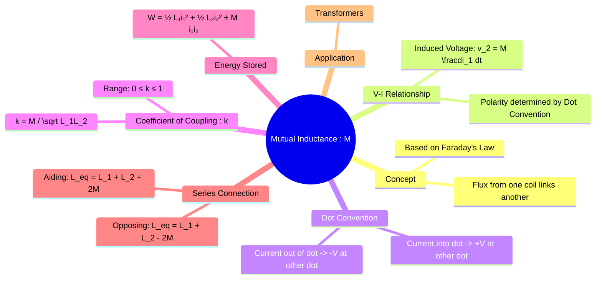

---
tags:
  - electric-circuits
  - magnetically-coupled-circuits
  - mutual-inductance
  - transformers
aliases:
  - Mutual Inductance
  - Coupled Inductors
  - Energy Stored in Coupled Inductors
  - Henry (H)
  - "H : Henry"
created: 2025-09-12
subject: "[[Electric Circuits]]"
parent:
  - Magnetically Coupled Circuits
confidence: 9
---

---
### Mutual Inductance
#mutual-inductance #magnetic-coupling

> **Mutual Inductance (M)** is a phenomenon in which a change of current in one inductor induces a voltage across a second, nearby inductor. This occurs when the magnetic flux produced by one coil links with the turns of the other coil. It is the fundamental principle behind the operation of [[Transformers]]. The SI unit for mutual inductance is the **Henry (H)**.

---
#### V-I Relationship and Dot Convention
#dot-convention

The voltage $v_2(t)$ induced in coil 2 by a changing current $i_1(t)$ in coil 1 is given by:
$$\boxed{\quad v_2(t) = M \frac{di_1(t)}{dt} \quad}$$
Similarly, a changing current in coil 2 induces a voltage in coil 1:
$$\boxed{\quad v_1(t) = M \frac{di_2(t)}{dt} \quad}$$
The polarity of this induced voltage is determined by the **[[Dot Convention]]**. A dot is placed on one terminal of each coil to indicate the relative winding direction.

> [!warning] Dot Convention Rule
> When current **enters** the dotted terminal of one coil, the mutually induced voltage in the second coil is **positive** at its dotted terminal. Conversely, when current **leaves** the dotted terminal of one coil, the mutually induced voltage is **negative** at its dotted terminal.

This is crucial for writing correct KVL equations in [[Mesh Analysis]]. For a coupled inductor in a mesh, the total voltage is the sum of its self-induced voltage and its mutually-induced voltage: $$V_{coil1} = L_1 \frac{di_1}{dt} \pm M \frac{di_2}{dt}$$The sign of the '$M$' term depends on the dot convention and the assumed current directions.

In the frequency domain (using phasors):
$$\mathbf{V}_2 = (j\omega M)\mathbf{I}_1$$
The mutual inductance term acts as a reactive impedance, $j\omega M$.

---
#### Coefficient of Coupling (k)
#coefficient-of-coupling

The **coefficient of coupling (k)** is a dimensionless measure of how much of the magnetic flux from one coil links with the other.
$$\boxed{\quad k = \frac{M}{\sqrt{L_1 L_2}} \quad}$$
The value of $k$ ranges from 0 to 1:
* $k = 0$: No coupling. The coils are magnetically isolated.
* $0 < k < 1$: Partial coupling. This is the case for most practical air-core transformers.
* $k = 1$: Perfect coupling. All the flux from one coil links the other. This is the ideal case, assumed for ideal transformers.

From this, the mutual inductance can be expressed as: $M = k\sqrt{L_1 L_2}$.

---
#### Energy Stored in Coupled Inductors
#coupled-inductors/energy

The total energy stored in a pair of mutually coupled inductors is:
$$\boxed{\quad W = \frac{1}{2}L_1 i_1^2 + \frac{1}{2}L_2 i_2^2 \pm M i_1 i_2 \quad}$$
The sign of the mutual inductance term depends on whether the fluxes produced by the two currents are aiding or opposing each other.
*   **Positive (+) sign**: Used when both currents enter (or both leave) the dotted terminals. The fluxes are **aiding**.
*   **Negative (-) sign**: Used when one current enters a dotted terminal while the other leaves a dotted terminal. The fluxes are **opposing**.

For the circuit to be passive, the stored energy must always be non-negative ($W \ge 0$). This leads to the physical constraint that $M \le \sqrt{L_1 L_2}$, which confirms that $k \le 1$.

---
#### Series Combination of Coupled Inductors
#coupled-inductors/series

When two coupled inductors are connected in series, the equivalent inductance depends on the winding direction.

##### Series-Aiding Connection
The current flows into the dot of one coil and out of the dot of the other. The magnetic fluxes add together.
$$\boxed{\quad L_{eq} = L_1 + L_2 + 2M \quad}$$

##### Series-Opposing Connection
The current flows into the dots of both coils (or out of both). The magnetic fluxes oppose each other.
$$\boxed{\quad L_{eq} = L_1 + L_2 - 2M \quad}$$

---
### Related Concepts
#related-concepts

> [[Transformers]] (The primary application of mutual inductance)

[[Inductors]] (Self-inductance is the related property of a single coil)
[[Faraday's Law of Induction]] (The underlying physics principle)
[[Electromagnetic Fields]]
[[Linear Transformer]]