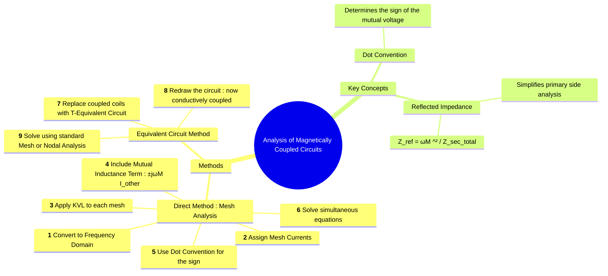

---
tags:
  - electric-circuits
  - magnetic-circuits
  - transformer
  - mutual-inductance
  - circuit-analysis
  - mesh-analysis
created: 2025-08-08
aliases:
  - Magnetically Coupled Circuits Analysis
  - Solving Coupled Circuits
subject: "[[Electric Circuits]]"
parent: "[[Linear Transformer]]"
formula:
  - "Reflected Impedance : $$Z_{ref} = \\frac{(\\omega M)^2}{Z_{\\text{secondary total}}} = \\frac{(\\omega M)^2}{Z_{\\text{secondary}} +Z_{\\text{load}}} = \\frac{(\\omega M)^2}{(R_2 + R_L) + j(\\omega L_2 + X_L)}$$"
define:
  - "Reflected Impedance : The effect of the secondary circuit's impedance on the primary circuit is called reflected impedance."
modified: 2026-07-16
---
### Analysis of Circuits with Magnetic Coupling
#magnetic-coupling-analysis #circuit-analysis

> Analyzing circuits with [[magnetic coupling]] involves finding the currents and voltages in a network that contains [[Linear Transformer|linear transformers]] or coupled coils. The presence of **[[concept of mutual inductance|mutual inductance (M)]]** adds a voltage term in each mesh's KVL equation that depends on the current in the other coupled mesh. The two primary methods for solving these circuits are direct application of mesh analysis or replacing the magnetic coupling with a conductive T-equivalent circuit.

The first step for any AC analysis is to convert the entire circuit into the **frequency (phasor) domain**.

---

#### Method 1: Mesh Analysis with Mutual Inductance
#mesh-analysis #dot-convention

This method directly incorporates the mutual inductance term into the KVL equations. It is the most fundamental approach.

**Procedure**:
1.  **Convert to Frequency Domain**: Represent all sources as phasors and all R, L, C components as impedances ($R, j\omega L, 1/j\omega C$).
2.  **Assign Mesh Currents**: Assign a mesh current (e.g., $\mathbf{I}_1, \mathbf{I}_2$) to each loop, as in standard mesh analysis.
3.  **Apply KVL**: Write the KVL equation for each mesh.
4.  **Include Mutual Term**: For each coil in a mesh, include the self-impedance term ($j\omega L \cdot \mathbf{I}_{own}$). In addition, include a mutual voltage term for each coil that is coupled to another mesh. The mutual voltage induced in coil 1 by the current in coil 2 is $\pm j\omega M \mathbf{I}_2$.
5.  **Determine the Sign (Dot Convention)**: The sign of the mutual term is crucial.
    *   **Positive (+) Sign**: If both mesh currents **enter** (or both **leave**) the dotted terminals of their respective coils.
    *   **Negative (-) Sign**: If one mesh current **enters** a dotted terminal and the other **leaves** its dotted terminal.
6.  **Solve**: Solve the resulting system of simultaneous linear equations for the unknown mesh currents.

For a typical two-mesh circuit, the equations will be:
$$\begin{align}
\mathbf{V}_s &= (\text{Sum of impedances in mesh 1})\mathbf{I}_1 \pm (j\omega M)\mathbf{I}_2 \\
0 &= (\text{Sum of impedances in mesh 2})\mathbf{I}_2 \pm (j\omega M)\mathbf{I}_1
\end{align}$$

---
#### Method 2: The T-Equivalent Circuit
#t-equivalent-circuit

This method eliminates the magnetic coupling by replacing the transformer with an equivalent, conductively coupled circuit. This allows the use of standard analysis techniques without needing to handle the mutual inductance term explicitly in each step.

**Procedure**:
1.  Identify the pair of coupled coils.
2.  Replace the coils and their magnetic coupling with the corresponding **T-equivalent circuit**.
3.  Redraw the entire circuit with the T-network in place.
4.  Solve the new, conductively-coupled circuit using standard [[Mesh Analysis]] or [[Nodal Analysis]].

For two coils with a **positive (aiding)** mutual inductance term, the impedances of the T-network are:
$$\boxed{\quad Z_a = j\omega(L_1 - M) \quad}$$
$$\boxed{\quad Z_b = j\omega(L_2 - M) \quad}$$
$$\boxed{\quad Z_c = j\omega M \quad}$$
(If the mutual term is negative/opposing, M is replaced by -M in the formulas).

---
#### Concept: Reflected Impedance
#reflected-impedance

This is a useful shortcut for finding the input impedance of a transformer or for solving the primary current without solving the full system. The impedance of the secondary circuit, including the load and the secondary coil's self-impedance, is "reflected" back to the primary side.

The total input impedance seen by the source connected to the primary is:
$$Z_{in} = Z_{primary} + Z_{ref}$$
Where $Z_{primary} = R_1 + j\omega L_1$ and the reflected impedance is:
$$\boxed{\quad Z_{ref} = \frac{(\omega M)^2}{Z_{\text{secondary total}}} = \frac{(\omega M)^2}{Z_{\text{secondary}} +Z_{\text{load}}} = \frac{(\omega M)^2}{(R_2 + R_L) + j(\omega L_2 + X_L)} \quad}$$
Once $Z_{in}$ is known, the primary current can be found directly: $\mathbf{I}_1 = \mathbf{V}_s / Z_{in}$.

> See [[Ideal Transformer#Impedance Reflection|Impedance Reflection in Ideal Transformer]]

> [!warning]- **Derivation: From Mutual to Ideal Reflection**
> **Concept:** Proving that the Coupled Circuit model converges to the [[Ideal Transformer|Turns Ratio model]].
>
> **Assumptions for Ideality:**
> 1. Perfect Coupling: $k = 1 \implies M^2 = L_1 L_2$
> 2. Negligible Leakage: $L \to \infty$ relative to $Z_L$
>
> **The Transformation:**
> Starting with the non-ideal input impedance:
> $$Z_{in} = j\omega L_1 + \frac{\omega^2 M^2}{j\omega L_2 + Z_L}$$
>
> Substitute $M^2 = L_1 L_2$:
> $$Z_{in} = \frac{(j\omega L_1)(j\omega L_2 + Z_L) + \omega^2 L_1 L_2}{j\omega L_2 + Z_L}$$
> $$Z_{in} = \frac{-\omega^2 L_1 L_2 + j\omega L_1 Z_L + \omega^2 L_1 L_2}{j\omega L_2 + Z_L}$$
> $$Z_{in} = \frac{j\omega L_1 Z_L}{j\omega L_2 + Z_L}$$
>
> For a large $L_2$ ($j\omega L_2 \gg Z_L$):
> $$Z_{in} \approx \frac{j\omega L_1 Z_L}{j\omega L_2} = \left( \frac{L_1}{L_2} \right) Z_L$$
>
> Since $\frac{L_1}{L_2} = (\frac{N_1}{N_2})^2$:
> $$Z_{in} = \frac{Z_L}{n^2}$$

---
### Related Concepts
#magnetic-coupling-analysis/related-concepts

> [[Linear Transformer]] (The component being analyzed)

[[Dot Convention]] (Essential for getting the signs correct in mesh analysis)
[[Mutual Inductance]]
[[Mesh Analysis]] and [[Nodal Analysis]] (The core solution techniques)
[[Frequency Response|Frequency Domain Analysis]] (The domain in which analysis is performed)
[[Impedance Parameters (Z-parameters)]] (The formal two-port representation of the KVL equations)