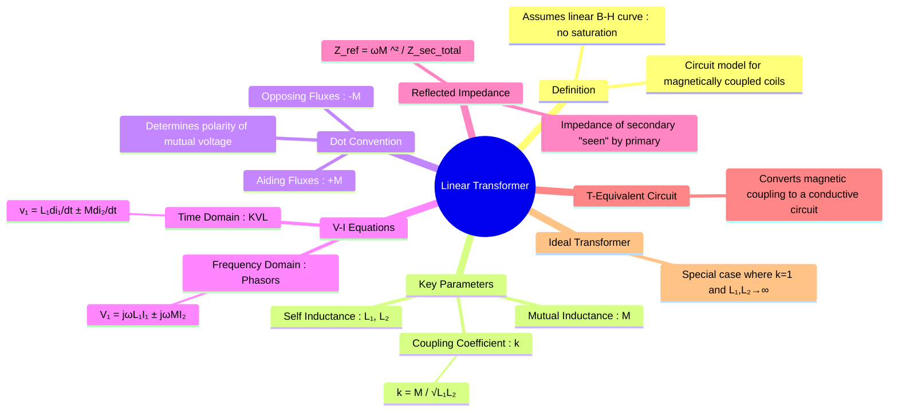

---
tags:
  - electric-circuits
  - magnetic-circuits
  - transformer
  - mutual-inductance
  - circuit-analysis
created: 2025-08-07
aliases:
  - Linear Transformer
  - Coupled Coils
  - Mutual Inductance
  - Reflected Impedance
subject: "[[Electric Circuits]]"
parent:
  - Magnetic Circuits
confidence: 9
formula:
  - "Transformer Secondary Voltage (open-circuit) : $$V_s = j\\omega M I_p$$"
---
###### Mind Map

---
### Linear Transformer (Coupled Coils)
#linear-transformer #mutual-inductance #coupled-coils

> A **linear transformer** is a four-terminal circuit element used to model two or more coils that are magnetically coupled. It operates under the assumption that the magnetic flux in the core is directly proportional to the current in the windings (i.e., the B-H curve is linear, and there are no saturation or hysteresis effects). The key parameter that governs its behavior is **mutual inductance (M)**.

#### Mutual Inductance and Coupling Coefficient (k)
#coupling-coefficient #mutual-inductance

*   **Self-Inductance (L)**: The property of a single coil to induce a voltage in itself due to a changing current. We have $L_1$ and $L_2$ for the primary and secondary coils.
*   **[[Concept of Mutual Inductance|Mutual Inductance (M)]]**: The property that a changing current in one coil induces a voltage in a nearby coil.
*   **Coefficient of Coupling (k)**: A measure of how much of the flux from one coil links with the other. It is a dimensionless number between 0 and 1.
    $$\boxed{\quad k = \frac{M}{\sqrt{L_1 L_2}} \quad}$$
    *   $k=0$: No coupling; the coils are independent.
    *   $k=1$: Perfect coupling; all flux from one coil links the other. This is a condition for the [[Ideal Transformer]].
    *   $0 < k < 1$: The typical case for a linear transformer.

---
#### The Dot Convention
#dot-convention

The dot convention is a notation used to determine the polarity of the mutually induced voltage.
*   **Physical Meaning**: Dots are placed on the terminals of the coils that have the same magnetic polarity at the same instant.
*   **Rule for KVL**: When writing KVL equations, the sign of the mutual inductance term ($M \frac{di}{dt}$ or $j\omega M I$) is determined as follows:
    *   **Positive (+) Sign (Aiding Fluxes)**: If the current in one coil **enters** its dotted terminal and the current in the other coil also **enters** its dotted terminal, the mutual term is positive. (This also applies if both currents *leave* their dotted terminals).
    *   **Negative (-) Sign (Opposing Fluxes)**: If one current **enters** its dotted terminal while the other **leaves** its dotted terminal, the mutual term is negative.

---
#### Voltage-Current Relationships (KVL)
#kvl #phasor-analysis

The behavior of a linear transformer is described by a pair of KVL equations.

*   **Time Domain**:
    $$\begin{align}
    v_1(t) &= L_1 \frac{di_1(t)}{dt} \pm M \frac{di_2(t)}{dt} \\
    v_2(t) &= L_2 \frac{di_2(t)}{dt} \pm M \frac{di_1(t)}{dt}
    \end{align}$$
    The sign depends on the dot convention and assumed current directions.

*   **Frequency (Phasor) Domain**: This is more common for AC circuit analysis.
    $$\begin{align}
    \mathbf{V}_1 &= (j\omega L_1)\mathbf{I}_1 \pm (j\omega M)\mathbf{I}_2 \\
    \mathbf{V}_2 &= (j\omega L_2)\mathbf{I}_2 \pm (j\omega M)\mathbf{I}_1
    \end{align}$$
    These equations are in the form of [[Impedance Parameters (Z-parameters)]], where $Z_{11} = j\omega L_1$, $Z_{22} = j\omega L_2$, and $Z_{12} = Z_{21} = \pm j\omega M$.

---
#### Reflected Impedance
#reflected-impedance

The effect of the secondary circuit's impedance on the primary circuit is called **reflected impedance**. If the secondary coil is connected to a load $Z_L$, the total secondary impedance is $Z_{sec} = Z_{load} + j\omega L_2$.
The impedance "seen" by the source connected to the primary is the input impedance $Z_{in} = \mathbf{V}_1 / \mathbf{I}_1$.
$$Z_{in} = j\omega L_1 + Z_{ref}$$
where the reflected impedance $Z_{ref}$ is:
$$\boxed{\quad Z_{ref} = \frac{(\omega M)^2}{Z_{load} + j\omega L_2} \quad}$$
This shows how the secondary load is "transformed" or "reflected" to the primary side.

> [!warning]- Reflected Impedance Derivation (General Method)
> To find the impedance seen from the primary of any coupled-inductor system:
> 1. **Find the secondary impedance**  
>  Reduce the secondary network to an equivalent  
   $$Z_2$$
> 2. **Write the primary voltage equation**  $$V_1 = j\omega L_1 I_1 + j\omega M I_2$$
> 3. **Write the secondary KVL equation** (even if $V_2 = 0$)  $$0 = Z_2 I_2 + j\omega M I_1$$
> 4. **Solve for the secondary current** $$I_2 = -\frac{j\omega M}{Z_2} I_1$$
> 5. **Substitute into the primary equation**  
   Gives $$V_1 = j\omega L_1 I_1 + \frac{\omega^2 M^2}{Z_2} I_1$$
> 6. **Divide to get the input (Thevenin) impedance** $$Z_{th} = \frac{V_1}{I_1}= j\omega L_1 + \frac{\omega^2 M^2}{Z_2}$$
>
> This last term is the **reflected impedance**.

> [!important]- Secondary Open-Circuit (OC) Transformer Insight
> **Condition:** Secondary load $Z_L \to \infty$ (open-circuit)
>
> **Secondary current**
> $$I_s = \frac{V_s}{Z_L} \xrightarrow{Z_L \to \infty} 0$$
>
> **Reflected effect on primary**
> - Reflected *admittance* is the correct loading indicator:
> $$Y_{\text{ref}} = \left(\frac{N_s}{N_p}\right)^2 Y_L \xrightarrow{Z_L \to \infty} 0$$
> - Hence, no load current is reflected from secondary to primary.
>
> **Primary current**
> $$I_p \approx I_m \quad (\text{only magnetizing + leakage components})$$
> Secondary OC does **not** alter primary current via loading.
>
> **Secondary voltage (open-circuit)**
> - Induced purely by mutual coupling:
> $$V_s = j\omega M I_p$$
> - Exists even when $I_s = 0$; voltage does **not** imply power transfer.
>
> **Power transfer**
> $$P_s = V_s I_s = 0$$
>
> **Revision takeaway**
> > Open secondary $\Rightarrow$ zero $I_s$, zero reflected loading, but finite induced $V_s$ due to mutual inductance.

> See [[Impedance Matching in Power Electronics]]

---
#### T-Equivalent Circuit
#t-equivalent-circuit

A magnetically coupled circuit can be replaced by an equivalent conductively coupled T-network, which can be easier to analyze with standard techniques.
For the case where the mutual inductance term is positive (aiding fluxes):
*   Series Arm 1: $Z_1 = j\omega(L_1 - M)$
*   Series Arm 2: $Z_2 = j\omega(L_2 - M)$
*   Shunt (Mutual) Arm: $Z_m = j\omega M$

---
### Related Concepts
#linear-transformer/related-concepts

> [[Magnetic Circuits]] (The underlying physical principles)

[[Impedance Matching in Power Electronics]]
[[Concept of Mutual Inductance]]
[[Faraday's Law of Induction]] (Governs the induced voltages)
[[Inductor]] (The basic component)
[[Ideal Transformer]] (A special, limiting case of the linear transformer)
[[Impedance Parameters (Z-parameters)]] (The formal two-port network representation)
[[Dot Convention]]