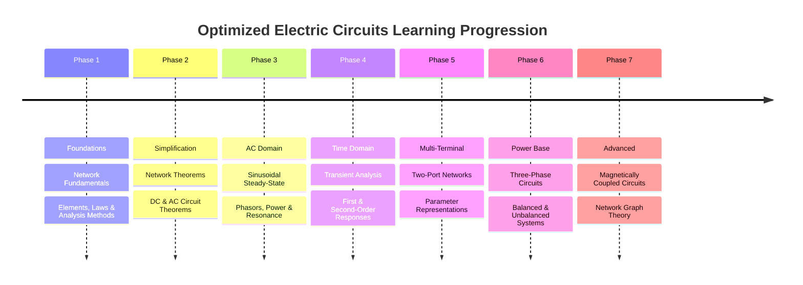

---
tags:
  - syllabus
  - electric-circuits
  - gate
  - moc
syllabus: electric circuits
---
### Electric Circuits

> [!info]
> This Map of Content (MOC) follows the recommended learning progression for GATE Electrical Engineering - Electric Circuits.
> 
> Learn each section sequentially. Every topic links to its detailed note.

---

### 1. Network Fundamentals

> Foundation of circuit analysis and basic elements.

#### 1. Circuit Elements
- [[Circuit Elements]]
- [[Resistors]]
- [[Capacitors]]
- [[Inductors]]
- [[Ohm's Law]]

#### 2. Fundamental Concepts
- [[Ideal Independent Sources]]
- [[Dependent Sources]]
- [[Passive Circuit Elements]]
- [[Energy Stored in Inductors and Capacitors]]
- [[Kirchhoff's Laws]]

#### 3. Circuit Laws and Rules
- [[Voltage Divider Rule]]
- [[Current Divider Rule]]
- [[Star-Delta Transformation]]

#### 4. Circuit Analysis Methods
- [[Nodal Analysis]]
- [[Mesh Analysis]]
- [[Supernode Analysis]]
- [[Supermesh Analysis]]
- [[Source Transformation]]

---

### 2. [[Network Theorems]]

> Tools for simplifying complex networks.

#### 1. DC & AC Network Theorems
- [[Superposition Theorem]]
- [[Thevenin's Theorem]]
- [[Norton's Theorem]]
- [[Maximum Power Transfer Theorem]]
- [[Reciprocity Theorem]]
- [[Tellegen's Theorem]]
- [[Millman's Theorem]]

---

### 3. Sinusoidal Steady-State Analysis (AC Circuits)

> Analysis of circuits under sinusoidal excitation.

#### 1. AC Fundamentals
- [[RMS and Average Values]]
- [[Phasors and Impedance Concept]]
- [[Admittance, Conductance, and Susceptance]]
- [[Series and Parallel AC Circuits]]
- [[AC Circuit Analysis]]

#### 2. Power in AC Circuits
- [[Instantaneous and Average Power]]
- [[AC Power Analysis]]
- [[Complex Power and the Power Triangle]]
- [[Power Factor]]
- [[Power Factor Correction]]
- [[Power and Energy in Circuits]]

#### 3. Resonance
- [[Resonance]]
- [[Series Resonance in RLC Circuits]]
- [[Parallel Resonance in RLC Circuits]]
- [[Quality Factor (Q-Factor)]]
- [[Bandwidth and Selectivity]]
- [[Half-Power Frequency (-3dB)]]

---

### 4. [[Transient Analysis]]

> Time-domain behavior of dynamic circuits.

#### 1. Fundamentals
- [[Initial and Final Conditions in Inductors and Capacitors]]
- [[Natural and Forced Response]]
- [[Switching Transients]]
- [[Time Constant]]

#### 2. First-Order Circuits
- [[Source-Free RL and RC Circuits]]
- [[Step Response of RL and RC Circuits]]

#### 3. Second-Order Circuits
- [[Source-Free Series and Parallel RLC Circuits]]
- [[Step Response of Series and Parallel RLC Circuits]]
- [[Overdamped, Critically Damped, and Underdamped Responses]]
- [[Natural Frequency and Damping Ratio]]

#### 4. Transient Analysis with Sinusoidal Excitation
- [[RLC Circuit Response to Sinusoidal Inputs]]

---

### 5. [[Two-Port Networks]]

> Characterizing multi-terminal networks.

#### 1. Network Parameters
- [[Impedance Parameters (Z-parameters)]]
- [[Admittance Parameters (Y-parameters)]]
- [[Hybrid Parameters (h-parameters)]]
- [[Inverse Hybrid Parameters (g-parameters)]]
- [[Transmission Parameters (ABCD-parameters)]]
- [[Conversion between Parameters]]

#### 2. Network Interconnection
- [[Series, Parallel, and Cascade Connection of Two-Port Networks]]
- [[Condition for Symmetry and Reciprocity]]

---

### 6. [[Three-Phase Circuits]]

> Analysis of power generation and distribution systems.

#### 1. Balanced Three-Phase Systems
- [[Generation of Three-Phase Voltages]]
- [[Phase Sequence]]
- [[Star and Delta Connections]]
- [[Voltage and Current Relationships in Star and Delta]]
- [[Analysis of Balanced Three-Phase Circuits]]

#### 2. Power in Three-Phase Circuits
- [[Power Measurement in Three-Phase Circuits]]
- [[Two-Wattmeter Method for Power Measurement]]
- [[Power Factor Calculation from Two-Wattmeter Readings]]

#### 3. Unbalanced Three-Phase Systems
- [[Analysis of Unbalanced Systems (Introduction)]]

---

### 7. Magnetically Coupled Circuits

> Circuits involving mutual inductance and transformers.

#### 1. Mutual Inductance
- [[Concept of Mutual Inductance]]
- [[Mutual Inductance]]
- [[Dot Convention]]
- [[Coefficient of Coupling]]
- [[Energy in a Coupled Circuit]]

#### 2. Transformer Fundamentals
- [[Linear Transformer]]
- [[Ideal Transformer]]
- [[Analysis of Circuits with Magnetic Coupling]]

---

### 8. Network Graph Theory

> Topological approach to circuit analysis.

#### 1. Graph Concepts
- [[Graph Theory in Circuits]]
- [[Incidence Matrix]]
- [[Tie-Set Matrix]]
- [[Cut-Set Matrix]]
- [[Relationship between Matrices]]

---

### 9. Reference

#### 1. Extra Topics
- [[Bridge Circuits]]
- [[Driving-Point Functions]]
- [[Filters]]
- [[Linearity in Electric Circuits]]
- [[Neutral Current in Three-Phase System]]
- [[Response to Square Wave]]
- [[Test Source Method]]
- [[Transient-Free Switching]]
- [[Two-Phase Systems]]

#### 2. Subject Overview

- Network Fundamentals
- [[Network Theorems]]
- Sinusoidal Steady-State Analysis
- [[Transient Analysis]]
- [[Two-Port Networks]]
- [[Three-Phase Circuits]]
- Magnetically Coupled Circuits
- Network Graph Theory

#### 3. Reference Tables

- Phasor Relationships
- Resonance Formula Sheet
- Three-Phase Formula Sheet

---
