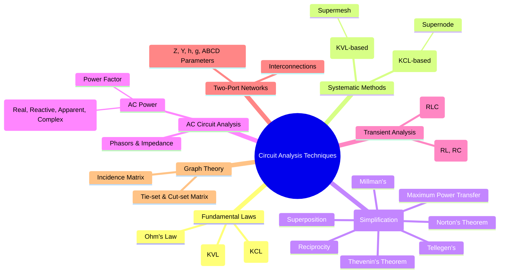

---
tags:
  - circuit-theory
  - network-analysis
  - fundamental-laws
  - network-theorems
created: 2025-09-08
aliases:
  - Network Analysis
  - Circuit Theory
  - Circuit Analysis
subject: "[[Electric Circuits]]"
parent: "[[Electric Circuits]]"
modified: 2026-07-16
---
### Circuit Analysis Techniques
#circuit-analysis #network-theory

> Circuit analysis is the process of finding all the currents and voltages in a network of connected components. It relies on a set of fundamental laws and theorems to systematically solve for the electrical behavior of a circuit, whether it is in a DC steady-state, AC steady-state, or transient condition.

---
#### Fundamental Laws
#fundamental-laws #kirchhoffs-laws #ohms-law

These are the foundational principles upon which all circuit analysis is built.
1. **[[Ohm's Law]]**: Describes the relationship between voltage, current, and resistance for a resistor.
    $$\boxed{\quad V = IR \quad}$$
2. **[[Kirchhoff's Laws#Kirchhoff's Current Law (KCL)|Kirchhoff's Current Law (KCL)]]**: Based on the conservation of charge, it states that the algebraic sum of currents entering a node (or a closed boundary) is zero.
    $$\boxed{\quad \sum_{k=1}^{n} I_k = 0 \quad}$$
3. **[[Kirchhoff's Laws#Kirchhoff's Voltage Law (KVL)|Kirchhoff's Voltage Law (KVL)]]**: Based on the conservation of energy, it states that the algebraic sum of all voltages around any closed loop in a circuit is zero.
    $$\boxed{\quad \sum_{k=1}^{n} V_k = 0 \quad}$$

---
#### Systematic Analysis Methods
#nodal-analysis #mesh-analysis

These are structured approaches for solving complex circuits using the fundamental laws.
* **[[Nodal Analysis]]**: A method based on KCL that solves for unknown node voltages with respect to a reference node. It is generally preferred for circuits with more voltage sources or fewer nodes. The **[[Supernode Analysis|supernode]]** technique is used when a voltage source exists between two non-reference nodes.
* **[[Mesh Analysis]]**: A method based on KVL that solves for fictitious mesh currents that flow in closed loops. It is suitable for planar circuits and often preferred for circuits with more current sources. The **[[Supermesh Analysis|supermesh]]** technique is used when a current source is shared between two meshes.

---
#### Network Theorems for Simplification
#network-theorems

These theorems allow for the simplification of complex linear circuits to make analysis easier.
* **[[Superposition Theorem]]**: In any linear circuit with multiple independent sources, the response (voltage or current) in any element is the algebraic sum of the responses caused by each independent source acting alone, while all other independent sources are turned off (voltage sources shorted, current sources opened).
* **[[Thevenin's Theorem]]**: Any linear two-terminal network can be replaced by an equivalent circuit consisting of a single voltage source ($V_{th}$) in series with a single impedance ($Z_{th}$).
    * $V_{th}$ is the open-circuit voltage at the terminals.
    * $Z_{th}$ is the equivalent impedance at the terminals when all independent sources are turned off.
* **[[Norton's Theorem]]**: Any linear two-terminal network can be replaced by an equivalent circuit consisting of a single current source ($I_N$) in parallel with a single impedance ($Z_N$).
    * $I_N$ is the short-circuit current through the terminals.
    * $Z_N = Z_{th}$.
    * Source Transformation: $V_{th} = I_N Z_N$.
* **[[Maximum Power Transfer Theorem]]**: For maximum power to be delivered to a load from a source network:
    * For DC circuits, the load resistance must equal the Thevenin resistance ($R_L = R_{th}$).
    * For AC circuits, the load impedance must be the complex conjugate of the Thevenin impedance ($Z_L = Z_{th}^*$).
    The maximum power delivered is:
    $$\boxed{\quad P_{max} = \frac{|V_{th}|^2}{4 R_{th}} \quad}$$
    (where $R_{th}$ is the real part of $Z_{th}$)
* **[[Reciprocity Theorem]]**: In any linear, bilateral network, the ratio of excitation to response is constant if the positions of the excitation source and the response measurement are interchanged.
* **[[Millman's Theorem]]**: Simplifies parallel branches containing voltage sources into a single equivalent voltage source and series resistance.

---
#### Analysis of AC Circuits (Sinusoidal Steady-State)
#ac-analysis #phasors #impedance

For circuits driven by sinusoidal sources in steady state, analysis is simplified by using phasors and complex impedance.
* **[[Phasors and Impedance Concept|Phasors]]**: Sinusoids are represented as complex numbers (phasors) that encode magnitude and phase. $v(t) = V_m \cos(\omega t + \phi) \Leftrightarrow \mathbf{V} = V_m e^{j\phi} = V_m \angle \phi$.
* **[[Phasors and Impedance Concept|Impedance]] ($Z$)**: The frequency-domain equivalent of resistance. It's the ratio of the phasor voltage to the phasor current, $Z = \mathbf{V}/\mathbf{I}$.
    * [[Resistors|Resistor]]: $Z_R = R$
    * [[Inductors|Inductor]]: $Z_L = j\omega L$
    * [[Capacitors|Capacitor]]: $Z_C = \frac{1}{j\omega C} = -j\frac{1}{\omega C}$
All DC analysis techniques (KCL, KVL, Nodal, Mesh, Thevenin's, etc.) apply directly to AC circuits in the frequency domain, with resistances replaced by impedances and real numbers replaced by complex numbers.

---
#### Transient Analysis
#transient-analysis #first-order-circuits #second-order-circuits

This involves analyzing the circuit's behavior during the transition period after a change in state (e.g., a switch opening or closing).
* **First-Order Circuits (RL, RC)**: Circuits containing a single energy storage element. Their response is described by a first-order differential equation and is characterized by a time constant $\tau$.
    * RC Circuit: $\tau = R_{eq}C$
    * RL Circuit: $\tau = L/R_{eq}$
* **Second-Order Circuits (RLC)**: Circuits with two energy storage elements. Their response is described by a second-order differential equation, which can be overdamped, critically damped, or underdamped depending on the circuit parameters.

---
### Related Concepts
#related-concepts

> [[Two-Port Networks]] (Characterizing circuit blocks by their terminal behavior)

[[AC Power Analysis]] (Analysis of real, reactive, and complex power)
[[Tellegen's Theorem]]
[[Transient Analysis]]
[[Resonance]] (A special condition in RLC circuits)
[[Graph Theory in Circuits]]
[[The Laplace Transform]] (A powerful mathematical tool for solving transient and steady-state responses)
[[Electric Circuits]]
