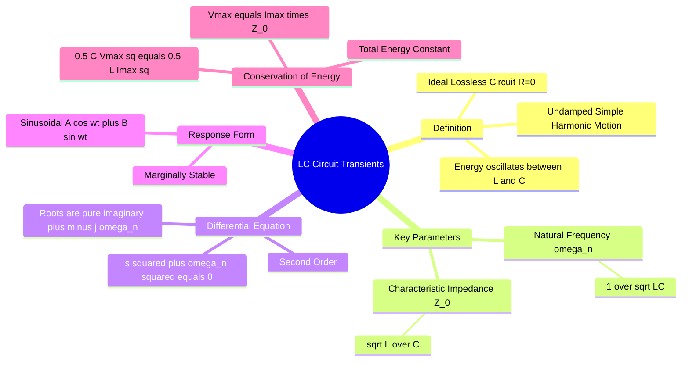

---
tags:
  - circuit-theory
  - transients
  - gate
  - oscillations
  - signals-and-systems
aliases:
  - Undamped Response
  - LC Tank Circuit
  - Lossless Oscillations
  - Natural Response of LC Circuit
  - State-Space Trajectory
subject: "[[Electric Circuits]]"
parent: "[[Switching Transients]]"
confidence: 10
---
###### Mind Map

---
### LC Circuit Transients
#circuit-theory/transients #oscillations

> ==An ideal **LC Circuit** consists of an inductor ($L$) and a capacitor ($C$) connected in a loop with **zero resistance**.== Since there is no dissipative element ($R=0$), ==energy is not lost as heat but continuously oscillates between the electric field of the capacitor and the magnetic field of the inductor==.

#### The Differential Equation
#transients/differential-equations

Consider a source-free LC circuit. Let $v(t)$ be the voltage across the capacitor and $i(t)$ be the current through the inductor.
Applying KVL:
$$v_L(t) + v_C(t) = 0$$
$$L \frac{di}{dt} + v = 0$$

Since $i = C \frac{dv}{dt}$:
$$L \frac{d}{dt}\left( C \frac{dv}{dt} \right) + v = 0$$
$$\boxed{\quad \frac{d^2v}{dt^2} + \frac{1}{LC}v = 0 \quad}$$

##### Characteristic Equation (s-domain)

$$s^2 + \frac{1}{LC} = 0 \implies s^2 = -\frac{1}{LC}$$
$$\boxed{\quad s_{1,2} = \pm j \frac{1}{\sqrt{LC}} = \pm j\omega_n \quad}$$

* **Roots:** Purely imaginary conjugate pair.
* **System Nature:** Undamped ($\zeta = 0$), **Marginally Stable**.

> [!mistake] Role of DC Source in Ideal LC Circuit
> When a DC source is connected to an ideal series LC circuit, the source does **not** supply continuous power.
> 
> At $t=0^+$, the source only:
> - sets the initial energy in the circuit, and
> - establishes initial conditions for $v_C(0^+)$ and $i_L(0^+)$.
> 
> After switching, the LC loop behaves as a **source-free system**, governed by:
> $$\frac{d^2 v}{dt^2} + \frac{1}{LC} v = 0$$
>
> > [!derivation]- Why the Circuit Acts "Source-Free" under DC Excitation
> > When a constant DC voltage $V_{DC}$ is switched into an ideal series LC circuit, the KVL equation is:
> > $$L \frac{di}{dt} + v_C = V_{DC}$$
> > 
> > To observe the dynamic behavior (the natural response), we differentiate the entire equation with respect to time $t$. Because the derivative of a constant DC source is zero, the right side vanishes:
> > $$L \frac{d^2i}{dt^2} + \frac{dv_C}{dt} = 0$$
> > 
> > Substituting the capacitor current relationship, $\frac{dv_C}{dt} = \frac{i}{C}$, we get:
> > $$L \frac{d^2i}{dt^2} + \frac{1}{C}i = 0 \implies \frac{d^2i}{dt^2} + \frac{1}{LC}i = 0$$
> > 
> > > [!memory] The Takeaway
> > > The resulting differential equation is homogeneous (equal to zero), identical to the purely source-free equation you derived for $v_c$. The DC source strictly dictates the **steady-state equilibrium** (shifting the axis of the capacitor's voltage oscillation from $0$ to $V_{DC}$), but it has absolutely no effect on the transient dynamics or the characteristic equation. 
> > > >[!pyq]- PYQ : 2018
> > > >![[ee_2018#^q31]]
> > 
> > > [!refer]
> > > [[Natural and Forced Response]]
> 
> The source voltage equals the **average capacitor voltage**, but does not damp or sustain oscillations.
> 
> Hence:
> - oscillations persist due to stored energy,
> - phase-plane trajectory remains a closed curve,
> - no steady-state DC current flows through the capacitor.

---
#### Key Parameters
#transients/parameters

1. **Natural Frequency of Oscillation ($\omega_n$):**
    $$\boxed{\quad \omega_n = \frac{1}{\sqrt{LC}} \quad \text{rad/s} \quad}$$
2. **Surge (Characteristic) Impedance ($Z_0$):**
    This relates the voltage magnitude to the current magnitude.
    $$\boxed{\quad Z_0 = \sqrt{\frac{L}{C}} \quad \Omega \quad}$$

---
#### Time Domain Response (General Formulas)
#transients/response 

The solution is of the form $v(t) = A \cos(\omega_n t) + B \sin(\omega_n t)$. The constants depend on initial conditions: $v(0) = V_0$ and $i(0) = I_0$.

**A. Case 1: Initial Charge on Capacitor only ($V_0 \neq 0, I_0 = 0$)**
*   Capacitor discharges into Inductor.
*   **Voltage:** $\boxed{\quad v(t) = V_0 \cos(\omega_n t) \quad}$
*   **Current:** $i(t) = -C \frac{dv}{dt} = C V_0 \omega_n \sin(\omega_n t)$
    $$\boxed{\quad i(t) = \frac{V_0}{Z_0} \sin(\omega_n t) \quad}$$

> [!pyq]- PYQ : 2010
> ![[ee_2010#^q54-55]]
> ![[ee_2010#^q54]]

**B. Case 2: Initial Current in Inductor only ($V_0 = 0, I_0 \neq 0$)**
*   Inductor charges Capacitor.
*   **Current:** $\boxed{\quad i(t) = I_0 \cos(\omega_n t)\quad}$
*   **Voltage:** $v(t) = L \frac{di}{dt}$ (magnitude logic).
    $$\boxed{\quad v(t) = I_0 Z_0 \sin(\omega_n t)\quad}$$

**C. General Case ($V_0$ and $I_0$ both present):**
$$v(t) = V_0 \cos(\omega_n t) + I_0 Z_0 \sin(\omega_n t)$$
$$i(t) = I_0 \cos(\omega_n t) - \frac{V_0}{Z_0} \sin(\omega_n t)$$

> [!mistake] Sign Convention Note
> Ensure the direction of $i$ and polarity of $v$ satisfy Passive Sign Convention for the component being analyzed.

---
#### Energy Conservation (GATE Shortcut)
#transients/energy

Since the system is lossless, the Total Energy ($W_{total}$) is constant at any instant $t$.
$$W_{total} = W_C(t) + W_L(t) = \text{Constant}$$
$$\frac{1}{2} C v(t)^2 + \frac{1}{2} L i(t)^2 = \text{Constant}$$

##### Maximum Values Relation

The energy oscillates. When capacitor voltage is max ($V_{max}$), inductor current is 0. When inductor current is max ($I_{max}$), capacitor voltage is 0.
$$W_{max} = \frac{1}{2} C V_{max}^2 = \frac{1}{2} L I_{max}^2$$

This gives the most important shortcut for finding peak values without solving differential equations:
$$\boxed{\quad V_{max} = I_{max} \sqrt{\frac{L}{C}} = I_{max} Z_0 \quad}$$

---
#### State-Space Trajectory
#control-system/state-space

If we plot $v(t)$ vs. $i(t)$ (State Plane):
* Since $v$ and $i$ are sinusoids phase-shifted by $90^\circ$, the trajectory is an **Ellipse** (or a Circle if normalized by $Z_0$).
* The trajectory is a **Closed Loop**, indicating the system returns to its initial state periodically (Oscillatory/Marginally Stable).

> [!concept] Normalization of State Space Trajectory via $Z_0$
> In an ideal LC circuit, plotting the raw state variables $v(t)$ vs $i(t)$ yields an **ellipse** because the peak values are asymmetric ($V_{max} = I_{max} Z_0$). 
> 
> By normalizing the current axis by the characteristic impedance ($Z_0 = \sqrt{\frac{L}{C}}$), we scale the current to have the units of voltage:
> $$x_1(t) = v(t) = V_{max} \cos(\omega_n t)$$
> $$x_2(t) = Z_0 \cdot i(t) = Z_0 \left( \frac{V_{max}}{Z_0} \sin(\omega_n t) \right) = V_{max} \sin(\omega_n t)$$
> 
> Squaring and adding both states eliminates the time variable:
> $$x_1^2 + x_2^2 = V_{max}^2 \cos^2(\omega_n t) + V_{max}^2 \sin^2(\omega_n t)$$
> $$\boxed{\quad v(t)^2 + [Z_0 \cdot i(t)]^2 = V_{max}^2 \quad}$$
> 
> **Why this matters:**
> - **Geometry:** The trajectory transforms from an **ellipse** into a **perfect circle** of radius $V_{max}$.
> - **Physical Insight:** This graphical circular symmetry perfectly reflects the constant, lossless conservation of total energy ($W_{total}$) rotating between the electric and magnetic fields.
> 
> > [!pyq]- PYQ : 2018
> > ![[ee_2018#^q31]]
> 
> > [!related]
> > [[State-Variable Analysis and Design|State Space Analysis]]
> > [[Surge Impedance and Surge Impedance Loading (SIL)]]

---
### Related Concepts
#topic/related-concepts

> [[Switching Transients]] (RL and RC circuits are damped versions)

[[Resonance]]
[[Series Resonance in RLC Circuits]] (LC resonance is the ideal limit $R \to 0$)
[[Natural and Forced Response]]
[[Characteristic Equation]]
[[State Space Analysis]]
[[Surge Impedance and Surge Impedance Loading (SIL)]] (Transmission line equivalent of $Z_0$)
