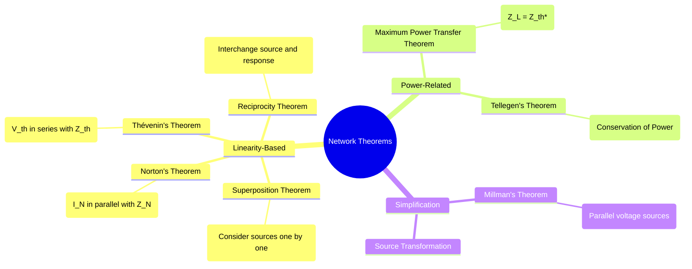

---
tags:
  - circuits
  - network-analysis
  - circuit-simplification
  - thevenin
  - norton
  - superposition
created: 2025-09-12
aliases:
  - Circuit Theorems
  - Network Simplification Theorems
subject: "[[Electric Circuits]]"
parent: "[[Electric Circuits]]"
modified: 2026-07-16
---
### Network Theorems
#network-theorems #circuit-analysis

> **Network Theorems** are a set of powerful tools and principles used to simplify the analysis of complex electrical circuits. ==They allow us to replace a complicated part of a circuit with a much simpler equivalent, making it easier to calculate voltages, currents, and power for a specific element of interest.== Most of these theorems are applicable only to **[[Linearity in Electric Circuits|linear circuits]]**.

---
#### Superposition Theorem
#superposition-theorem

**Statement**: In any linear circuit containing multiple independent sources, the current through or voltage across any element is the algebraic sum of the currents or voltages produced by each independent source acting alone.
* **Procedure**:
    1. Select one independent source to be active.
    2. Deactivate all other independent sources:
        * **Voltage Sources** are replaced by a **short circuit** (0 V).
        * **Current Sources** are replaced by an **open circuit** (0 A).
    3. **Important**: Dependent sources are left unchanged in the circuit.
    4. Calculate the desired voltage or current due to the single active source.
    5. Repeat steps 1-4 for all other independent sources.
    6. The total response is the algebraic sum of the individual responses.
* **Limitation**: This theorem cannot be used to calculate power directly, as power is a non-linear function ($P = I^2R$). Power must be calculated from the final total voltage and current.

---
#### Thévenin's and Norton's Theorems
#thevenins-theorem #nortons-theorem

These two theorems allow the simplification of any linear two-terminal network into a simple equivalent circuit.

##### Thévenin's Theorem
**Statement**: Any linear two-terminal network can be replaced by an equivalent circuit consisting of a single voltage source ($V_{th}$) in series with a single impedance ($Z_{th}$).
* **Thévenin Voltage ($V_{th}$)**: The open-circuit voltage ($V_{oc}$) measured or calculated at the terminals A-B.
* **Thévenin Impedance ($Z_{th}$)**: The equivalent impedance looking into the terminals A-B with all independent sources deactivated.
    * If the network has dependent sources, $Z_{th}$ is found by applying a test voltage/current source at the terminals: $Z_{th} = V_{test} / I_{test}$.

##### Norton's Theorem
**Statement**: Any linear two-terminal network can be replaced by an equivalent circuit consisting of a single current source ($I_N$) in parallel with a single impedance ($Z_N$).
* **Norton Current ($I_N$)**: The short-circuit current ($I_{sc}$) flowing through a short placed across terminals A-B.
* **Norton Impedance ($Z_N$)**: It is identical to the Thévenin impedance. $$\boxed{\quad Z_N = Z_{th} \quad}$$

**Source Transformation**: The Thévenin and Norton equivalents are related by source transformation:
$$\boxed{\quad V_{th} = I_N Z_{th} \quad}$$

---
#### Maximum Power Transfer Theorem
#maximum-power-transfer

**Statement**: For a DC or AC circuit, maximum power is delivered to a variable load impedance when the load impedance is the complex conjugate of the Thévenin impedance of the source network.

* **For DC Circuits**: Maximum power transfer occurs when the load resistance equals the Thévenin resistance.
    $$\boxed{\quad R_L = R_{th} \quad \implies \quad P_{max} = \frac{V_{th}^2}{4R_{th}} \quad}$$
* **For AC Circuits**: Maximum power transfer occurs when the load impedance is the complex conjugate of the Thévenin impedance.
    $$\boxed{\quad Z_L = Z_{th}^* = R_{th} - jX_{th} \quad \implies \quad P_{max} = \frac{|V_{th}|^2}{4R_{th}} \quad}$$
* **Efficiency**: The efficiency of the circuit under maximum power transfer conditions is 50%.

---
#### Other Important Theorems
#millmans-theorem #reciprocity-theorem #tellegens-theorem

* **[[Millman's Theorem]]**: Provides a method to find the common voltage across a number of parallel branches, where each branch contains a voltage source in series with an impedance.
    $$\boxed{\quad V_{ab} = \frac{\sum_{k=1}^N V_k Y_k}{\sum_{k=1}^N Y_k} = \frac{V_1/Z_1 + V_2/Z_2 + \dots}{1/Z_1 + 1/Z_2 + \dots} \quad}$$
* **[[Reciprocity Theorem]]**: In a linear, bilateral, single-source network, the ratio of excitation to response is constant when the positions of the source and the measuring instrument are interchanged.
* **[[Tellegen's Theorem]]**: For any lumped network, the algebraic sum of the power delivered to all branches at any instant is zero ($\sum_{k=1}^N v_k i_k = 0$). This is a fundamental statement of the conservation of power and is valid for any network (linear, non-linear, time-varying, etc.) as long as it obeys KCL and KVL.

---
### Related Concepts
#related-concepts

> [[AC Circuit Analysis]]

[[Transient Analysis]]
[[Source Transformation]]
[[Nodal and Mesh Analysis]]
[[Current Divider Rule]]
[[Voltage Divider Rule]]
