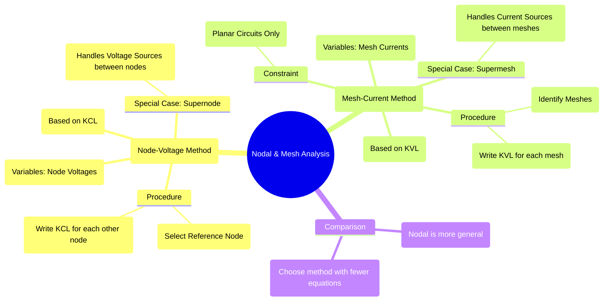

---
tags:
  - circuits
  - network-analysis
  - nodal-analysis
  - mesh-analysis
  - KCL
  - KVL
created: 2025-09-12
aliases:
  - Nodal Analysis
  - Mesh Analysis
  - Node-Voltage Method
  - Mesh-Current Method
subject: "[[Electric Circuits]]"
parent: "[[Electric Circuits]]"
confidence: 9
---

---
### Nodal and Mesh Analysis
#nodal-analysis #mesh-analysis #circuit-analysis

> **Nodal Analysis** and **Mesh Analysis** are two fundamental and systematic techniques used to determine all the voltages and currents in a linear circuit. Nodal analysis is based on Kirchhoff's Current Law (KCL) and uses node voltages as the circuit variables, while Mesh analysis is based on Kirchhoff's Voltage Law (KVL) and uses mesh currents as the variables.

---
#### Nodal Analysis (Node-Voltage Method)
#nodal-analysis #KCL

Nodal analysis provides a general procedure for analyzing circuits using node voltages as the circuit variables.
*   **Procedure**:
    1. **Identify Nodes & Reference**: Identify all the nodes in the circuit and select one as the **reference node** (ground, 0 V).
    2. **Assign Variables**: Assign a voltage variable ($v_1, v_2, \dots$) to each of the ($N-1$) non-reference nodes.
    3. **Apply KCL**: For each non-reference node, apply KCL. It's conventional to write the equations by assuming all unknown currents are leaving the node. The current flowing from node $a$ to node $b$ through impedance $Z$ is $\frac{v_a - v_b}{Z}$.
    4. **Solve**: Solve the resulting system of ($N-1$) linear equations to find the unknown node voltages.

##### Special Case: The Supernode
#supernode
A supernode is formed when a **voltage source** (either independent or dependent) is connected between two non-reference nodes.
*   **Procedure**:
    1. Treat the voltage source and the two nodes it connects as a single large node (the **supernode**).
    2. Apply KCL to this supernode, summing the currents from all branches connected to it.
    3. Form a **constraint equation** from the voltage source itself, which relates the two node voltages (e.g., $v_a - v_b = V_s$).
    This provides the necessary set of equations to solve the circuit.

---
#### Mesh Analysis (Mesh-Current Method)
#mesh-analysis #KVL

Mesh analysis provides a systematic procedure for analyzing circuits using mesh currents as the variables. This method is only applicable to **planar circuits** (circuits that can be drawn on a flat surface without any branches crossing).
*   **Procedure**:
    1. **Identify Meshes**: Identify the meshes, which are the simplest loops in the circuit (the "window panes").
    2. **Assign Variables**: Assign a mesh current ($i_1, i_2, \dots$) to each mesh, typically in a clockwise direction. The current through a branch shared by two meshes is the algebraic difference of the two mesh currents.
    3. **Apply KVL**: For each mesh, apply KVL. Sum the voltage drops and rises around the loop in the direction of the mesh current.
    4. **Solve**: Solve the resulting system of linear equations to find the unknown mesh currents.

##### Special Case: The Supermesh
#supermesh
A supermesh is formed when a **current source** is located on a branch that is common to two meshes.
*   **Procedure**:
    1. Mentally remove the branch containing the current source, creating a larger loop called a **supermesh**.
    2. Apply KVL around this supermesh path.
    3. Form a **constraint equation** from the current source itself, which relates the two mesh currents (e.g., $i_2 - i_1 = I_s$).
    This provides the necessary equations to solve the circuit.

---
#### Choosing Between Nodal and Mesh Analysis
The choice of method can simplify the analysis by reducing the number of equations that need to be solved.
* Let $N$ = number of nodes and $B$ = number of branches.
* Number of Nodal equations = $N-1$.
* Number of Mesh equations = $B - (N-1)$ (for planar circuits).

**General Guidelines**:
* Choose the method that results in the **fewer number of equations**.
* **Nodal analysis** is generally preferred for circuits with many **current sources**.
* **Mesh analysis** is often preferred for circuits with many **voltage sources**.
* Nodal analysis is more general because it can be applied to **both planar and non-planar circuits**.

---
### Related Concepts
#related-concepts

> [[Kirchhoff's Laws]] (The foundation for both methods)

[[Network Theorems]] (Alternative analysis techniques)
[[AC Circuit Analysis]] (Applying these methods with phasors and impedances)
[[Linear Algebra - System of Linear Equations]] (The mathematical method for solving the derived equations)