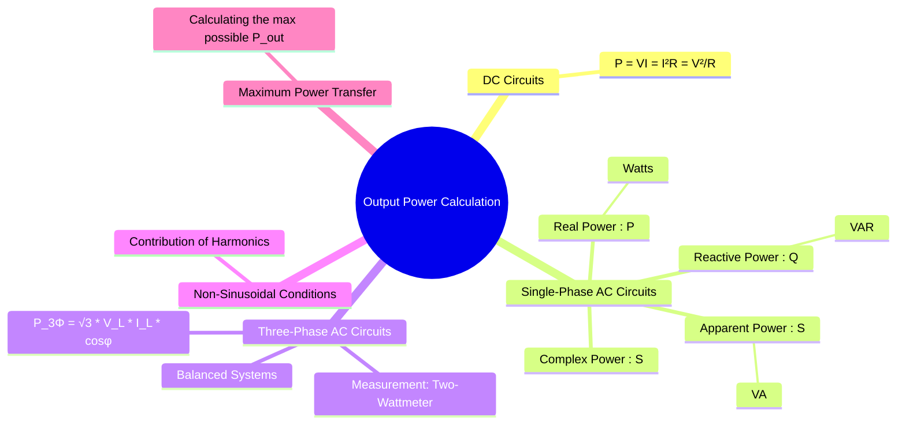

---
tags:
  - circuits
  - power-calculation
  - ac-power
  - dc-power
  - three-phase
created: 2025-09-20
aliases:
  - Power Calculation
  - Load Power
  - Power Delivered to a Load
subject: "[[Electric Circuits]]"
parent: "[[AC Power Analysis]]"
confidence: 9
---
###### Mind Map

---
### Output Power Calculation
#power-calculation #load-power

> **Output Power** is the power delivered to and consumed by a load in an electrical circuit. The method for calculating this power depends on whether the circuit is operating under DC, single-phase AC, or three-phase AC conditions.

#### DC Circuits
#dc-power

In a direct current (DC) circuit, the power ($P$) delivered to a resistive load is constant. It is calculated using one of the following fundamental formulas:
$$\boxed{\quad P = V_L \cdot I_L = I_L^2 R_L = \frac{V_L^2}{R_L} \quad}$$
where $V_L$, $I_L$, and $R_L$ are the voltage across, current through, and resistance of the load, respectively. The unit of power is **Watts (W)**.

---
#### Single-Phase AC Circuits
#ac-power #complex-power

In AC circuits, the presence of reactance leads to a phase difference between voltage and current, making power a more complex quantity.
* **Real Power (P)**: The average power consumed by the load, representing useful work.
    $$\boxed{\quad P = V_{rms} I_{rms} \cos(\phi) \quad (\text{Watts, W}) \quad}$$
* **Reactive Power (Q)**: The power exchanged with the reactive components of the load.
    $$\boxed{\quad Q = V_{rms} I_{rms} \sin(\phi) \quad (\text{Volt-Amperes Reactive, VAR}) \quad}$$
* **Apparent Power (S)**: The magnitude of the total power flowing to the load.
    $$\boxed{\quad S = V_{rms} I_{rms} \quad (\text{Volt-Amperes, VA}) \quad}$$
* **Complex Power ($\vec{S}$)**: The vector sum of real and reactive power, providing a complete power description.
    $$\boxed{\quad \vec{S} = P + jQ = \vec{V}_{rms} \vec{I}_{rms}^* \quad}$$
Here, $\phi$ is the power factor angle ($\theta_v - \theta_i$).

---
#### Three-Phase AC Circuits
#three-phase-power

For a **balanced** three-phase load, the total output power is three times the power of a single phase. The formulas are typically expressed in terms of line quantities ($V_L, I_L$). These formulas are valid for both Star (Y) and Delta ($\Delta$) connected loads.
* **Total Real Power ($P_{3\phi}$)**:
    $$\boxed{\quad P_{3\phi} = \sqrt{3} V_L I_L \cos(\phi) \quad (\text{W}) \quad}$$
* **Total Reactive Power ($Q_{3\phi}$)**:
    $$\boxed{\quad Q_{3\phi} = \sqrt{3} V_L I_L \sin(\phi) \quad (\text{VAR}) \quad}$$
* **Total Apparent Power ($S_{3\phi}$)**:
    $$\boxed{\quad S_{3\phi} = \sqrt{3} V_L I_L \quad (\text{VA}) \quad}$$
Here, $\phi$ is the power factor angle of the **load per phase**.

##### Measurement using Two-Wattmeter Method
The total real power in a three-phase system can be measured using two wattmeters. If the readings are $W_1$ and $W_2$:
* Total Real Power: $P_{3\phi} = W_1 + W_2$
* Total Reactive Power: $Q_{3\phi} = \sqrt{3} (W_1 - W_2)$

---
#### Power in Non-Sinusoidal Conditions
#harmonic-power

When a non-linear load draws a non-sinusoidal current from a sinusoidal voltage source, the current contains [[Input Current Harmonics|harmonics]].
* The total average power delivered to the load is the sum of the powers at each harmonic frequency. However, since the voltage is assumed to be purely sinusoidal (at the fundamental frequency), only the fundamental component of the current contributes to the average power.
    $$\boxed{\quad P_{total} = V_{1,rms} I_{1,rms} \cos(\phi_1) \quad}$$
* The total apparent power is calculated using the total RMS values: $S_{total} = V_{rms} I_{rms}$.
* The total reactive power is more complex and is defined by $Q = \sqrt{S^2 - P^2}$.

---
### Related Concepts
#related-concepts

> [[AC Power Analysis]] (Parent Concept)

[[Power Factor]]
[[RMS and Average Values]]
[[Three-Phase Circuits]]
[[Network Theorems#Maximum Power Transfer Theorem|Maximum Power Transfer]] (Calculating the maximum possible output power)
[[Harmonic Analysis]]
[[Efficiency]] (Ratio of output power to input power)