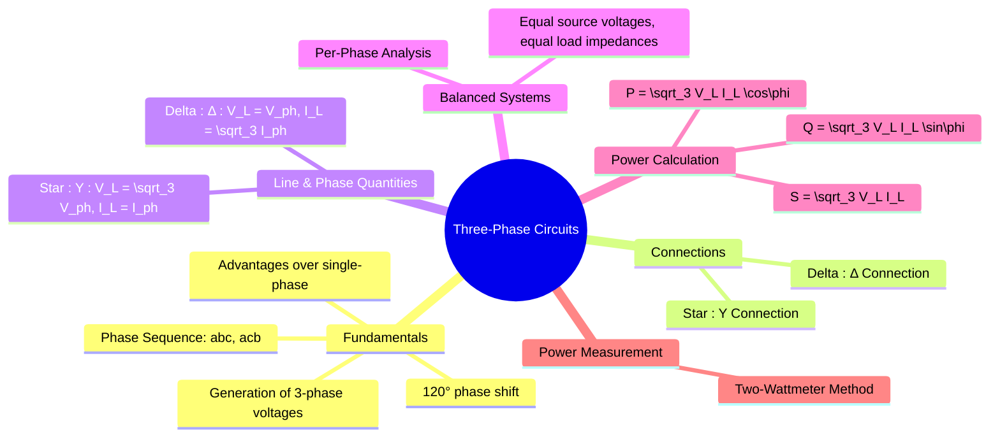

---
tags:
  - electric-circuits
  - power-systems
  - ac-circuits
  - three-phase
aliases:
  - 3-Phase Circuits
  - Three-Phase Systems
  - Power in Balanced Three-Phase Systems
created: 2025-09-11
subject: "[[Electric Circuits]]"
parent: "[[AC Circuits]]"
confidence: 9
---

---
### Three-Phase Circuits
#three-phase-circuits #polyphase-systems

> A **three-phase system** is a polyphase system for generating, transmitting, and distributing electrical power. It consists of three AC voltages of the same frequency and magnitude, but with a **120° phase difference** between each other. It is the most common method used by grids worldwide.

**Advantages over single-phase:**
1.  Delivers more power for the same amount of copper.
2.  Provides constant power delivery to the load (unlike the pulsating power in single-phase).
3.  Three-phase motors are self-starting and have a uniform torque.

---
#### Balanced Three-Phase Voltages
#balanced-3-phase #phase-sequence

In a balanced system, the three phase voltages are equal in magnitude and 120° apart.
$$\begin{align}
v_{an}(t) &= V_m \cos(\omega t) \\
v_{bn}(t) &= V_m \cos(\omega t - 120^\circ) \\
v_{cn}(t) &= V_m \cos(\omega t - 240^\circ) = V_m \cos(\omega t + 120^\circ)
\end{align}$$
The sum of these three voltages at any instant is zero: $v_{an} + v_{bn} + v_{cn} = 0$.

**Phase Sequence** is the order in which the phase voltages reach their positive peak.
*   **Positive Sequence (abc)**: The standard sequence (a-b-c). $V_{an}$ is followed by $V_{bn}$, then $V_{cn}$.
*   **Negative Sequence (acb)**: The phase order is a-c-b. This is important for rotating machines as it reverses the direction of motor rotation.

---
#### Source and Load Connections
#star-connection #delta-connection

Both the source and the load in a three-phase system can be connected in one of two configurations: **Star (Y)** or **Delta ($\Delta$)**.

*   **Phase Quantities**: Voltages or currents measured across or through a single phase of the source or load ($V_{ph}, I_{ph}$).
*   **Line Quantities**: Voltages or currents measured between the lines connecting the source and load ($V_L, I_L$).

##### Star (Y) Connection
The neutral points of the three phases are connected together.
*   **Current Relationship**: The current leaving a phase is the same as the line current.
    $$\boxed{\quad I_L = I_{ph} \quad}$$
*   **Voltage Relationship**: The line voltage is the phasor difference between two phase voltages.
    $$\boxed{\quad V_L = \sqrt{3} V_{ph} \quad \text{(Line voltage leads phase voltage by 30°)}}$$
    For example, $\mathbf{V}_{ab} = \mathbf{V}_{an} - \mathbf{V}_{bn} = (\sqrt{3}V_{ph})\angle 30^\circ$.

##### Delta ($\Delta$) Connection
The three phases are connected end-to-end, forming a closed loop.
*   **Voltage Relationship**: The voltage across a phase is the same as the voltage between the lines.
    $$\boxed{\quad V_L = V_{ph} \quad}$$
*   **Current Relationship**: The line current is the phasor difference between two phase currents.
    $$\boxed{\quad I_L = \sqrt{3} I_{ph} \quad \text{(Line current lags phase current by 30°)}}$$
    For example, $\mathbf{I}_a = \mathbf{I}_{ab} - \mathbf{I}_{ca} = (\sqrt{3}I_{ph})\angle -30^\circ$.

---
#### Power in Balanced Three-Phase Systems
#three-phase-power

For a balanced system, the total power is the same regardless of the Y or $\Delta$ connection. Let $\phi$ be the angle of the load impedance (the power factor angle).

*   **Total Average (Real) Power (P)**:
    $$\boxed{\quad P_T = 3 P_{ph} = 3 V_{ph} I_{ph} \cos\phi = \sqrt{3} V_L I_L \cos\phi \quad \text{(Watts)}}$$
*   **Total Reactive Power (Q)**:
    $$\boxed{\quad Q_T = 3 Q_{ph} = 3 V_{ph} I_{ph} \sin\phi = \sqrt{3} V_L I_L \sin\phi \quad \text{(VAR)}}$$
*   **Total Apparent Power (S)**:
    $$\boxed{\quad S_T = 3 S_{ph} = 3 V_{ph} I_{ph} = \sqrt{3} V_L I_L \quad \text{(VA)}}$$
*   **Complex Power**: $\vec{S} = P_T + jQ_T$.

---
#### Analysis of Balanced Systems: Per-Phase Analysis
#per-phase-analysis

A key advantage of balanced three-phase systems is that they can be analyzed by simplifying them into an equivalent **single-phase circuit**. This is done by considering one phase (e.g., phase 'a') connected to the neutral. All calculations are performed on this per-phase circuit, and the results for the other two phases are found by shifting the phase by $\pm 120^\circ$.
*Any $\Delta$-connected load or source is typically converted to its Y-equivalent ($Z_Y = Z_\Delta / 3$) for per-phase analysis.*

---
#### Two-Wattmeter Method for Power Measurement
#two-wattmeter-method

This is a standard method to measure the total power in any three-wire, three-phase system (balanced or unbalanced). Two wattmeters are connected as shown:
*   Current coils are in series with two of the lines (e.g., lines A and C).
*   Voltage coils are connected between their respective line and the third line (e.g., line B).

For a **balanced load** with a lagging power factor, the wattmeter readings ($W_1$ and $W_2$) can be used to find total power, reactive power, and the power factor.
*   **Total Real Power**:
    $$\boxed{\quad P_T = W_1 + W_2 \quad}$$
*   **Total Reactive Power**:
    $$\boxed{\quad Q_T = \sqrt{3} (W_2 - W_1) \quad}$$
*   **Power Factor Angle ($\phi$)**:
    $$\boxed{\quad \tan\phi = \frac{Q_T}{P_T} = \sqrt{3} \frac{W_2 - W_1}{W_1 + W_2} \quad}$$
From this, the power factor $\cos\phi$ can be calculated.

---
### Related Concepts
#related-concepts

> [[AC Power Analysis]] (Fundamental single-phase power concepts)
> [[Power System]] (Where 3-phase systems are ubiquitous)
> [[Electrical Machines]] (Most industrial motors are 3-phase)

[[AC Circuit Analysis|Phasor Analysis]]
[[Star-Delta Transformation]]
