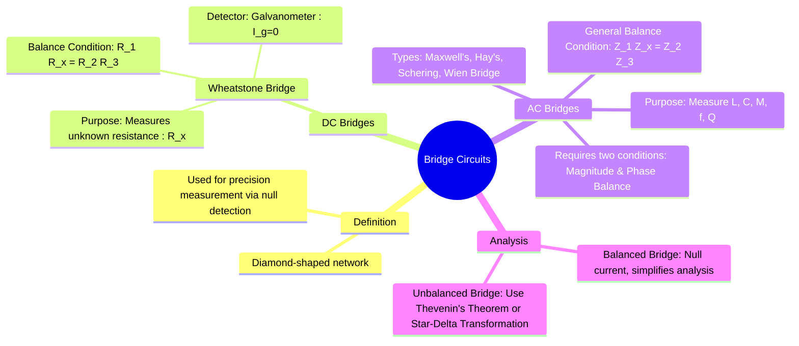

---
tags:
  - electric-circuits
  - network-analysis
  - measurements
  - wheatstone-bridge
  - ac-bridges
aliases:
  - Bridge Circuit
  - Wheatstone Bridge
  - AC Bridge
created: 2025-09-11
subject: "[[Electric Circuits]]"
parent:
  - Network Analysis Techniques
confidence: 9
trends:
  - "[[trends - Wheatstone Bridge]]"
---
###### Mind Map

---
### Bridge Circuits
#bridge-circuits #null-detection #measurement

> A **bridge circuit** is a type of electrical circuit, typically consisting of four arms in a diamond or bridge-like configuration, used to measure an unknown component value (like resistance, inductance, or capacitance) with high precision. Its operation relies on a **null-balance principle**, where an adjustable component is varied until a detector in the center of the bridge reads zero.

#### DC Bridge: The Wheatstone Bridge
#wheatstone-bridge

The Wheatstone bridge is a classic DC bridge circuit used to accurately measure an unknown electrical resistance.

##### Balance Condition
The bridge consists of four resistive arms ($R_1, R_2, R_3, R_x$) and a central branch with a galvanometer (a sensitive current detector). The bridge is said to be **balanced** when no current flows through the galvanometer ($I_g = 0$).

> See [[Wheatstone Bridge and Sensitivity Analysis]]

This occurs when the voltage at node 'a' is equal to the voltage at node 'b' ($V_a = V_b$).
Applying the [[Voltage Divider Rule]] to both parallel branches:
$$V_a = V \frac{R_3}{R_1 + R_3} \quad \text{and} \quad V_b = V \frac{R_x}{R_2 + R_x}$$
For balance, $V_a = V_b$:
$$\frac{R_3}{R_1 + R_3} = \frac{R_x}{R_2 + R_x}$$
$$R_3(R_2 + R_x) = R_x(R_1 + R_3)$$
$$R_2R_3 + R_3R_x = R_1R_x + R_3R_x$$
This simplifies to the well-known balance condition:
$$\boxed{\quad R_1 R_x = R_2 R_3 \quad}$$
or "<u>Product of opposite arms are equal</u>". To find the unknown resistance $R_x$, one of the other resistors (e.g., $R_3$) is varied until the galvanometer reads zero.

---
#### AC Bridges
#ac-bridges

AC bridges are used to measure unknown inductances, capacitances, and frequencies. They operate on the same null-balance principle as the Wheatstone bridge but use an AC source and AC detector (like headphones or a vibration galvanometer). The arms are complex impedances.

##### General Balance Condition
For an AC bridge with four impedance arms ($\mathbf{Z}_1, \mathbf{Z}_2, \mathbf{Z}_3, \mathbf{Z}_x$), the balance condition is:
$$\boxed{\quad \mathbf{Z}_1 \mathbf{Z}_x = \mathbf{Z}_2 \mathbf{Z}_3 \quad}$$
Since this is a complex equation, it implies that two conditions must be satisfied simultaneously for the bridge to be balanced:
1. **Magnitude Balance**: $|\mathbf{Z}_1| |\mathbf{Z}_x| = |\mathbf{Z}_2| |\mathbf{Z}_3|$
2. **Phase Balance**: $\angle\mathbf{Z}_1 + \angle\mathbf{Z}_x = \angle\mathbf{Z}_2 + \angle\mathbf{Z}_3$

In practice, this is solved by separating the main balance equation into its real and imaginary parts, yielding two independent equations that must both be satisfied. This allows for the measurement of two properties of a component (e.g., the inductance and resistance of a coil).

Common types are studied in [[Electrical & Electronic Measurements]], including:
* **Maxwell's Bridge**: Measures inductance.
* **Hay's Bridge**: Measures inductance of high Q-factor coils.
* **Schering Bridge**: Measures capacitance and dissipation factor.
* **Wien Bridge**: Measures frequency.

---
#### Analysis of Unbalanced Bridges
#unbalanced-bridge

When a bridge circuit is not balanced, a current $I_g$ flows through the detector. Finding this current or the voltage across the detector is a common problem. The most efficient methods for solving an unbalanced bridge are:
1. **[[Thevenin's Theorem]]**: Find the Thevenin equivalent circuit across the terminals of the galvanometer or central branch.
2. **[[Star-Delta Transformation]]**: Convert either the top or bottom star (Y) network (formed by R1-R2-Rg or R3-Rx-Rg) to a delta ($\Delta$) network, or a delta network to a star network, to simplify the circuit into series/parallel combinations.

---
### Related Concepts
#related-concepts

> [[Thevenin's Theorem]] (Crucial for analyzing unbalanced bridges)
> [[Star-Delta Transformation]] (A powerful tool for simplifying bridge topology)
> [[Electrical & Electronic Measurements]] (Where specific AC bridges are detailed)

[[Wheatstone Bridge and Sensitivity Analysis]] (application)
[[AC Circuits]]
[[Phasors and Impedance Concept|Impedance]] & [[Admittance, Conductance, and Susceptance|Admittance]]
[[Resistors]], [[Inductors]], [[Capacitors]]
