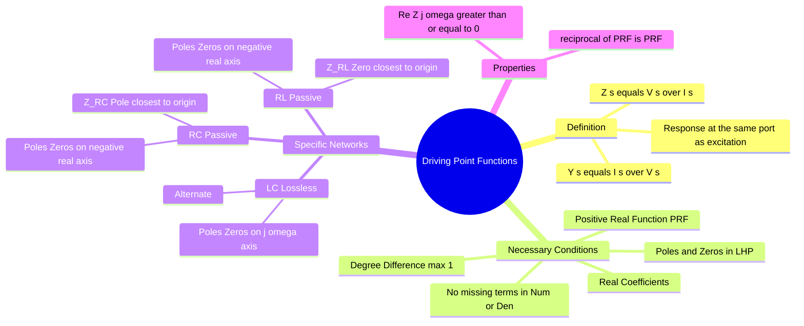

---
tags:
  - circuit-theory
  - network-theory
  - network-synthesis
  - gate
  - transfer-function
aliases:
  - Input Impedance Function
  - Input Admittance Function
  - One-Port Network Function
subject: "[[Electric Circuits]]"
parent:
  - Network Functions
confidence: 10
---

---
### Driving-Point Functions
#network-theory #circuit-analysis

> A **Driving-Point Function** (or Input Function) relates the voltage and current at the **same port** of a network. It represents the equivalent impedance or admittance seen looking into that port. It characterizes the "load" the network presents to a source.

#### Mathematical Definition
#network-functions/definition

For a one-port network (or a two-port network with one port considered), if an excitation is applied at port $j$ and the response is measured at the same port $j$:

*   **Driving-Point Impedance:**
    $$\boxed{\quad Z_{dp}(s) = Z_{jj}(s) = \frac{V_j(s)}{I_j(s)} \quad}$$
*   **Driving-Point Admittance:**
    $$\boxed{\quad Y_{dp}(s) = Y_{jj}(s) = \frac{I_j(s)}{V_j(s)} = \frac{1}{Z_{jj}(s)} \quad}$$

*Contrast:* **Transfer Functions** relate variables at *different* ports (e.g., $V_{out}/V_{in}$).

> [!warning] Input Impedance in s-domain (Universal Rule)
> To find input impedance from the primary side, first identify the input port. Convert energy storage elements to s-domain impedances ($L \to sL$, $C \to 1/(sC)$). Suppress **independent sources** (voltage → short, current → open) but **keep dependent sources active**. If any dependent source is present, apply a test source $(V_t \text{ or } I_t)$ at the input port and compute
> $$
> Z_{\text{in}}(s) = \frac{V_t(s)}{I_t(s)}
> $$
> Initial conditions are **not included** in input impedance.

---
#### Necessary Conditions (Positive Real Function)
#network-synthesis/prf

For a driving-point function to be realizable as a passive electrical network (containing R, L, C, but no independent sources or active components), it must be a **Positive Real Function (PRF)**.

**Key Properties for GATE validation:**
1.  **Polynomials:** $Z(s) = \frac{N(s)}{D(s)}$ is a ratio of polynomials with **real and positive coefficients**.
2.  **Stability:** All poles and zeros must lie in the **Left Half of the s-plane** (LHP) or on the imaginary axis. (No RHP poles/zeros).
3.  **Imaginary Axis:** Poles and zeros on the $j\omega$ axis must be **simple** (non-repeated) and have **real, positive residues**.
4.  **Degree Limit:** The highest degree of the numerator $N(s)$ and the denominator $D(s)$ can differ by at most 1.
    $$| \deg(N) - \deg(D) | \le 1$$
5.  **Lowest Degree:** The lowest degree of $N(s)$ and $D(s)$ can differ by at most 1.
6.  **Missing Terms:** In $N(s)$ or $D(s)$, no terms of intermediate powers can be missing unless all even or all odd terms are missing (like in LC networks).

---
#### Properties of Specific Passive Networks
#network-synthesis/rc-rl-lc

Identifying the type of network (LC, RC, RL) from its pole-zero plot is a high-frequency GATE question type.

**A. LC Networks (Lossless):**
*   **Location:** Poles and Zeros lie **only on the $j\omega$ axis**.
*   **Pattern:** Poles and Zeros **alternate** (interlace).
*   **Origin:** Must have either a pole or a zero at the origin ($s=0$) and infinity.
*   **Function:** Ratio of Odd/Even or Even/Odd polynomials.
*   **Slope:** $\frac{dZ(\sigma)}{d\sigma} > 0$ (Slope is always positive).

**B. RC Networks:**
*   **Location:** Poles and Zeros lie **only on the negative real axis** ($-\sigma$).
*   **Pattern:** Alternate.
*   **Impedance ($Z_{RC}$):**
    *   The critical frequency **closest to the origin is a POLE**.
    *   The critical frequency **closest to infinity is a ZERO**.
    *   $\lim_{s \to \infty} Z_{RC}(s) = \text{constant}$ or $0$.
*   **Admittance ($Y_{RC}$):** Behaves like $Z_{RL}$.

**C. RL Networks:**
*   **Location:** Poles and Zeros lie **only on the negative real axis**.
*   **Pattern:** Alternate.
*   **Impedance ($Z_{RL}$):**
    *   The critical frequency **closest to the origin is a ZERO**.
    *   The critical frequency **closest to infinity is a POLE**.

**Summary Table for Impedance $Z(s)$:**

| Network | Poles/Zeros Location | Closest to Origin | Closest to Infinity |
| :--- | :--- | :--- | :--- |
| **LC** | $j\omega$ axis | Pole or Zero | Opposite of Origin |
| **RC** | $-\sigma$ axis | **Pole** | Zero |
| **RL** | $-\sigma$ axis | **Zero** | Pole |

---
#### Example
**Question:** Which network does $Z(s) = \frac{s+2}{s+1}$ represent?
**Analysis:**
1.  **Zeros:** $s = -2$.
2.  **Poles:** $s = -1$.
3.  **Location:** Both on negative real axis.
4.  **Order:** Origin $\to$ Pole (-1) $\to$ Zero (-2) $\to \infty$.
5.  **Closest to Origin:** Pole ($s=-1$ is closer to 0 than $s=-2$).
**Conclusion:** It is an **RC Impedance**.

---
### Related Concepts
#topic/related-concepts

> [[The Transfer Function H(s)]] (The other major class of network functions)
> [[Transfer Function and Impulse Response]]

[[Two-Port Networks]]
[[Poles and Zeros]]
[[Routh-Hurwitz Stability Criterion]] (Used to test the denominator polynomial)
[[Network Synthesis]] (Foster and Cauer Forms)
[[The Laplace Transform]]
[[Test Source Method]]
[[Z-bus Matrix]]
