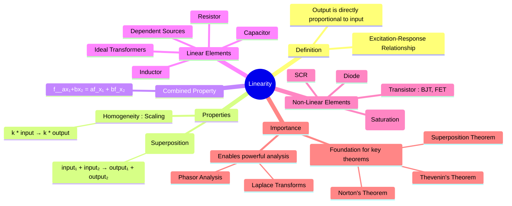

---
tags:
  - electric-circuits
  - network-theorems
  - system-properties
  - linearity
aliases:
  - Linearity Principle
  - Linear Circuit
  - Linear System
  - What is a Linear Circuit?
created: 2025-09-11
subject: "[[Electric Circuits]]"
parent: "[[Network Theorems]]"
modified: 2026-07-16
---
###### Navigation

> [!navigation]
> - [[Linearity]] (in System & Signals)

### Linearity
#linearity #system-properties

> ==**Linearity** is a fundamental property of a circuit or system where the output (response) is directly proportional to the input (excitation).== This property is the cornerstone of several major circuit analysis techniques, as it allows complex circuits to be broken down into simpler, manageable parts.

---
#### Definition of a Linear System
#linearity/definition

A circuit or element is considered linear if it satisfies the combined principles of **Homogeneity** and **Additivity**.

If an excitation (input) $x$ produces a response (output) $y$, we can write this as $y = f(x)$. For the system to be linear, the following must hold for any inputs $x_1, x_2$ and any constants $a, b$:
$$\boxed{\quad f(a x_1 + b x_2) = a f(x_1) + b f(x_2) \quad}$$
This single equation encapsulates both properties.

---
#### Properties of Linearity
#linearity/properties

##### 1. Homogeneity (Scaling Property)
#homogeneity #scaling
> This property states that if the input is scaled by a factor, the output will be scaled by the same factor.

If an input $x$ produces an output $y$, then scaling the input by a constant $k$ will result in the output being scaled by $k$.
$$\text{If } \quad x \longrightarrow y$$
$$\text{Then } \quad kx \longrightarrow ky$$
**Example**: In a purely resistive circuit, if you double the input voltage source, every current and voltage in the circuit will also double.

##### 2. Additivity (Superposition Property)
#additivity #superposition-property
> This property states that the response to a sum of inputs is the sum of the responses to each input applied individually.

If an input $x_1$ produces an output $y_1$, and a separate input $x_2$ produces an output $y_2$, then applying both inputs simultaneously ($x_1 + x_2$) will produce the summed output ($y_1 + y_2$).
$$\text{If } \quad x_1 \longrightarrow y_1 \quad \text{and} \quad x_2 \longrightarrow y_2$$
$$\text{Then } \quad (x_1 + x_2) \longrightarrow (y_1 + y_2)$$
This property is the direct basis for the [[Superposition Theorem]].

---
#### Linear vs. Non-Linear Circuit Elements
#linear-elements #non-linear-elements

*   **Linear Elements**: The V-I relationship for these elements can be described by a linear equation (a straight line passing through the origin). The ideal passive elements and dependent sources are linear.
    *   **Resistor**: $V = IR$
    *   **Inductor**: $V = L \frac{di}{dt}$
    *   **Capacitor**: $I = C \frac{dv}{dt}$
    *   **Dependent Sources**: e.g., $V = k \cdot I_x$ or $I = \beta \cdot I_x$ are linear relationships.

*   **Non-Linear Elements**: Their V-I characteristic is not a straight line.
    *   Examples include **diodes, transistors (BJTs, MOSFETs), SCRs, thermistors,** and **iron-core inductors** (which exhibit magnetic saturation).
    *   Circuit analysis theorems based on linearity cannot be applied to circuits containing these elements.

---
#### Importance in Circuit Analysis
#linearity/importance

The assumption of linearity is crucial because it allows us to use powerful and simplified analysis methods:
1.  **Superposition Theorem**: Directly derived from the additivity property.
2.  **Thevenin's Theorem**: Simplifies a linear network into a voltage source and series resistor.
3.  **Norton's Theorem**: Simplifies a linear network into a current source and parallel resistor.
4.  **Frequency-Domain Analysis**: Techniques like Phasor Analysis and [[The Laplace Transform]] are valid for circuits with linear elements, as they rely on linear differential equations.

---
### Related Concepts
#related-concepts

> [[Superposition Theorem]] (A direct application of the linearity principle)
> [[Thevenin's Theorem]] (Requires the circuit to be linear)
> [[Norton's Theorem]] (Requires the circuit to be linear)

[[Resistors]]
[[Inductors]]
[[Capacitors]]
[[Dependent Sources]]
[[Signals & Systems]] (Linearity is a core concept in system theory)
