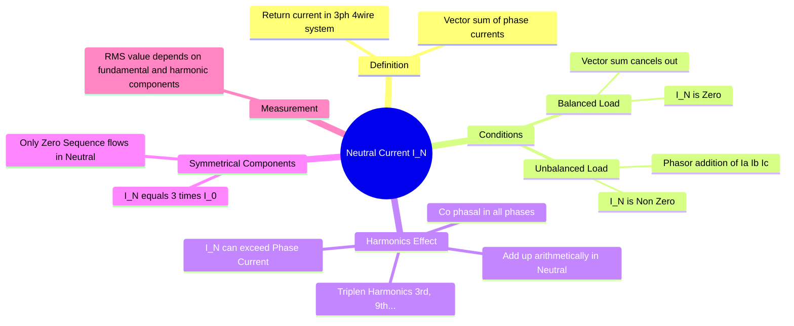

---
tags:
  - power-system
  - circuit-theory
  - three-phase
  - harmonics
  - gate
aliases:
  - Return Current
  - Zero Sequence Current Path
  - In
subject:
  - "[[Power System]]"
  - "[[2. Electric Circuits/Electric Circuits|Electric Circuits]]"
parent:
  - "[[Three-Phase Circuits]]"
confidence: 10
---
### Neutral Current in Three-Phase Systems
#three-phase/neutral #circuit-theory

> The **Neutral Current ($I_N$)** is the current flowing through the neutral conductor in a 3-phase, 4-wire Star ([[Star and Delta Connections|Wye]]) connected system. Ideally zero in balanced systems, it becomes significant in unbalanced conditions and can become dangerous in the presence of non-linear loads generating harmonics.

---
#### Fundamental Definition (Kirchhoff's Current Law)
#circuit-theory/kcl

At the star point of the load (or source), applying KCL:
$$\vec{I}_a + \vec{I}_b + \vec{I}_c + \vec{I}_N = 0$$
$$\boxed{\quad \vec{I}_N = -(\vec{I}_a + \vec{I}_b + \vec{I}_c) \quad}$$
> [!mistake] Note
> This is a **Phasor (Vector) Sum**, not an arithmetic sum.

---
#### Case A: Balanced Linear Load
If the loads are identical in impedance and power factor:
*   Magnitudes are equal: $|I_a| = |I_b| = |I_c| = I$.
*   Phase displacement is $120^\circ$.
*   $\vec{I}_N = I \angle 0^\circ + I \angle -120^\circ + I \angle 120^\circ = 0$.

> [!memory] Result
> No current flows in the neutral. The neutral wire can theoretically be removed (in a 3-wire system).

---
#### Case B: Unbalanced Linear Load
If the phase currents differ in magnitude or relative phase angle (due to unequal single-phase loads):
*   The phasor sum is **non-zero**.
*   This current returns to the source via the neutral wire.
*   **Floating Neutral:** If the neutral wire is broken (open circuit) in an unbalanced system, the star point voltage shifts (Neutral Displacement Voltage), causing over-voltage in lightly loaded phases and under-voltage in heavily loaded phases.

---
#### Case C: Non-Linear Loads (Effect of Harmonics)
#power-system/harmonics

This is a high-yield concept for GATE and practical engineering. Non-linear loads (rectifiers, computers, LED drivers) draw non-sinusoidal currents containing harmonics.
##### Analysis of Harmonic Components

Let phase currents be:
*   $i_a = I_{m1}\sin(\omega t) + I_{m3}\sin(3\omega t) + I_{m5}\sin(5\omega t) \dots$
*   $i_b = I_{m1}\sin(\omega t - 120^\circ) + I_{m3}\sin(3(\omega t - 120^\circ)) \dots$
    *   Note: $3(\omega t - 120^\circ) = 3\omega t - 360^\circ = 3\omega t$.
*   $i_c = I_{m1}\sin(\omega t + 120^\circ) + I_{m3}\sin(3(\omega t + 120^\circ)) \dots$
    *   Note: $3(\omega t + 120^\circ) = 3\omega t + 360^\circ = 3\omega t$.

---
##### Summation in Neutral

> $i_N = i_a + i_b + i_c$

1. **Fundamental & Non-Triplen Harmonics (1st, 5th, 7th...):** These form balanced sets (Positive or Negative sequence) and sum to **Zero** (assuming balanced loading).
2. **Triplen Harmonics (3rd, 9th, 15th...):**
    From the equations above, the 3rd harmonic components in all three phases are **in phase** (Co-phasal). $$i_{N(3rd)} = 3 \times I_{m3}\sin(3\omega t)$$

> [!success] Conclusion
> In a system with balanced non-linear loads, the neutral current is dominated by the 3rd harmonic. $$\boxed{\quad I_{N(rms)} \approx 3 \times I_{ph(3rd\_harmonic)} \quad}$$

> [!danger] Risk
> The neutral current can actually exceed the line current, requiring the neutral conductor to be rated **higher** (often 200%) than the phase conductors.

---
##### ⚠ Special Case: Entire waveform phase-shifted
#special-case 

If the **complete current waveform** (e.g., square wave) in each phase is
time-shifted by $120^\circ$, then harmonic-only reasoning can be misleading.

In such cases:
- Harmonic phases are determined by **time shift**, not by sequence order
- Instantaneous neutral current must be checked using:
$$ i_N(t) = i_a(t) + i_b(t) + i_c(t) $$

For 120°-shifted square waves of amplitude $I$:
- At every instant, two phases have the same sign and one the opposite sign
- Hence $|i_N(t)| = I$
$$\boxed{\quad I_{N(rms)} = I \quad}$$

This result differs from the usual “triplen harmonics add” rule.

---
#### Relation to Symmetrical Components
#symmetrical-components/zero-sequence

The neutral current provides the path for **Zero Sequence Currents** ($I_0$).
From the definition of symmetrical components:
$$I_0 = \frac{1}{3} (\vec{I}_a + \vec{I}_b + \vec{I}_c)$$
Comparing with $\vec{I}_N = \vec{I}_a + \vec{I}_b + \vec{I}_c$:

$$\boxed{\quad \vec{I}_N = 3 \vec{I}_0 \quad}$$

*   **Implication:** If there is no neutral connection (3-wire system), $I_N$ must be 0, which implies $I_0$ must be 0. Thus, **Zero Sequence currents cannot flow in a 3-wire system** (e.g., Delta connection or Star without ground).

---
#### Measuring Neutral Current

For a general unbalanced wave with harmonics:
$$I_{N(rms)} = \sqrt{I_{N(fund)}^2 + I_{N(3rd)}^2 + I_{N(5th)}^2 + \dots}$$
*   Ideally, $I_{N(fund)} \approx 0$ and $I_{N(5th)} \approx 0$.
*   Therefore, $I_{N(rms)} \approx I_{N(3rd)} = 3 I_{ph(3rd)}$.

---
### Related Concepts
#topic/related-concepts

> [[Concept of Symmetrical Components|Concept of Symmetrical Components (Positive, Negative, Zero Sequence)]]

[[Three-Phase Circuits]]
[[Harmonics in Transformers]] (Delta windings trap the triplen harmonics so they don't enter the line)
[[Neutral Grounding]]
[[Analysis of Single Line-to-Ground (LG) Fault]] (LG fault uses neutral path)
[[Analysis of Double Line-to-Ground (LLG) Fault]]
[[Total Harmonic Distortion (THD)]]
