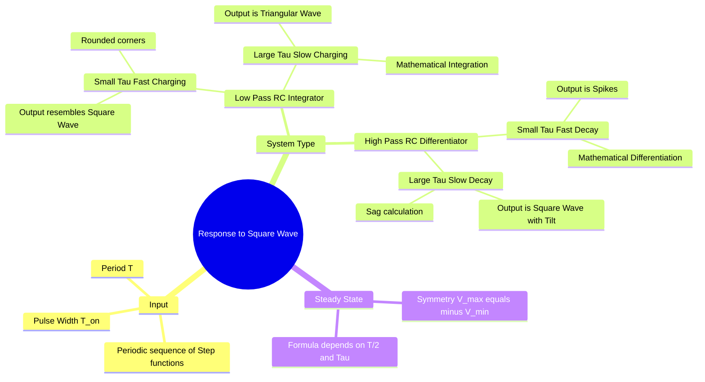

---
tags:
  - circuit-theory
  - signals-and-systems
  - analog-electronics
  - transient-response
  - gate
aliases:
  - Square Wave Response
  - RC Circuit Response to Square Wave
  - Tilt and Sag
subject:
  - "[[Electric Circuits]]"
  - "[[Analog & Digital Electronics]]"
parent:
  - Transient Response Analysis
confidence: 10
---

---
### Response to Square Wave
#circuit-theory/transients #signals-and-systems

> The response of a linear system (like an RC circuit) to a **Square Wave** is analyzed as a repetitive sequence of **Step Responses**. The shape of the output waveform is heavily dependent on the relationship between the circuit's **Time Constant ($\tau$)** and the **Pulse Width ($T_p = T/2$)** of the square wave.

> [!concept] GATE Core Insight  
> A square wave is **not treated as a frequency-domain signal** here.  
> It is analyzed as **repeated charging and discharging transients**.

---
#### Low-Pass Circuit (RC Integrator) Response
#filters/integrator

Consider a series RC circuit where the output is taken across the **Capacitor** ($V_c$).
Input switches between $+V$ and $-V$ (or $0$ to $V$) with period $T$.

**A. Small Time Constant ($\tau \ll T/2$):**
*   The capacitor charges and discharges very quickly compared to the pulse width.
*   **Waveform:** The output rises rapidly to the final value and stays there. It looks like a **Square Wave with rounded corners**.
*   **Behavior:** Acts as a faithful transmission of the pulse (Passes low frequencies).

> [!warning] Interpretation  
> Circuit behaves as a **signal follower** for slow inputs.

**B. Large Time Constant ($\tau \gg T/2$):**
*   The capacitor barely has time to charge before the input switches polarity. It operates in the initial linear portion of the exponential curve.
*   **Waveform:** The exponential rise and fall approximate straight lines. The output becomes a **Triangular Wave**.
*   **Behavior:** Acts as an **Integrator**.
    $$v_{out}(t) \approx \frac{1}{RC} \int v_{in}(t) dt$$

> [!tip] Cross-topic Link  
> This regime is identical to the **integrator approximation** used in  
> [[Integrator and Differentiator Circuits]] and [[Operational Amplifiers]].

**C. Steady-State Peak Voltage Calculation:**
For a symmetric square wave input ($\pm V_{in}$), in steady state, the output swings symmetrically between $+V_x$ and $-V_x$.
Using the step response formula:
$$V_{final} - (V_{final} - V_{initial})e^{-t/\tau}$$
$$V_x = V_{in} - (V_{in} - (-V_x))e^{-T/2\tau}$$
Solving for $V_x$:
$$\boxed{\quad V_{peak} = V_{in} \left( \frac{1 - e^{-T/2\tau}}{1 + e^{-T/2\tau}} \right) \quad}$$

> [!examtip] Exam Cue  
> This formula appears whenever **numerical peak or p-p values** are asked.

---
#### High-Pass Circuit (RC Differentiator) Response
#filters/differentiator

Consider a series RC circuit where the output is taken across the **Resistor** ($V_R$).
$V_R = V_{in} - V_C$.

**A. Small Time Constant ($\tau \ll T/2$):**
*   The capacitor charges instantly. Current flows only during the transition (edge).
*   **Waveform:** Sharp positive spikes at the rising edge and negative spikes at the falling edge.
*   **Behavior:** Acts as a **Differentiator** (Edge Detector).
    $$v_{out}(t) \approx RC \frac{d v_{in}(t)}{dt}$$

> [!warning ] Physical Meaning  
> HPF reacts to **rate of change**, not signal level.

**B. Large Time Constant ($\tau \gg T/2$):**
*   The capacitor charges very slowly. The voltage drop across the resistor drops slightly as the capacitor gains charge.
*   **Waveform:** Looks like the original Square Wave but with a slanted top. This slant is called **Tilt** or **Sag**.
*   **Behavior:** AC Coupling (Blocks DC, passes the pulse).

**C. Percentage Tilt ($P$):**
For a pulse of duration $t_p$ (or $T/2$), the voltage drops from $V_1$ to $V_2$.
$$V_2 = V_1 e^{-t_p/\tau}$$
Since $\tau \gg t_p$, use approximation $e^{-x} \approx 1 - x$:
$$V_2 \approx V_1 (1 - t_p/\tau)$$
$$\text{Tilt} = V_1 - V_2 = V_1 \frac{t_p}{\tau}$$
$$\boxed{\quad \% \text{ Tilt} = \frac{V_1 - V_2}{V_1} \times 100 \approx \frac{t_p}{\tau} \times 100 \quad}$$

> [!warning] Application Alert  
> Tilt limits are critical in **pulse transformers**, **video amplifiers**, and **digital coupling networks**.

---
#### Summary of Regimes

| System | Condition ($\tau$ vs $T/2$) | Output Waveform | Function |
| :--- | :--- | :--- | :--- |
| **Low Pass** (Across C) | $\tau \ll T/2$ | Square (Rounded) | Signal Transmission |
| **Low Pass** (Across C) | $\tau \gg T/2$ | Triangular | **Integrator** |
| **High Pass** (Across R) | $\tau \ll T/2$ | Spikes/Impulses | **Differentiator** |
| **High Pass** (Across R) | $\tau \gg T/2$ | Tilted Square | AC Coupling |

---
### Related Concepts
#topic/related-concepts

> [[Switching Transients]] (The math basis for step response)

[[Low-Pass Filter]]
[[High-Pass Filter]]
[[Fourier Series]] (Analyzing Square Wave as sum of odd harmonics: fundamental dominates for LPF)
[[Integrator and Differentiator Circuits]]
[[Operational Amplifiers]] (Active implementation of integrators)
