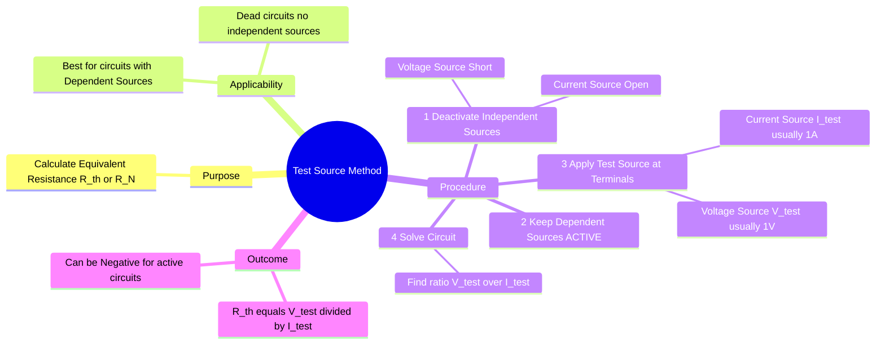

---
tags:
  - circuit-theory
  - thevenin-theorem
  - problem-solving
  - gate
aliases:
  - Method of Excitation
  - Calculating Rth with Dependent Sources
  - Test Voltage Method
subject: "[[Electric Circuits]]"
parent: "[[Thevenin's Theorem]]"
confidence: 10
---
###### Mind Map

---
### Test Source Method
#circuit-theory/thevenin #problem-solving

> The **Test Source Method** (or Method of Excitation) is the most robust technique for determining the Thevenin ($R_{th}$) or Norton ($R_N$) equivalent resistance of a network. It is **mandatory** when the circuit contains **Dependent Sources** (Controlled Sources) and is also applicable for "Dead Circuits" (circuits with no independent sources).

#### Why is it needed?
#circuit-theory/dependent-sources

Standard series-parallel reduction techniques fail when dependent sources are present because the controlling variable (e.g., $v_x$ or $i_x$) is embedded within the circuit. The dependent source behaves like a resistance (or transconductance) that cannot be simply combined.
*   **Independent Sources:** Must be deactivated (turned off).
*   **Dependent Sources:** **Must remain ACTIVE.** Their value depends on the circuit conditions created by the test source.

---
#### The Procedure
#circuit-theory/procedure

To find the equivalent resistance across terminals $a-b$:

1.  **Deactivate Independent Sources:**
    *   Replace Independent **Voltage** Sources with a **Short Circuit** ($0V$).
    *   Replace Independent **Current** Sources with an **Open Circuit** ($0A$).
2.  **Retain Dependent Sources:** Leave all diamonds (controlled sources) exactly as they are.
3.  **Apply Test Source:** Connect an external source to terminals $a-b$.
    *   **Option A (Test Voltage):** Apply a voltage source $V_{test}$ (usually $1\text{ V}$ for simplicity). Calculate the resulting current $I_{source}$ leaving the positive terminal.
    *   **Option B (Test Current):** Apply a current source $I_{test}$ (usually $1\text{ A}$). Calculate the resulting voltage $V_{ab}$ across the source.
4.  **Calculate Resistance:**
    Apply Ohm's Law to the terminals:
    $$\boxed{\quad R_{th} = R_N = \frac{V_{test}}{I_{test}} \quad}$$

---
#### Mathematical Formulation

If we apply a voltage $V_T$ and measure the current $I_T$ entering the port:

$$\begin{align}
\text{Applied} &= V_T \\
\text{Resulting} &= I_T \\
R_{th} &= \frac{V_T}{I_T}
\end{align}$$

> [!warning] GATE Calculation Tip
> * If using [[Nodal Analysis]]: Apply $I_{test} = 1\text{ A}$. Find $V_{node}$. Then $R_{th} = V_{node}/1 = V_{node}$.
> * If using [[Mesh Analysis]]: Apply $V_{test} = 1\text{ V}$. Find $I_{mesh}$. Then $R_{th} = 1/I_{mesh}$.
> * You can strictly keep variables $V$ and $I$ without assigning values (e.g., $V/I$) if the algebra is simple.

---
#### Special Case: Negative Resistance
#circuit-theory/negative-resistance

Unlike passive networks where resistance is always positive, circuits with Dependent Sources (which essentially contain active elements like Op-Amps or Transistors) can exhibit **Negative Thevenin Resistance**.
*   **Result:** If $R_{th} < 0$, it implies the circuit is supplying power to the test source rather than absorbing it.
*   This indicates the circuit is potentially active or unstable.

---
#### Dead Circuits (No Independent Sources)

If a circuit contains *only* resistors and dependent sources (no independent sources):
1.  **Open Circuit Voltage ($V_{th}$):** Always **0 V**.
2.  **Short Circuit Current ($I_{sc}$):** Always **0 A**.
3.  **Resistance ($R_{th}$):** **Non-zero**. You *must* use the Test Source Method to find it. $R_{th} \neq V_{th}/I_{sc}$ here (since $0/0$ is indeterminate).

---
### Related Concepts
#topic/related-concepts

> [[Thevenin's Theorem]]

[[Norton's Theorem]]
[[Dependent Sources]]
[[Nodal Analysis]] (Preferred method when applying Test Current)
[[Maximum Power Transfer Theorem]] (Requires calculation of $R_{th}$)
