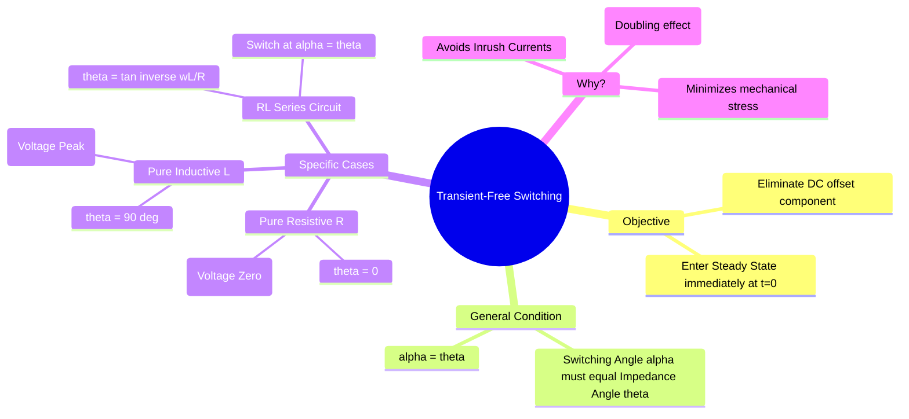

---
tags:
  - circuit-theory
  - transients
  - power-system
  - gate
  - differential-equations
aliases:
  - Transient Free Switching
  - Zero Transient Condition
  - Switching Angle Control
subject: "[[Electric Circuits]]"
parent: "[[Switching Transients]]"
confidence: 10
---

---
### Transient-Free Switching
#circuit-theory/transients #transient-free

> **Transient-Free Switching** refers to the technique of closing a switch in an AC circuit at a specific phase angle of the supply voltage such that the **natural response (transient component)** is zero, and the circuit immediately assumes its steady-state behavior. This is crucial for minimizing inrush currents in transformers and motors.

#### Mathematical Derivation (RL Series Circuit)
#transients/derivation

Consider a series RL circuit connected to a sinusoidal voltage source $v(t) = V_m \sin(\omega t + \alpha)$ at time $t=0$.
*   $\alpha$: Switching angle (Phase of voltage at $t=0$).
*   $Z = R + j\omega L = |Z| \angle \theta$.
*   $\theta = \tan^{-1}\left(\frac{\omega L}{R}\right)$.

**The Total Current Response:**
The current consists of a Transient (DC offset) component and a Steady-State (AC) component.
$$i(t) = \underbrace{A e^{-\frac{R}{L}t}}_{\text{Transient}} + \underbrace{\frac{V_m}{|Z|} \sin(\omega t + \alpha - \theta)}_{\text{Steady State}}$$

**Finding the Constant A:**
At $t=0$, assuming the inductor is initially uncharged, $i(0) = 0$.
$$0 = A \cdot e^0 + \frac{V_m}{|Z|} \sin(\alpha - \theta)$$
$$A = - \frac{V_m}{|Z|} \sin(\alpha - \theta)$$

**Condition for Zero Transient:**
For the transient to be absent, the constant $A$ must be zero.
$$A = 0 \implies \sin(\alpha - \theta) = 0$$
$$\boxed{\quad \alpha = \theta \quad}$$

> **Conclusion:** To avoid transients in an AC circuit, the switch should be closed when the **phase angle of the supply voltage ($\alpha$) is equal to the impedance angle ($\theta$)** of the load.

---
#### Specific Circuit Cases
#gate/high-yield

| Load Type | Impedance Angle ($\theta$) | Transient-Free Switching Condition ($\alpha$) | Physical Meaning |
| :--- | :--- | :--- | :--- |
| **Pure Resistive** ($R$) | $0^\circ$ | **$0^\circ$ (Voltage Zero Crossing)** | Voltage starts at 0, Current starts at 0. No conflict. |
| **Pure Inductive** ($L$) | $90^\circ$ | **$90^\circ$ (Voltage Peak)** | In steady state, purely inductive current lags voltage by $90^\circ$. At Voltage Peak ($90^\circ$), steady-state current passes through **Zero**. Since initial current is zero, they match perfectly. |
| **RL Series** | $0 < \theta < 90^\circ$ | **$\alpha = \tan^{-1}(\frac{\omega L}{R})$** | Somewhere between zero crossing and peak. |
| **Pure Capacitive** ($C$) | $-90^\circ$ | **$0^\circ$ or voltage match** | For uncharged C, switch at $V=0$ to avoid $i = C dv/dt \to \infty$. (Note: This logic differs slightly from RL; usually we look at limiting inrush). |

---
#### Maximum Transient Condition
#transients/worst-case

Conversely, the worst-case transient (maximum DC offset) occurs when the sine term is maximum ($\pm 1$).
$$\sin(\alpha - \theta) = \pm 1$$
$$\alpha - \theta = \pm 90^\circ$$
$$\boxed{\quad \alpha = \theta \pm 90^\circ \quad}$$

*   **For Pure Inductor ($\theta = 90^\circ$):** Worst case is switching at $\alpha = 0^\circ$ (Voltage Zero).
    *   This causes the "Doubling Effect" of flux/current.
    *   $i(t)$ will start at 0, rise to $2 \times I_{max}$, and oscillate (if undamped) or decay to steady state.
    *   This is why **Transformers** (highly inductive) should **NOT** be switched on at voltage zero.

---
#### Summary for GATE Problems
1.  **Identify the Load:** Is it R, L, or RL?
2.  **Calculate $\theta$:** Find the impedance angle $\tan^{-1}(X_L/R)$.
3.  **Check Question:**
    *   If asking for "Transient Free": Set Supply Phase = $\theta$.
    *   If asking for "Maximum Inrush/Transient": Set Supply Phase = $\theta \pm 90^\circ$.

---
### Related Concepts
#topic/related-concepts

> [[Switching Transients]]

[[Natural and Forced Response]]
[[Inductance of Single-phase and Three-phase Lines]]
[[Transformer Construction and Core]] (Inrush current phenomenon)
[[Circuit Breakers]] (Zero crossing interruption vs Switching instant)
