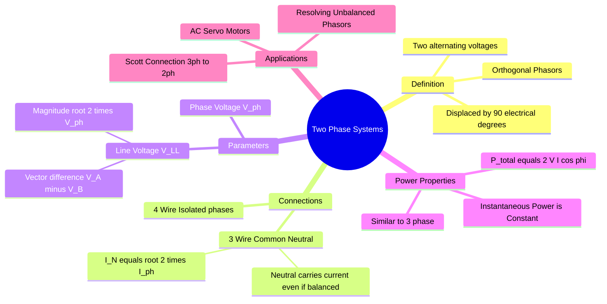

---
tags:
  - circuit-theory
  - polyphase-systems
  - electrical-machines
  - gate
  - control-system
aliases:
  - 2-Phase System
  - Quadrature Phase System
  - Quarter Phase System
subject: "[[Electric Circuits]]"
parent:
  - "[[Three-Phase Circuits]]"
confidence: 10
---
### Two-Phase Systems
#circuit-theory/polyphase

> A **Two-Phase System** is a polyphase AC system where two alternating voltages of the same frequency and magnitude are produced, but they are displaced from each other by **$90^\circ$** (electrical). While less common than 3-phase systems for transmission, they are theoretically important and widely used in control systems (Servo Motors).

---
#### Phasor Representation
#phasor/two-phase

Let the two phases be Phase A and Phase B.
*   **Phase A:** $\mathbf{V}_A = V_m \angle 0^\circ$
*   **Phase B:** $\mathbf{V}_B = V_m \angle -90^\circ$ (Lagging)

The voltages are orthogonal (Quadrature).
$$v_a(t) = V_m \cos(\omega t)$$
$$v_b(t) = V_m \cos(\omega t - 90^\circ) = V_m \sin(\omega t)$$

---
#### Three-Wire Two-Phase System
#circuit-theory/connections

In this configuration, the two phases share a **common neutral return** conductor.

**A. Line Voltage ($V_{LL}$):**
The voltage between the outer wires (Phase A and Phase B) is the vector difference:
$$\mathbf{V}_{AB} = \mathbf{V}_A - \mathbf{V}_B$$
$$\mathbf{V}_{AB} = V \angle 0^\circ - V \angle -90^\circ = V - (-jV) = V(1 + j)$$
$$\mathbf{V}_{AB} = \sqrt{2} V \angle 45^\circ$$

$$\boxed{\quad V_{line} = \sqrt{2} V_{phase} \quad}$$

**B. Neutral Current ($I_N$):**
This is a critical difference compared to 3-phase systems.
Applying KCL at the neutral point for a **Balanced Load** (Impedance $Z$ per phase):
*   $\mathbf{I}_A = I \angle -\phi$
*   $\mathbf{I}_B = I \angle (-90^\circ - \phi)$
*   $\mathbf{I}_N = -(\mathbf{I}_A + \mathbf{I}_B)$ (Phasor sum returning to source)

Magnitude Calculation:
$$|\mathbf{I}_N| = \sqrt{I^2 + I^2} = \sqrt{2}I$$

$$\boxed{\quad I_{N(balanced)} = \sqrt{2} I_{ph} \quad}$$

> **GATE Trap:** In a balanced 3-phase star system, the neutral current is **Zero**. In a balanced 2-phase 3-wire system, the neutral current is **$\sqrt{2}$ times the phase current**. Thus, the neutral wire must be thicker than the phase wires.

---
#### Power in Two-Phase Systems
#power-system/power

Similar to 3-phase systems, 2-phase systems provide **Constant Instantaneous Power** to a balanced load (unlike single-phase, which creates pulsating power).

**Total Power:**
$$P_{total} = P_A + P_B$$
$$\boxed{\quad P_{total} = 2 V_{ph} I_{ph} \cos \phi \quad}$$

**Proof of Constant Power:**
$$p(t) = v_a i_a + v_b i_b$$
$$p(t) = V_m \cos(\omega t) I_m \cos(\omega t - \phi) + V_m \sin(\omega t) I_m \sin(\omega t - \phi)$$
Using trig identities ($\cos A \cos B + \sin A \sin B = \cos(A-B)$):
$$p(t) = V_m I_m \cos(\omega t - (\omega t - \phi)) = V_m I_m \cos \phi$$
This is a constant DC value. This results in smooth torque in 2-phase motors.

---
#### Applications and Generation
#electrical-machines/applications

1.  **AC Servo Motors:**
    *   Used extensively in control systems.
    *   Stator has two windings: **Reference Winding** (fixed voltage) and **Control Winding** (variable voltage, $90^\circ$ phase shift).
    *   The 2-phase supply creates a rotating magnetic field.
2.  **Scott Connection (T-T Connection):**
    *   Used to convert **3-Phase supply to 2-Phase supply** (or vice versa).
    *   Uses a Main Transformer and a Teaser Transformer.
    *   Standard method to power 2-phase electric furnaces or motors from the utility grid.

---
### Related Concepts
#topic/related-concepts

> [[Three-Phase Circuits]] (Standard Polyphase system)

[[Exhaustive Formulas - Three-Phase Transformer]] (Details on Scott Connection)
[[AC Servo Motor]] (Primary application of 2-phase theory)
[[Algebra of Complex Numbers]]
[[Symmetrical Components]] (2-phase concepts are used when resolving dq0 frames)
