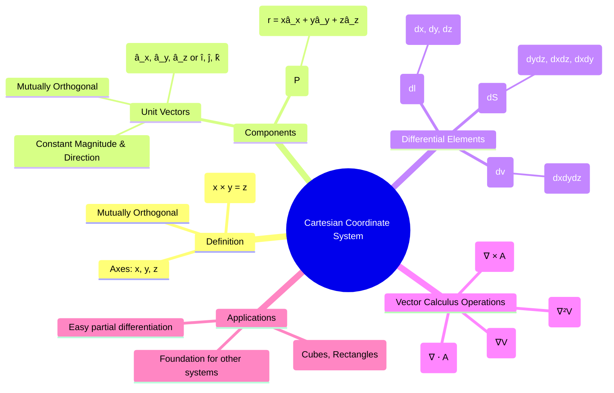

---
tags:
  - coordinate-systems
  - vector-calculus
  - electromagnetics
  - math
created: 2025-10-17
aliases:
  - Rectangular Coordinate System
  - x-y-z system
subject: "[[Electromagnetic Fields]]"
parent: Vector Analysis and Coordinate Systems
modified: 2026-08-04T09:16:32
---
### Cartesian Coordinate System
#coordinate-systems #vector-analysis #cartesian

> The **Cartesian** or **Rectangular Coordinate System** is the most fundamental system for specifying the position of a point in space. It uses three mutually perpendicular axes (x, y, z) that intersect at the origin (0, 0, 0). It follows the **right-hand rule**: if you curl the fingers of your right hand from the positive x-axis to the positive y-axis, your thumb points in the direction of the positive z-axis.

---
#### Representation of a Point and a Vector
#vector-representation #unit-vectors

A point $P$ is represented by an ordered triplet of coordinates $(x_P, y_P, z_P)$. The position of this point relative to the origin is described by the **position vector** $\vec{P}$.

The system is defined by three **base vectors** or **unit vectors**: $\hat{a}_x, \hat{a}_y, \hat{a}_z$ (often written as $\hat{i}, \hat{j}, \hat{k}$).
- They are mutually orthogonal: $\hat{a}_x \cdot \hat{a}_y = \hat{a}_y \cdot \hat{a}_z = \hat{a}_z \cdot \hat{a}_x = 0$.
- They have unit magnitude: $|\hat{a}_x| = |\hat{a}_y| = |\hat{a}_z| = 1$.
- **Crucially, their direction is constant and does not change with position.**

A **position vector** $\vec{P}$ from the origin to a point $P(x,y,z)$ is given by:
$$\boxed{\quad \vec{P} = x\hat{a}_x + y\hat{a}_y + z\hat{a}_z \quad}$$
A general **vector field** $\vec{A}$ in Cartesian coordinates has components that are functions of $(x, y, z)$:
$$\boxed{\quad \vec{A} = A_x(x,y,z)\hat{a}_x + A_y(x,y,z)\hat{a}_y + A_z(x,y,z)\hat{a}_z \quad}$$

#### Differential Elements
#differential-elements #vector-calculus

Differential elements are fundamental for performing line, surface, and volume integrals in vector calculus.
1.  **Differential Length ($d\vec{l}$)**: A differential displacement vector.
    $$\boxed{\quad d\vec{l} = dx\,\hat{a}_x + dy\,\hat{a}_y + dz\,\hat{a}_z \quad}$$

2.  **Differential Surface Area ($d\vec{S}$)**: A vector with magnitude equal to the area and direction normal to the surface.
    *   Surface normal to $\hat{a}_x$ (constant x plane): $d\vec{S}_x = dy\,dz\,\hat{a}_x$
    *   Surface normal to $\hat{a}_y$ (constant y plane): $d\vec{S}_y = dx\,dz\,\hat{a}_y$
    *   Surface normal to $\hat{a}_z$ (constant z plane): $d\vec{S}_z = dx\,dy\,\hat{a}_z$

3.  **Differential Volume ($dv$)**: A scalar volume element.
    $$\boxed{\quad dv = dx\,dy\,dz \quad}$$

#### Vector Operations in Cartesian Coordinates
#gradient #divergence #curl #laplacian

The simplicity of the Cartesian system is reflected in the straightforward expressions for vector calculus operators. Let $V$ be a scalar field and $\vec{A}$ be a vector field.

1.  **Gradient ($\nabla V$)**: The maximum spatial rate of change of a scalar field.
    $$\boxed{\quad \nabla V = \frac{\partial V}{\partial x}\hat{a}_x + \frac{\partial V}{\partial y}\hat{a}_y + \frac{\partial V}{\partial z}\hat{a}_z \quad}$$

2.  **Divergence ($\nabla \cdot \vec{A}$)**: The net outward flux per unit volume.
    $$\boxed{\quad \nabla \cdot \vec{A} = \frac{\partial A_x}{\partial x} + \frac{\partial A_y}{\partial y} + \frac{\partial A_z}{\partial z} \quad}$$

3.  **Curl ($\nabla \times \vec{A}$)**: The circulation of a vector field per unit area. It is most easily expressed as a determinant:
    $$\boxed{\quad \nabla \times \vec{A} = \begin{vmatrix} \hat{a}_x & \hat{a}_y & \hat{a}_z \\ \frac{\partial}{\partial x} & \frac{\partial}{\partial y} & \frac{\partial}{\partial z} \\ A_x & A_y & A_z \end{vmatrix} \quad}$$
    $$\begin{align}
    \nabla \times \vec{A} = \left(\frac{\partial A_z}{\partial y} - \frac{\partial A_y}{\partial z}\right)\hat{a}_x + \left(\frac{\partial A_x}{\partial z} - \frac{\partial A_z}{\partial x}\right)\hat{a}_y + \left(\frac{\partial A_y}{\partial x} - \frac{\partial A_x}{\partial y}\right)\hat{a}_z
    \end{align}$$

4.  **Laplacian ($\nabla^2 V$)**: The divergence of the gradient of a scalar field.
    $$\boxed{\quad \nabla^2 V = \nabla \cdot (\nabla V) = \frac{\partial^2 V}{\partial x^2} + \frac{\partial^2 V}{\partial y^2} + \frac{\partial^2 V}{\partial z^2} \quad}$$

---
### Related Concepts
#cartesian/related-concepts

> [[Vector Analysis and Coordinate Systems]]

[[Cylindrical Coordinate System]]
[[Spherical Coordinate System]]
[[Coordinate Transformations]]
[[Gradient of a Scalar Field]]
[[Divergence of a Vector Field]]
[[Curl of a Vector Field]]
[[Laplacian of a Scalar Field]]