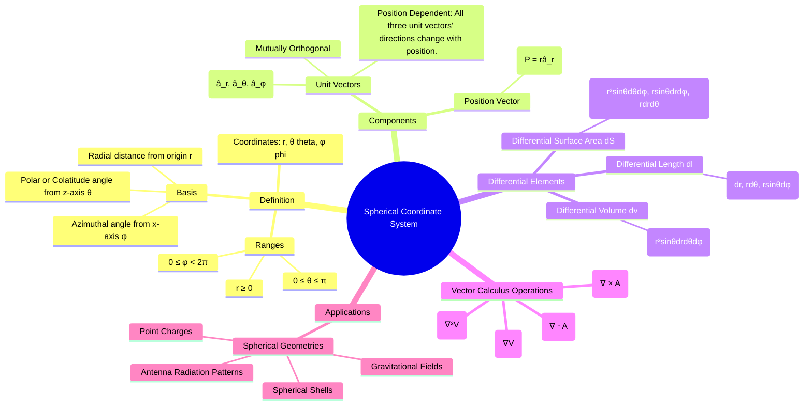

---
tags:
  - coordinate-systems
  - vector-calculus
  - electromagnetics
  - math
created: 2025-10-17
aliases:
  - Spherical Coordinates
subject: "[[Electromagnetic Fields]]"
parent:
  - Vector Analysis and Coordinate Systems
modified: 2026-08-04T10:32:51
---
### Spherical Coordinate System
#coordinate-systems #vector-analysis #spherical

> The **Spherical Coordinate System** is essential for problems with spherical symmetry, such as the fields from point charges, spherical charge distributions, and antenna radiation patterns. It specifies a point $P$ in space by its radial distance from the origin ($r$), a polar angle from the z-axis ($\theta$), and an azimuthal angle from the x-axis ($\phi$).

![[Spherical Coordinate System.png]]

A point $P$ is represented by the triplet $(r, \theta, \phi)$, where:
- $r$: The radial distance from the origin to the point. $0 \le r < \infty$.
- $\theta$: The polar (or colatitude) angle, measured from the positive z-axis. $0 \le \theta \le \pi$.
- $\phi$: The azimuthal angle, measured from the positive x-axis in the x-y plane (same as in cylindrical). $0 \le \phi < 2\pi$.

---
#### Representation of a Point and a Vector
#vector-representation #unit-vectors

The system is defined by three mutually orthogonal unit vectors: $\hat{a}_r, \hat{a}_\theta, \hat{a}_\phi$.
- $\hat{a}_r$: Points radially outward from the origin.
- $\hat{a}_\theta$: Points in the direction of increasing $\theta$, tangential to the sphere.
- $\hat{a}_\phi$: Points in the direction of increasing $\phi$, tangential to the sphere.

> [!warning] Important Note
> The directions of all three unit vectors ($\hat{a}_r, \hat{a}_\theta, \hat{a}_\phi$) are position-dependent, changing as the point $(r, \theta, \phi)$ moves. This adds complexity to vector calculus operations.

A **position vector** $\vec{P}$ from the origin to a point $P(r,\theta,\phi)$ is simply:
$$\boxed{\quad \vec{P} = r\hat{a}_r \quad}$$
A general **vector field** $\vec{A}$ in spherical coordinates is:
$$\boxed{\quad \vec{A} = A_r(r,\theta,\phi)\hat{a}_r + A_\theta(r,\theta,\phi)\hat{a}_\theta + A_\phi(r,\theta,\phi)\hat{a}_\phi \quad}$$

---
#### Differential Elements
#differential-elements #vector-calculus

1.  **Differential Length ($d\vec{l}$)**: Represents displacements along the coordinate directions. The arc lengths in the $\theta$ and $\phi$ directions are $r d\theta$ and $r\sin\theta d\phi$ respectively.
    $$\boxed{\quad d\vec{l} = dr\,\hat{a}_r + r\,d\theta\,\hat{a}_\theta + r\sin\theta\,d\phi\,\hat{a}_\phi \quad}$$

2.  **Differential Surface Area ($d\vec{S}$)**:
    *   Surface of a sphere (constant $r$): $d\vec{S}_r = r^2\sin\theta\,d\theta\,d\phi\,\hat{a}_r$
    *   Surface of a cone (constant $\theta$): $d\vec{S}_\theta = r\sin\theta\,dr\,d\phi\,\hat{a}_\theta$
    *   Surface of a half-plane (constant $\phi$): $d\vec{S}_\phi = r\,dr\,d\theta\,\hat{a}_\phi$

3.  **Differential Volume ($dv$)**:
    $$\boxed{\quad dv = r^2\sin\theta\,dr\,d\theta\,d\phi \quad}$$
    The term $r^2\sin\theta$ is the Jacobian of the transformation from Cartesian coordinates.

---
#### Vector Operations in Spherical Coordinates
#gradient #divergence #curl #laplacian

1.  **Gradient ($\nabla V$)**:
    $$\boxed{\quad \nabla V = \frac{\partial V}{\partial r}\hat{a}_r + \frac{1}{r}\frac{\partial V}{\partial \theta}\hat{a}_\theta + \frac{1}{r\sin\theta}\frac{\partial V}{\partial \phi}\hat{a}_\phi \quad}$$

2.  **Divergence ($\nabla \cdot \vec{A}$)**:
    $$\boxed{\quad \nabla \cdot \vec{A} = \frac{1}{r^2}\frac{\partial (r^2 A_r)}{\partial r} + \frac{1}{r\sin\theta}\frac{\partial (A_\theta \sin\theta)}{\partial \theta} + \frac{1}{r\sin\theta}\frac{\partial A_\phi}{\partial \phi} \quad}$$

3.  **Curl ($\nabla \times \vec{A}$)**:
    $$\boxed{\quad \nabla \times \vec{A} = \frac{1}{r^2\sin\theta} \begin{vmatrix} \hat{a}_r & r\hat{a}_\theta & r\sin\theta\hat{a}_\phi \\ \frac{\partial}{\partial r} & \frac{\partial}{\partial \theta} & \frac{\partial}{\partial \phi} \\ A_r & r A_\theta & r\sin\theta A_\phi \end{vmatrix} \quad}$$
    $$\begin{align}
    \nabla \times \vec{A} &= \frac{1}{r\sin\theta}\left[\frac{\partial(A_\phi\sin\theta)}{\partial\theta} - \frac{\partial A_\theta}{\partial\phi}\right]\hat{a}_r \\
    &+ \frac{1}{r}\left[\frac{1}{\sin\theta}\frac{\partial A_r}{\partial\phi} - \frac{\partial(rA_\phi)}{\partial r}\right]\hat{a}_\theta \\
    &+ \frac{1}{r}\left[\frac{\partial(rA_\theta)}{\partial r} - \frac{\partial A_r}{\partial\theta}\right]\hat{a}_\phi
    \end{align}$$

4.  **Laplacian ($\nabla^2 V$)**:
    $$\boxed{\quad \nabla^2 V = \frac{1}{r^2}\frac{\partial}{\partial r}\left(r^2 \frac{\partial V}{\partial r}\right) + \frac{1}{r^2\sin\theta}\frac{\partial}{\partial \theta}\left(\sin\theta \frac{\partial V}{\partial \theta}\right) + \frac{1}{r^2\sin^2\theta}\frac{\partial^2 V}{\partial \phi^2} \quad}$$

---
### Related Concepts
#spherical/related-concepts

> [[Vector Analysis and Coordinate Systems]]

[[Cartesian Coordinate System]]
[[Cylindrical Coordinate System]]
[[Coordinate Transformations]]
[[Coulomb's Law]]
[[Electric Dipole and Dipole Moment]]
[[Gauss's Law]]
[[Laplace's Equation]]