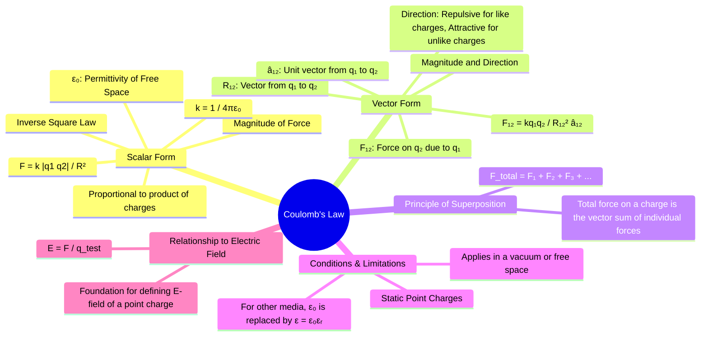

---
tags:
  - electrostatics
  - fundamental-laws
  - force
  - coulomb
created: 2025-10-17
aliases:
  - Coulomb's Law
  - Electrostatic Force
subject: "[[Electromagnetic Fields]]"
parent:
  - Electrostatics
modified: 2026-08-04T09:28:49
---
### Coulomb's Law
#coulombs-law #electrostatic-force #inverse-square-law

> **Coulomb's Law** is the fundamental experimental law of electrostatics that quantifies the amount of force between two stationary, electrically charged particles (point charges). It states that the force is directly proportional to the product of the magnitudes of the charges and inversely proportional to the square of the distance between them.

> [!prerequisite] Prerequisites
> [[Vector Operations]]
> Properties of Electric Charge

---
#### Scalar Form
#coulombs-law/scalar-form

The scalar form of Coulomb's Law gives the **magnitude** of the electrostatic force $F$ between two point charges $q_1$ and $q_2$ separated by a distance $R$.
$$\boxed{\quad F = k \frac{|q_1 q_2|}{R^2} \quad}$$
where:
-   $k$ is the Coulomb's constant, $k = \frac{1}{4\pi\varepsilon_0} \approx 9 \times 10^9 \, \text{N}\cdot\text{m}^2/\text{C}^2$.
-   $\varepsilon_0$ is the **permittivity of free space**, $\varepsilon_0 \approx 8.854 \times 10^{-12} \, \text{F/m}$.
-   The force acts along the straight line joining the two charges. It is **repulsive** if the charges have the same sign and **attractive** if they have opposite signs.

This relationship is an **inverse-square law**, meaning the force weakens rapidly with distance.

#### Vector Form
#coulombs-law/vector-form

To describe both the magnitude and direction of the force, the vector form is essential. The force $\vec{F}_{12}$ exerted **on charge $q_2$ by charge $q_1$** is given by:
$$\boxed{\quad \vec{F}_{12} = \frac{1}{4\pi\varepsilon_0} \frac{q_1 q_2}{R_{12}^2} \hat{a}_{12} \quad}$$
where:
-   $\vec{R}_{12} = \vec{r}_2 - \vec{r}_1$ is the vector from the position of $q_1$ to the position of $q_2$.
-   $R_{12} = |\vec{R}_{12}|$ is the distance between the charges.
-   $\hat{a}_{12} = \frac{\vec{R}_{12}}{R_{12}}$ is the unit vector pointing from $q_1$ to $q_2$.

**Directionality:**
-   If $q_1$ and $q_2$ have the same sign ($q_1q_2 > 0$), $\vec{F}_{12}$ is in the direction of $\hat{a}_{12}$ (**repulsive**).
-   If $q_1$ and $q_2$ have opposite signs ($q_1q_2 < 0$), $\vec{F}_{12}$ is in the opposite direction of $\hat{a}_{12}$ (**attractive**).
Note that by Newton's third law, the force on $q_1$ due to $q_2$ is $\vec{F}_{21} = -\vec{F}_{12}$.

#### Principle of Superposition for Electrostatic Forces
#superposition-principle

If there are more than two charges, the net force on any one charge is the **vector sum** of the forces exerted on it by all other charges. For a charge $q$ at position $\vec{r}$ in the presence of $N$ other charges $q_i$ at positions $\vec{r}_i$:
$$\begin{align}
\vec{F}_{\text{net on } q} &= \sum_{i=1}^{N} \vec{F}_{iq} \\
 &= \frac{q}{4\pi\varepsilon_0} \sum_{i=1}^{N} \frac{q_i}{|\vec{r} - \vec{r}_i|^2} \hat{a}_{iq}
\end{align}$$
where $\hat{a}_{iq}$ is the unit vector from charge $q_i$ to charge $q$.

---
### Related Concepts
#coulombs-law/related-concepts

> [[Electric Field Intensity (E)]] (Defined as force per unit charge, $\vec{E} = \vec{F}/q$, and is derived from Coulomb's Law for a point charge)

[[Gauss's Law]]
[[Electric Potential and Potential Difference (V)]]
[[Electric Field due to Continuous Charge Distributions]]
[[Lorentz Force Equation]]
[[Vector Operations]]
[[Electrostatics]]