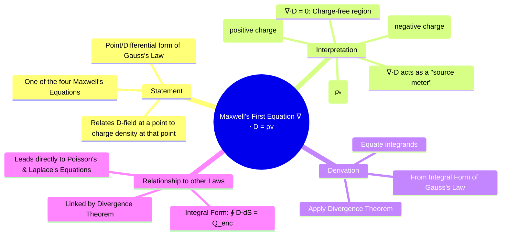

---
tags:
  - electrostatics
  - maxwells-equations
  - gausss-law
  - vector-calculus
created: 2025-10-17
aliases:
  - Gauss's Law (Point Form)
  - Gauss's Law (Differential Form)
  - ∇ ⋅ D = ρv
subject: "[[Electromagnetic Fields]]"
parent:
  - Electrostatics
modified: 2026-08-04T10:01:02
---
### Maxwell's First Equation (Electrostatics)
#maxwells-equations #gausss-law #divergence

> **Maxwell's First Equation** is the differential (or point) form of Gauss's Law. It provides a local, point-by-point relationship between the electric flux density and the distribution of electric charge. It is one of the four fundamental equations that govern all classical electromagnetic phenomena.

---
#### Statement of the Law
#gausss-law/differential-form #charge-density

The equation states that the divergence of the electric flux density vector $\vec{D}$ at any point is equal to the free volume charge density $\rho_v$ at that same point.
$$\boxed{\quad \nabla \cdot \vec{D} = \rho_v \quad}$$
where:
-   $\nabla \cdot \vec{D}$ is the [[Divergence of a Vector Field|divergence]] of the electric flux density.
-   $\rho_v$ is the free volume charge density (in C/m³).

#### Physical Interpretation
#divergence #source-sink

This equation provides a profound physical insight: **Free electric charge is the source of the electric flux density field.**
-   A point where $\rho_v > 0$ (a positive charge) is a **source** of $\vec{D}$ field lines; the field lines diverge from this point.
-   A point where $\rho_v < 0$ (a negative charge) is a **sink** for $\vec{D}$ field lines; the field lines converge to this point.
-   A region where $\rho_v = 0$ is charge-free. In this region, $\nabla \cdot \vec{D} = 0$, which means the field is **solenoidal**—field lines may pass through the region, but they do not start or end there.

The divergence operator $\nabla \cdot$ acts as a "source meter," detecting the presence and strength of charge density at every point in space.

#### Derivation from Integral Form
#divergence-theorem #derivation

Maxwell's First Equation can be derived directly from the integral form of [[Gauss's Law|Gauss's Law]] using the [[Gauss's Divergence Theorem|Divergence Theorem]].
1.  Start with Gauss's Law in integral form:
    $$\oint_S \vec{D} \cdot d\vec{S} = Q_{\text{enclosed}} = \iiint_V \rho_v dv$$
2.  Apply the Divergence Theorem to the left side, converting the closed surface integral into a volume integral:
    $$\oint_S \vec{D} \cdot d\vec{S} = \iiint_V (\nabla \cdot \vec{D}) dv$$
3.  Now equate the two volume integrals:
    $$\iiint_V (\nabla \cdot \vec{D}) dv = \iiint_V \rho_v dv$$
4.  Since this equality must hold for any arbitrary volume $V$, the integrands themselves must be equal at every point. This leads to the differential form:
    $$\nabla \cdot \vec{D} = \rho_v$$

#### Relation to Poisson's and Laplace's Equations
#poissons-equation #laplaces-equation

This equation is the foundation for deriving [[Poisson's Equation]] and [[Laplace's Equation]].
$$\begin{align}
\nabla \cdot \vec{D} &= \rho_v \\
\text{Substitute } \vec{D} &= \varepsilon\vec{E} \quad \implies \quad \nabla \cdot (\varepsilon\vec{E}) = \rho_v \\
\text{Substitute } \vec{E} &= -\nabla V \quad \implies \quad \nabla \cdot (-\varepsilon\nabla V) = \rho_v \\
\text{If } \varepsilon \text{ is constant} \quad &\implies \quad -\varepsilon(\nabla \cdot \nabla V) = \rho_v \\
\text{Since } \nabla^2V = \nabla \cdot \nabla V \quad &\implies \quad \boxed{\nabla^2 V = -\frac{\rho_v}{\varepsilon}} \quad \text{(Poisson's Equation)}
\end{align}$$
In a charge-free region ($\rho_v=0$), this simplifies to Laplace's Equation: $\nabla^2 V = 0$.

---
### Related Concepts
#maxwells-equations/related-concepts

> [[Gauss's Law]] (The integral form from which this is derived)

[[Electric Flux Density (D)]]
[[Divergence of a Vector Field]]
[[Gauss's Divergence Theorem]]
[[Poisson's Equation]]
[[Laplace's Equation]]
[[Maxwell's Equations in Final Form]]