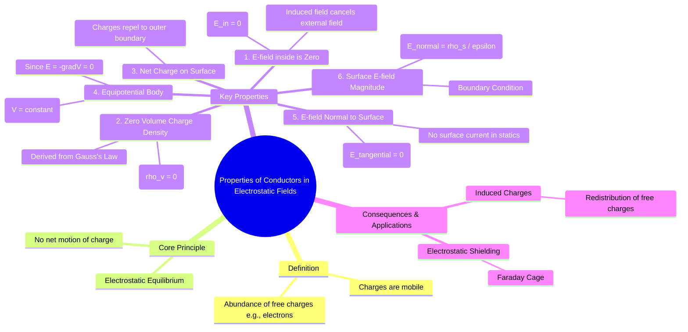

---
tags:
  - electrostatics
  - conductors
  - electromagnetic-fields
  - faraday-cage
created: 2025-10-17
aliases:
  - Electrostatic Properties of Conductors
  - Conductors in Electrostatic Fields
subject: "[[Electromagnetic Fields]]"
parent:
  - Electrostatics
modified: 2026-08-04T10:18:32
---
### Properties of Conductors in an Electrostatic Field
#electrostatics/conductors #electric-field #equipotential

> A conductor is a material with a large number of free charges (typically electrons) that are not bound to individual atoms and are free to move throughout the material. When a conductor is placed in an external electrostatic field, these free charges redistribute themselves to reach a state of **electrostatic equilibrium**, where there is no net motion of charge within the conductor. This redistribution leads to several fundamental properties.

The key principle is that for a system to be in electrostatic equilibrium, the net force on every free charge within the conductor must be zero. This implies the electric field inside the conductor must be zero.

---
#### 1. Electric Field Inside a Conductor is Zero ($E_{in} = 0$)
#conductor/internal-field #electrostatic-equilibrium

Under static conditions, the net electric field inside the volume of a conducting material is zero.
- **Reasoning**: If a non-zero electric field existed inside the conductor, it would exert a force ($\vec{F} = q\vec{E}$) on the free charges, causing them to move. This movement of charge would constitute a current, which contradicts the assumption of electrostatic equilibrium (no net motion of charge).
- The free charges rearrange themselves (creating an internal induced field) to perfectly cancel the external applied field throughout the conductor's interior.
$$\boxed{\quad \vec{E}_{in} = 0 \quad}$$

---
#### 2. Zero Volume Charge Density ($\rho_v = 0$)
#conductor/charge-density

The net volume charge density inside a conductor in electrostatic equilibrium is zero.
- **Derivation**: This is a direct consequence of the electric field being zero. From Maxwell's first equation (Gauss's law in point form), we have $\nabla \cdot \vec{E} = \frac{\rho_v}{\varepsilon}$.
$$\begin{align}
\because \quad \vec{E}_{in} &= 0 \\
\therefore \quad \nabla \cdot \vec{E}_{in} &= 0 \\
\implies \quad \frac{\rho_v}{\varepsilon} &= 0 \implies \rho_v = 0
\end{align}$$
$$\boxed{\quad \rho_v = 0 \quad}$$

---
#### 3. Net Charge Resides on the Surface
#conductor/surface-charge

Since the volume charge density ($\rho_v$) is zero, any net charge placed on an isolated conductor must reside entirely on its outer surface. The mutual repulsion of like charges forces them to move as far apart as possible, which is the surface of the conductor.

---
#### 4. Conductor is an Equipotential
#conductor/equipotential

The entire conductor (both its surface and its interior volume) is at the same electric potential.
- **Derivation**: The relationship between electric field and potential is $\vec{E} = -\nabla V$. Since $\vec{E} = 0$ everywhere inside the conductor:
$$\nabla V = 0$$
This implies that the potential $V$ does not change with position; it is a constant.
$$\boxed{\quad V = \text{constant} \quad}$$
Because the electric field is zero within the conductor, no work is done in moving a test charge from one point to another inside the conductor or on its surface.

---
#### 5. Electric Field is Perpendicular to the Surface
#conductor/surface-field-direction

The electric field just outside a conductor's surface must be normal (perpendicular) to the surface at every point.
- **Reasoning**: If there were a tangential component of the electric field ($E_t$) along the surface, it would exert a force on the surface charges, causing them to move along the surface. This would create a surface current, violating the static condition. Therefore, the tangential component must be zero.
$$\boxed{\quad E_t = 0 \quad}$$
The field can only have a normal component, $\vec{E} = E_n \hat{a}_n$.

---
#### 6. Surface Electric Field and Charge Density
#boundary-conditions #surface-charge-density

The magnitude of the normal component of the electric field just outside a conductor is directly proportional to the surface charge density ($\rho_s$) at that point.
- **Derivation**: Applying Gauss's law to a small cylindrical "pillbox" that straddles the surface, with one face inside the conductor ($E=0$) and one face just outside.
$$\begin{align}
\oint_S \vec{D} \cdot d\vec{S} &= Q_{enc} \\
D_n \Delta S &= \rho_s \Delta S \\
D_n &= \rho_s
\end{align}$$
Since $\vec{D} = \varepsilon \vec{E}$, we get:
$$\boxed{\quad E_n = \frac{\rho_s}{\varepsilon} \quad}$$
where $\varepsilon$ is the permittivity of the medium just outside the conductor.

---
#### Application: Electrostatic Shielding (Faraday Cage)
#faraday-cage #electrostatic-shielding

A direct and important application of these principles is electrostatic shielding.
- A closed conducting shell (a Faraday cage) shields its interior from external static electric fields.
- When an external field is applied, the charges on the conductor's outer surface rearrange to ensure that the field inside the conducting material is zero.
- Because the conductor is an equipotential, the potential in the cavity enclosed by the conductor is also constant, meaning the electric field inside the hollow region is zero (assuming no charges are placed inside the cavity).

---
### Related Concepts
#topic/related-concepts

> [[Boundary Conditions for Electrostatic Fields]]

[[Gauss's Law]]
[[Electric Potential and Potential Difference (V)]]
[[Electric Field Intensity (E)]]
[[Dielectric Materials and Polarization]]
[[Capacitance and Calculation of Capacitance]]
[[Method of Images]]
