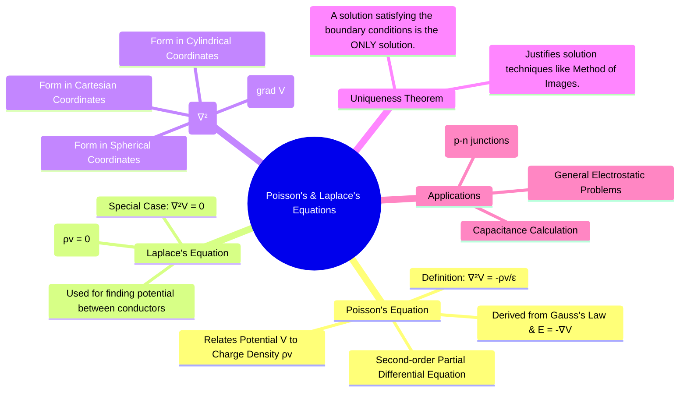

---
tags:
  - electrostatics
  - pde
  - potential-theory
  - electromagnetic-fields
created: 2025-10-17
aliases:
  - Poisson's Law
subject: "[[Electromagnetic Fields]]"
parent:
  - Electrostatics
formula:
  - "Poisson's Equation (PDEs) : $$\\nabla^2 V = -\\frac{\\rho_v}{\\varepsilon}$$"
modified: 2026-08-04T10:14:09
---
### Poisson's Equation
#electrostatics/potential #pde #poissons-equation

> **Poisson's equation** is a fundamental partial differential equation in electrostatics that provides a relationship between the electric potential ($V$) and the volume charge density ($\rho_v$) at any point in a region. It allows us to calculate the potential field if the charge distribution is known.

---
#### Derivation
#poissons-equation/derivation

Poisson's equation is derived from two fundamental electrostatic principles:
1.  **Gauss's Law (Point Form)**: Relates the divergence of the electric flux density $\vec{D}$ to the volume charge density $\rho_v$.
    $$\nabla \cdot \vec{D} = \rho_v$$
2.  **Electric Field as Gradient of Potential**: The static electric field $\vec{E}$ is conservative and can be expressed as the negative gradient of the scalar potential $V$.
    $$\vec{E} = -\nabla V$$

For a linear and isotropic medium, we have the constitutive relation $\vec{D} = \varepsilon \vec{E}$. Combining these equations:
$$\begin{align}
\nabla \cdot (\varepsilon \vec{E}) &= \rho_v \\
\nabla \cdot (-\varepsilon \nabla V) &= \rho_v
\end{align}$$
If the medium is also homogeneous, the permittivity $\varepsilon$ is constant and can be taken out of the divergence operator:

$$\begin{align}
-\varepsilon (\nabla \cdot \nabla V) &= \rho_v \\
\nabla^2 V &= -\frac{\rho_v}{\varepsilon}
\end{align}$$
This is **Poisson's Equation**. The operator $\nabla^2$ (del-squared) is the **Laplacian operator**.
$$\boxed{\quad \nabla^2 V = -\frac{\rho_v}{\varepsilon} \quad}$$

> [!pyq]- PYQ : 2019
> ![[ee_2019#^q3]]

---
#### Laplace's Equation
#laplaces-equation

**Laplace's equation** is a special case of Poisson's equation that applies to a **charge-free region**, where the volume charge density $\rho_v = 0$.
$$\boxed{\quad \nabla^2 V = 0 \quad}$$
This equation is extremely important for finding the potential in the space between conductors (e.g., in capacitors, vacuum tubes, or electron guns) where there is no free charge. Solutions to Laplace's equation are known as **harmonic functions**.

---
#### Laplacian Operator ($\nabla^2$) in Different Coordinate Systems
#laplacian-operator

The mathematical form of the Laplacian operator depends on the coordinate system being used.

*   **Cartesian (x, y, z):**
    $$\nabla^2 V = \frac{\partial^2 V}{\partial x^2} + \frac{\partial^2 V}{\partial y^2} + \frac{\partial^2 V}{\partial z^2}$$
*   **Cylindrical ($\rho, \phi, z$):**
    $$\nabla^2 V = \frac{1}{\rho}\frac{\partial}{\partial \rho}\left(\rho \frac{\partial V}{\partial \rho}\right) + \frac{1}{\rho^2}\frac{\partial^2 V}{\partial \phi^2} + \frac{\partial^2 V}{\partial z^2}$$
*   **Spherical ($r, \theta, \phi$):**
    $$\nabla^2 V = \frac{1}{r^2}\frac{\partial}{\partial r}\left(r^2 \frac{\partial V}{\partial r}\right) + \frac{1}{r^2 \sin\theta}\frac{\partial}{\partial \theta}\left(\sin\theta \frac{\partial V}{\partial \theta}\right) + \frac{1}{r^2 \sin^2\theta}\frac{\partial^2 V}{\partial \phi^2}$$

---
#### Uniqueness Theorem
#uniqueness-theorem

The **Uniqueness Theorem** states that a solution to Poisson's or Laplace's equation that satisfies the given boundary conditions for a region is the one and only (unique) solution for that region.
- **Importance**: If we can find a solution by any means (including educated guessing or using techniques like the Method of Images) and it satisfies the boundary conditions, we are guaranteed that it is the correct and only solution.

---
### Related Concepts
#topic/related-concepts

> [[Laplace's Equation]]
> [[Uniqueness Theorem]]

[[Gauss's Law]]
[[Electric Potential and Potential Difference (V)]]
[[Gradient of a Scalar Field]]
[[Divergence of a Vector Field]]
[[Method of Images]]
[[Boundary Conditions for Electrostatic Fields]]