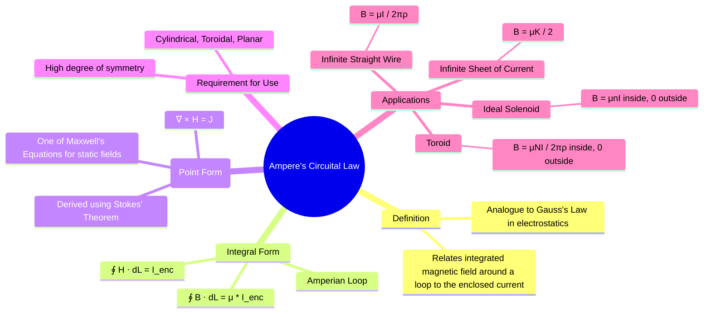

---
tags:
  - magnetostatics
  - ampere-law
  - maxwells-equations
  - electromagnetic-fields
created: 2025-10-17
aliases:
  - Ampere's Law
  - Ampere's Circuital Law and its Applications
subject: "[[Electromagnetic Fields]]"
parent:
  - Magnetostatics
formula:
  - "Ampere's Circuital Law : $$\\oint_L \\vec{H} \\cdot d\\vec{l} = I_{enc}$$"
  - "Ampere's Circuital Law (for linear, homogeneous media) : $$\\oint_L \\vec{B} \\cdot d\\vec{l} = \\mu I_{enc}$$"
  - "Ampere's Circuital Law (Differential (Point) Form) : $$\\nabla \\times \\vec{H} = \\vec{J}$$"
modified: 2026-07-22T10:42:21
---

---
### Ampere's Circuital Law
#magnetostatics/ampere-law #maxwells-equations

> **Ampere's Circuital Law** is a fundamental law of magnetostatics that relates the integrated magnetic field around a closed loop to the electric current passing through that loop. It is the magnetic equivalent of Gauss's Law, providing a simple method for calculating magnetic fields in situations with high symmetry.

---
#### Integral Form
#ampere-law/integral-form

Ampere's Law states that the [[Line Integrals|line integral]] of the [[Magnetic Field Intensity (H)|magnetic field intensity]] $\vec{H}$ around any closed path (called an **Amperian loop**) is equal to the net free current $I_{enc}$ enclosed by that path.
$$\boxed{\quad \oint_L \vec{H} \cdot d\vec{l} = I_{enc} \quad}$$
The enclosed current $I_{enc}$ is the net current passing through the surface S bounded by the path L, and can be calculated by:
$$I_{enc} = \int_S \vec{J} \cdot d\vec{S}$$
For linear, homogeneous media, where $\vec{B} = \mu\vec{H}$, the law can be written in terms of the magnetic flux density $\vec{B}$:
$$\oint_L \vec{B} \cdot d\vec{l} = \mu I_{enc}$$

---
#### Differential (Point) Form
#ampere-law/differential-form

The differential form of Ampere's Law relates the magnetic field at a point to the current density at that same point. It can be derived from the integral form using **[[Stokes' Theorem]]**.
By Stokes' Theorem, $\oint_L \vec{H} \cdot d\vec{l} = \int_S (\nabla \times \vec{H}) \cdot d\vec{S}$. Equating this with the integral of the current density gives:
$$\int_S (\nabla \times \vec{H}) \cdot d\vec{S} = \int_S \vec{J} \cdot d\vec{S}$$
For this to hold true for any surface S, the integrands must be equal.
$$\boxed{\quad \nabla \times \vec{H} = \vec{J} \quad}$$
This is the **third of Maxwell's equations for static fields**. It states that a static magnetic field has a non-zero curl in the presence of a current.

---
#### Condition for Application
#ampere-law/symmetry

Ampere's Law is always true, but it is only useful for calculating magnetic fields in problems with a high degree of symmetry. To use the integral form, we must be able to choose an Amperian loop L such that:
1.  The magnetic field intensity $\vec{H}$ is constant in magnitude along the loop (or segments of it).
2.  The vector $\vec{H}$ is either tangential or normal to the path at every point.
This simplifies the line integral $\oint \vec{H} \cdot d\vec{l}$ to a simple multiplication (e.g., $H \times \text{Length}$).

---
### Applications of Ampere's Law
#ampere-law/applications

##### 1. Infinite Straight Conductor

-   **Symmetry**: Cylindrical.
-   **Amperian Loop**: A concentric circle of radius $\rho$.
-   **Calculation**: $\oint \vec{H} \cdot d\vec{l} = H_\phi(2\pi\rho) = I_{enc} = I$.
-   **Result**: $H_\phi = \frac{I}{2\pi\rho} \implies \vec{B} = \frac{\mu I}{2\pi\rho}\hat{a}_\phi$.

##### 2. Ideal Solenoid

An ideal solenoid is infinitely long with tightly wound coils.
-   **Symmetry**: The field is uniform inside and zero outside.
-   **Amperian Loop**: A rectangular path with one side inside the solenoid (length L) and the other far outside.
-   **Calculation**: $\oint \vec{H} \cdot d\vec{l} = H L = I_{enc} = NI$, where N is the number of turns over length L.
-   **Result**: $H = \frac{N}{L}I = nI$ (where $n$ is turns/meter). $\vec{B} = \mu n I$ (inside).

##### 3. Toroid

A toroid is a solenoid bent into a circle (donut shape).
-   **Symmetry**: The field is confined within the core and is circular.
-   **Amperian Loop**: A concentric circle of radius $\rho$ inside the core.
-   **Calculation**: $\oint \vec{H} \cdot d\vec{l} = H_\phi(2\pi\rho) = I_{enc} = NI$, where N is the total number of turns.
-   **Result**: $H_\phi = \frac{NI}{2\pi\rho}$. $\vec{B} = \frac{\mu N I}{2\pi\rho}\hat{a}_\phi$ (inside core).

##### 4. Infinite Surface Current Sheet

An infinite current sheet carrying a uniform surface current density $\vec K$ produces a **constant magnetic field intensity** on either side of the sheet, independent of distance.

For a surface with unit normal vector $\hat a_n$, the magnetic field intensity is given by:
$$\boxed{\quad \vec H = \frac{1}{2}\,(\vec K \times \hat a_n) \quad}$$

The direction of $\vec H$ is obtained using the right-hand rule applied to $\vec K \times \hat a_n$.

The magnetic flux density is:
$$
\vec B = \mu \vec H
$$

---
### Related Concepts
#topic/related-concepts

> [[Biot-Savart's Law]]
> [[Magnetic Field Intensity (H)]]
> [[Maxwell's Equation from Ampere's Law]]

[[Magnetic Field of Finite and Infinite Conductors]]
[[Stokes' Theorem]]
[[Gauss's Law]]
[[Inconsistency of Ampere's Law for Time-Varying Fields]]
