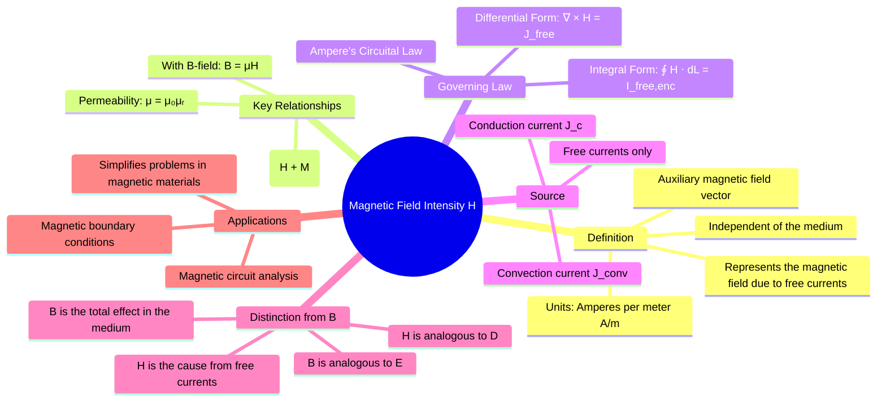

---
tags:
  - magnetostatics
  - magnetic-field
  - permeability
  - ampere-law
  - electromagnetic-fields
created: 2025-10-17
aliases:
  - H-field
  - Magnetic Field Strength
subject: "[[Electromagnetic Fields]]"
parent:
  - Magnetostatics
formula:
  - "Relationship between B and Magnetic Field Intensity (H) : $$\\vec{B} = \\mu \\vec{H}$$"
  - "Permeability : $$\\mu = \\mu_0 \\mu_r$$"
  - "Permeability of free space : $$\\mu_0 = 4\\pi \\times 10^{-7}$$"
  - "Relationship between B and Magnetic Field Intensity (H) : $$\\vec{B} = \\mu_0(\\vec{H} + \\vec{M})$$"
modified: 2026-07-22T10:20:59
---
### Magnetic Field Intensity ($\vec{H}$)
#magnetostatics/H-field #magnetic-field-strength

> The **Magnetic Field Intensity**, denoted by $\vec{H}$, is an auxiliary magnetic field vector used in magnetostatics. Its primary purpose is to represent the magnetic field produced solely by macroscopic **free currents**, independent of the magnetic properties of the material in which the field exists.

While the [[Magnetic Flux Density (B)|magnetic flux density]] $\vec{B}$ is the fundamental field that determines the force on a moving charge, the $\vec{H}$-field is extremely useful for analyzing problems involving magnetic materials. Its unit is **Amperes per meter (A/m)**.

---
#### Relationship between $\vec{B}$ and $\vec{H}$
#permeability #B-H-relation

For linear, isotropic, and homogeneous (LIH) materials, the magnetic flux density $\vec{B}$ is directly proportional to the magnetic field intensity $\vec{H}$.
$$\boxed{\quad \vec{B} = \mu \vec{H} \quad}$$
where $\mu$ is the **permeability** of the material. Permeability is defined as:
$$\mu = \mu_0 \mu_r$$
-   $\mu_0$ is the permeability of free space, $\mu_0 = 4\pi \times 10^{-7}$ H/m.
-   $\mu_r$ is the dimensionless **relative permeability** of the material.

A more general relationship, which includes the effect of magnetization $\vec{M}$ (the magnetic dipole moment per unit volume of the material), is:
$$\boxed{\quad \vec{B} = \mu_0(\vec{H} + \vec{M}) \quad}$$
From this, we see that $\vec{H}$ accounts for the external free currents, while $\vec{M}$ accounts for the material's internal response (bound currents).

---
#### Source of the $\vec{H}$-field: Ampere's Law
#ampere-law-for-H

The source of the $\vec{H}$-field is free current. This relationship is defined by **Ampere's Circuital Law**, which is one of Maxwell's equations for magnetostatics.

*   **Integral Form**: The line integral of $\vec{H}$ around any closed path is equal to the net free current ($I_{f,enc}$) enclosed by that path.
    $$\boxed{\quad \oint_L \vec{H} \cdot d\vec{l} = I_{f,enc} \quad}$$
*   **Differential (Point) Form**: The curl of $\vec{H}$ at any point is equal to the free current density ($\vec{J}_f$) at that point.
    $$\boxed{\quad \nabla \times \vec{H} = \vec{J}_f \quad}$$
The power of using $\vec{H}$ is evident here: we can calculate it directly from the free currents we control (e.g., current in a wire), without needing to know the permeability of the surrounding materials beforehand.

---
#### Distinction Between $\vec{B}$ and $\vec{H}$

| Feature                     | **$\vec{B}$ (Magnetic Flux Density)**                               | **$\vec{H}$ (Magnetic Field Intensity)**                               |
| --------------------------- | ------------------------------------------------------------------- | --------------------------------------------------------------------- |
| **Definition**              | The fundamental magnetic field; defines force on a charge.          | An auxiliary field representing the effect of free currents.          |
| **Units**                   | Tesla (T) or Webers/m² (Wb/m²)                                      | Amperes/meter (A/m)                                                   |
| **Source**                  | All currents: free currents ($\vec{J}_f$) + bound currents ($\vec{J}_b$). | Only free currents ($\vec{J}_f$).                                     |
| **Governing Law (Curl)**    | $\nabla \times \vec{B} = \mu_0(\vec{J}_f + \vec{J}_b)$ (General)             | $\nabla \times \vec{H} = \vec{J}_f$                                    |
| **Dependence on Medium**    | Depends on the permeability ($\mu$) of the medium.                  | Defined independently of the medium's magnetic properties.            |
| **Electrostatic Analogy**   | Analogous to Electric Field Intensity ($\vec{E}$).                   | Analogous to Electric Flux Density ($\vec{D}$).                        |

---
### Related Concepts
#topic/related-concepts

> [[Magnetic Flux Density (B)]]
> [[Ampere's Circuital Law]]

[[Biot-Savart's Law]]
[[Magnetic Boundary Conditions]]
[[Maxwell's Equation from Ampere's Law]]
[[Electric Flux Density (D)]]
[[Lorentz Force Equation]]