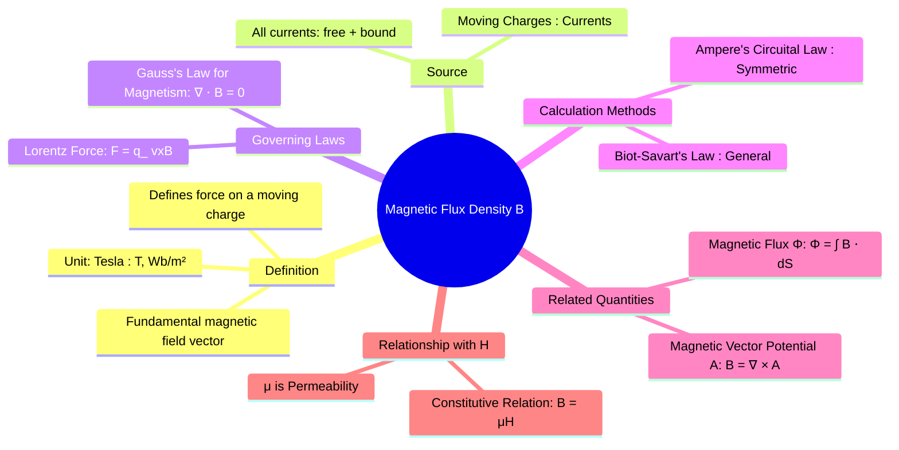

---
tags:
  - magnetostatics
  - magnetic-field
  - lorentz-force
  - maxwells-equations
  - electromagnetic-fields
created: 2025-10-17
aliases:
  - B-field
  - Magnetic Induction
subject: "[[Electromagnetic Fields]]"
parent:
  - Magnetostatics
formula:
  - "Tesla : $$1 \\text{ Tesla} = 1 \\frac{\\text{Weber}}{\\text{meter}^2} = 1 \\frac{\\text{Newton}}{\\text{Ampere} \\cdot \\text{meter}}$$"
  - "Magnetic Flux (Weber (Wb)) : $$\\Phi = \\int_S \\vec{B} \\cdot d\\vec{S}$$"
modified: 2026-07-22T10:21:18
---
### Magnetic Flux Density ($\vec{B}$)
#magnetostatics/B-field #magnetic-flux

> The **Magnetic Flux Density**, denoted by $\vec{B}$, is the fundamental magnetic field vector. It is a vector field that describes the magnetic influence on moving electric charges, electric currents, and magnetic materials. The $\vec{B}$-field at any point is defined by the force it exerts on a moving charge at that point, as described by the Lorentz Force Law.

The unit of magnetic flux density is the **Tesla (T)**.
$$1 \text{ Tesla} = 1 \frac{\text{Weber}}{\text{meter}^2} = 1 \frac{\text{Newton}}{\text{Ampere} \cdot \text{meter}}$$

---
#### Defining Property: The Lorentz Force
#lorentz-force

The magnetic field $\vec{B}$ is fundamentally defined by the magnetic force component of the **[[lorentz force equation]]**:
$$\vec{F}_m = q(\vec{v} \times \vec{B})$$
where:
- $\vec{F}_m$ is the magnetic force on a charge.
- $q$ is the charge.
- $\vec{v}$ is the velocity of the charge.
- $\vec{B}$ is the magnetic flux density.

The force is always perpendicular to both the velocity of the charge and the magnetic field itself.

---
#### Sources of the $\vec{B}$-field
#magnetic-field/source

The $\vec{B}$-field is produced by moving charges, which constitute an electric current. It can be calculated from its source currents using:
1. **[[Biot-Savart's Law|Biot-Savart's Law]]**: A general method for finding $\vec{B}$ from any current distribution by integrating the contributions of differential current elements.
2. **[[Ampere's Circuital Law|Ampere's Law]]**: A simpler method for finding $\vec{B}$ in situations with a high degree of symmetry (e.g., infinite wires, solenoids).

---
#### Gauss's Law for Magnetism
#maxwells-equations #magnetic-monopole

One of the four Maxwell's Equations, Gauss's Law for Magnetism, describes a fundamental property of the $\vec{B}$-field.

* **Integral Form**: The net magnetic flux through any closed surface is always zero.
    $$\boxed{\quad \oint_S \vec{B} \cdot d\vec{S} = 0 \quad}$$
* **Differential Form**: The divergence of the $\vec{B}$-field is zero.
    $$\boxed{\quad \nabla \cdot \vec{B} = 0 \quad}$$

**Physical Meaning**: This law implies that there are **no magnetic monopoles** (isolated north or south poles). Magnetic field lines are always continuous and form closed loops; they never begin or end at a point.

---
#### Magnetic Flux ($\Phi$)
#magnetic-flux

Magnetic flux is the measure of the total magnetic field lines passing through a given surface. For an open surface $S$, the magnetic flux is defined as:
$$\boxed{\quad \Phi = \int_S \vec{B} \cdot d\vec{S} \quad}$$
The unit of magnetic flux is the **Weber (Wb)**.

---
#### Relationship with $\vec{H}$ and $\vec{A}$

* **With Magnetic Field Intensity ($\vec{H}$)**: For linear, isotropic materials, $\vec{B}$ is related to the [[Magnetic Field Intensity (H)|magnetic field intensity]] $\vec{H}$ by the permeability of the medium, $\mu$.
    $$\vec{B} = \mu \vec{H}$$
    While $\vec{H}$ is generated by free currents, $\vec{B}$ is the total resulting field within the material, accounting for both free currents and the material's magnetization.

* **With Magnetic Vector Potential ($\vec{A}$)**: Since the divergence of $\vec{B}$ is always zero ($\nabla \cdot \vec{B} = 0$), it can always be expressed as the curl of another vector field, known as the **[[Magnetic Vector Potential (A)|magnetic vector potential]]** $\vec{A}$.
    $$\boxed{\quad \vec{B} = \nabla \times \vec{A} \quad}$$
    This is analogous to expressing the irrotational electric field as the gradient of a scalar potential, $\vec{E} = -\nabla V$.

---
### Related Concepts
#topic/related-concepts

> [[Magnetic Field Intensity (H)]]

[[Lorentz Force Equation]]
[[Maxwell's Equation for Magnetostatics]]
[[Biot-Savart's Law]]
[[Ampere's Circuital Law]]
[[Magnetic Vector Potential (A)]]
[[Faraday's Law of Induction]]