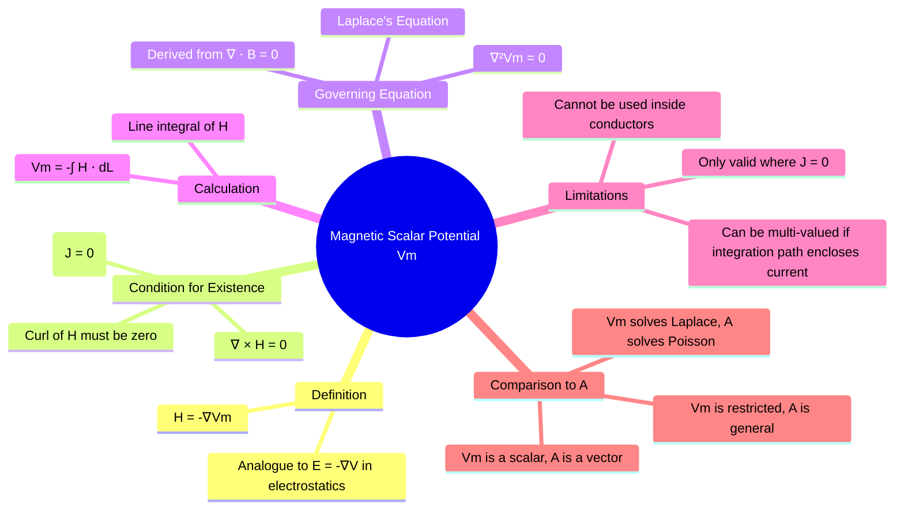

---
tags:
  - magnetostatics
  - potential-theory
  - magnetic-potential
  - electromagnetic-fields
created: 2025-10-17
aliases:
  - Vm
  - Magnetic Potential
subject: "[[Electromagnetic Fields]]"
parent:
  - Magnetostatics
modified: 2026-08-04T09:58:25
---
### Magnetic Scalar Potential ()
#magnetostatics/potential #scalar-potential

> The **Magnetic Scalar Potential** ($V_m$) is a scalar utility function that can be used to simplify the calculation of the magnetic field intensity $\vec{H}$ in regions of space where there is **no free current**. It is the magnetostatic analogue of the electric potential $V$.

Just as the electrostatic field can be found from the scalar potential $V$ using $\vec{E} = -\nabla V$, the magnetostatic field $\vec{H}$ can be found from $V_m$ using:
$$\boxed{\quad \vec{H} = -\nabla V_m \quad}$$
The unit of magnetic scalar potential is the **Ampere (A)**. Using a scalar potential is often much simpler than working directly with the vector field $\vec{H}$.

---
#### Condition for Existence: Current-Free Region ($\vec{J}=0$)
#current-free-region

The magnetic scalar potential is only defined and valid in regions where the current density $\vec{J}$ is zero.
-   **Reasoning**: From a fundamental vector identity, the curl of the gradient of any scalar field is identically zero: $\nabla \times (\nabla V_m) \equiv 0$.
-   If we define $\vec{H} = -\nabla V_m$, this inherently implies that the curl of $\vec{H}$ must be zero: $\nabla \times \vec{H} = \nabla \times (-\nabla V_m) = 0$.
-   However, Ampere's law states that $\nabla \times \vec{H} = \vec{J}$.
-   Therefore, for the definition $\vec{H} = -\nabla V_m$ to be valid, we must have $\vec{J} = 0$.

This is the key limitation of $V_m$. It can be used to find the field *outside* a conductor, but not *inside* it where the current flows.

---
#### Governing Equation: Laplace's Equation
#laplaces-equation

In a region where $V_m$ is valid, it must satisfy Laplace's equation.
-   **Derivation**:
    1.  Start with Gauss's law for magnetism: $\nabla \cdot \vec{B} = 0$.
    2.  For a linear, homogeneous medium, $\vec{B} = \mu\vec{H}$, so we have $\nabla \cdot (\mu\vec{H}) = 0$. Since $\mu$ is a constant, this gives $\nabla \cdot \vec{H} = 0$.
    3.  Substitute the definition of $V_m$: $\vec{H} = -\nabla V_m$.
    4.  This yields: $\nabla \cdot (-\nabla V_m) = 0$, which simplifies to:
$$\boxed{\quad \nabla^2 V_m = 0 \quad}$$
This powerful result means that all the techniques used to solve Laplace's equation for electrostatic problems can be applied to magnetostatic problems in current-free regions.

---
#### Comparison with Magnetic Vector Potential ($\vec{A}$)
#vector-potential-comparison
It is crucial to distinguish the scalar potential $V_m$ from the more general [[Magnetic Vector Potential (A)|magnetic vector potential $\vec{A}$]].

| Feature                 | **Magnetic Scalar Potential ($V_m$)**    | **Magnetic Vector Potential ($\vec{A}$)**                                 |
| ----------------------- | ---------------------------------------- | ------------------------------------------------------------------------- |
| **Nature**              | Scalar                                   | Vector                                                                    |
| **Field Calculation**   | $\vec{H} = -\nabla V_m$                     | $\vec{B} = \nabla \times \vec{A}$                                           |
| **Domain of Validity**  | Restricted to current-free regions (`J=0`) | Universally valid in all regions                                          |
| **Governing Equation**  | $\nabla^2 V_m = 0$ (Laplace's Equation)    | $\nabla^2 \vec{A} = -\mu\vec{J}$ (Poisson's Equation, under Lorenz gauge) |
| **Primary Usefulness**  | Simple problems with current-free regions of interest (e.g., fields from permanent magnets). | General-purpose; essential for radiation and time-varying fields. |

---
### Related Concepts
#topic/related-concepts

> [[Magnetic Vector Potential (A)]]

[[Laplace's Equation]]
[[Electric Potential and Potential Difference (V)]]
[[Ampere's Circuital Law]]
[[Magnetic Boundary Conditions]]
[[Gradient of a Scalar Field]]
[[Curl of a Vector Field]]
