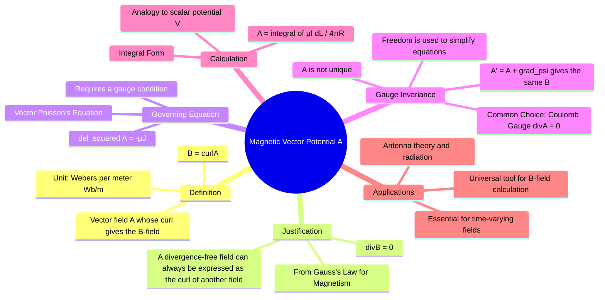

---
tags:
  - magnetostatics
  - potential-theory
  - vector-potential
  - maxwells-equations
  - electromagnetic-fields
created: 2025-10-17
aliases:
  - A-potential
  - Vector Potential A
subject: "[[Electromagnetic Fields]]"
parent:
  - Magnetostatics
formula:
  - "Magnetic Vector Potential (A is in Webers per meter (Wb/m)) : $$\\vec{B} = \\nabla \\times \\vec{A}$$"
modified: 2026-08-04T09:58:45
---
### Magnetic Vector Potential (
)
#magnetostatics/potential #vector-potential

> The **Magnetic Vector Potential** ($\vec{A}$) is a fundamental utility in electromagnetism. It is a vector field from which the magnetic flux density $\vec{B}$ can be derived. While it is a mathematical construct, it is a powerful tool for calculating magnetic fields, especially for complex current distributions, and is essential for understanding time-varying fields and radiation.

---
#### Definition and Existence
#vector-potential/definition

The magnetic vector potential $\vec{A}$ is defined by the relation:
$$\boxed{\quad \vec{B} = \nabla \times \vec{A} \quad}$$
The unit of $\vec{A}$ is **Webers per meter (Wb/m)**.

The existence of $\vec{A}$ is guaranteed by **[[Maxwell's Equation for Magnetostatics|Gauss's Law for Magnetism]]**. A fundamental theorem of vector calculus states that any vector field that is **divergence-free** (like the $\vec{B}$-field) can be expressed as the **curl** of another vector field.

---
#### Governing Equation: Vector Poisson's Equation
#vector-poisson-equation

We can derive a differential equation for $\vec{A}$ in terms of its source, the current density $\vec{J}$.
1.  Start with Ampere's Law for static fields: $\nabla \times \vec{B} = \mu\vec{J}$.
2.  Substitute the definition of $\vec{A}$: $\nabla \times (\nabla \times \vec{A}) = \mu\vec{J}$.
3.  Apply the vector identity $\nabla \times (\nabla \times \vec{A}) = \nabla(\nabla \cdot \vec{A}) - \nabla^2\vec{A}$.
    $$\nabla(\nabla \cdot \vec{A}) - \nabla^2\vec{A} = \mu\vec{J}$$
This equation is complicated. However, the definition $\vec{B} = \nabla \times \vec{A}$ does not uniquely specify $\vec{A}$. We have the freedom to choose its divergence ($\nabla \cdot \vec{A}$). This is called **gauge invariance**.

For magnetostatics, we choose the **Coulomb gauge**:
$$\nabla \cdot \vec{A} = 0$$
With this choice, the $\nabla(\nabla \cdot \vec{A})$ term vanishes, and we are left with the **vector Poisson's equation**:
$$\boxed{\quad \nabla^2 \vec{A} = -\mu\vec{J} \quad}$$
This is a set of three scalar Poisson's equations, one for each component of $\vec{A}$ ($A_x, A_y, A_z$).

---
#### Calculation of $\vec{A}$
#vector-potential/calculation

The solution to the vector Poisson's equation is analogous to the solution for the scalar electric potential $V$.

*   For a **line current** $I$:
    $$\boxed{\quad \vec{A} = \int_L \frac{\mu I d\vec{l}}{4\pi R} \quad}$$
*   For a **surface current** density $\vec{K}$ (in A/m):
    $$\vec{A} = \int_S \frac{\mu \vec{K} dS}{4\pi R}$$
*   For a **volume current** density $\vec{J}$ (in A/m²):
    $$\vec{A} = \int_v \frac{\mu \vec{J} dv}{4\pi R}$$

Here, $R$ is the distance from the differential current element to the point where $\vec{A}$ is being calculated. The direction of $\vec{A}$ at any point is the same as the direction of the current element that produces it. Once $\vec{A}$ is found by integration, the magnetic field $\vec{B}$ can be found by taking its curl: $\vec{B} = \nabla \times \vec{A}$.

---
### Related Concepts
#topic/related-concepts

> [[Magnetic Scalar Potential (Vm)]]

[[Maxwell's Equation for Magnetostatics]]
[[Biot-Savart's Law]]
[[Poisson's Equation]]
[[Curl of a Vector Field]]
[[Inductance and Mutual Inductance]]
[[Faraday's Law of Induction]]