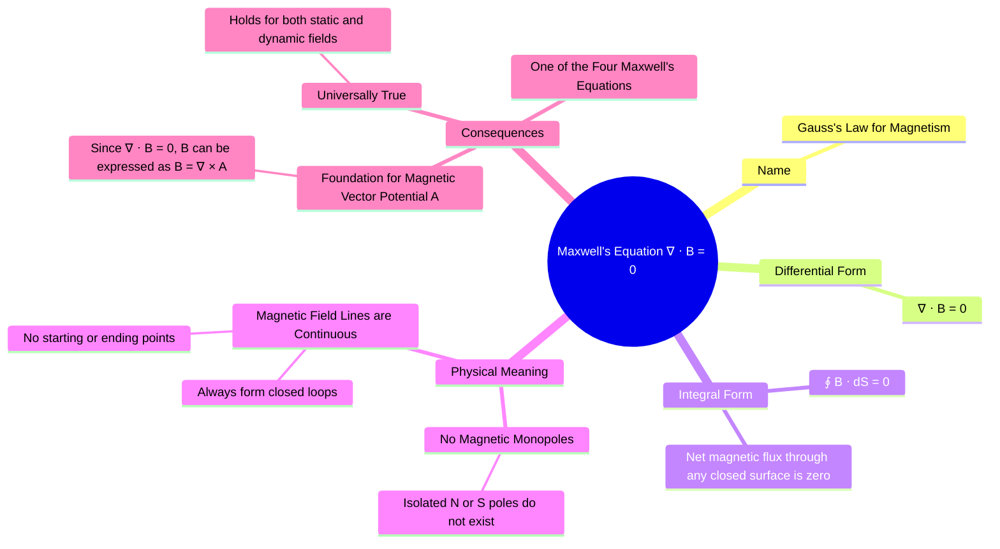

---
tags:
  - magnetostatics
  - maxwells-equations
  - divergence
  - magnetic-monopole
  - electromagnetic-fields
created: 2025-10-17
aliases:
  - Gauss's Law for Magnetism
  - No-Monopole Law
  - Divergence of B
  - Maxwell's Equation for Magnetostatics (∇ ⋅ B = 0)
subject: "[[Electromagnetic Fields]]"
parent:
  - Magnetostatics
modified: 2026-08-04T10:00:38
---
### Maxwell's Equation for Magnetostatics ($\nabla \cdot \vec{B} = 0$)
#maxwells-equations #gauss-law-magnetism #divergence #no-monopole-law

> This equation, also known as **Gauss's Law for Magnetism**, is the second of Maxwell's four equations for static fields. It is a fundamental law that describes a key characteristic of all magnetic fields, both static and time-varying. It states that the magnetic field is **divergence-free**, which has a profound physical meaning: there are no magnetic monopoles.

---
#### Integral Form
#integral-form #magnetic-flux
The integral form of the law states that the net magnetic flux ($\Phi$) passing through any arbitrary closed surface (a "Gaussian surface") is always zero.
$$\boxed{\quad \oint_S \vec{B} \cdot d\vec{S} = 0 \quad}$$
**Physical Interpretation**: This means that for any closed volume, the total number of magnetic field lines entering the volume is exactly equal to the total number of lines leaving it. This is a direct consequence of magnetic field lines being continuous and always forming closed loops.

---
#### Differential (Point) Form
#differential-form #divergence-of-B
The differential, or point, form of the law is a more localized statement. It is derived from the integral form using the [[Gauss's Divergence Theorem|Divergence Theorem]].
$$\boxed{\quad \nabla \cdot \vec{B} = 0 \quad}$$
**Physical Interpretation**: This states that the divergence of the magnetic flux density is zero at every point in space. Mathematically, this means there are no "sources" or "sinks" for the $\vec{B}$-field. This is in direct contrast to electrostatics, where the divergence of the electric flux density equals the volume charge density ($\nabla \cdot \vec{D} = \rho_v$), and electric charges (monopoles) act as the sources and sinks of the electric field.

---
#### Physical Consequence: No Magnetic Monopoles
#magnetic-monopole
The most significant physical consequence of $\nabla \cdot \vec{B} = 0$ is the non-existence of **magnetic monopoles** (isolated north or south poles).
-   If you cut a bar magnet in half, you do not get a separate north pole and a separate south pole. Instead, you get two smaller magnets, each with its own north-south pole pair.
-   Magnetic field lines do not start or end on charges. They are always continuous, forming closed loops that exit the north pole of a source and re-enter the south pole.

---
#### Mathematical Consequence: Magnetic Vector Potential ($\vec{A}$)
#magnetic-vector-potential
A fundamental theorem of vector calculus states that if the divergence of a vector field is zero, then that vector field can be expressed as the curl of another vector field.
Since $\nabla \cdot \vec{B} = 0$, we can always define a **[[Magnetic Vector Potential (A)|magnetic vector potential]]** $\vec{A}$ such that:
$$\boxed{\quad \vec{B} = \nabla \times \vec{A} \quad}$$
This mathematical potential is an extremely powerful tool for solving complex magnetostatics problems, analogous to using the scalar potential $V$ to find the electric field $\vec{E}$ in electrostatics.

---
### Related Concepts
#topic/related-concepts

> [[Magnetic Vector Potential (A)]]

[[Magnetic Flux Density (B)]]
[[Divergence of a Vector Field]]
[[Maxwell's Equations in Final Form]]
[[Gauss's Law]]
[[Faraday's Law of Induction]]