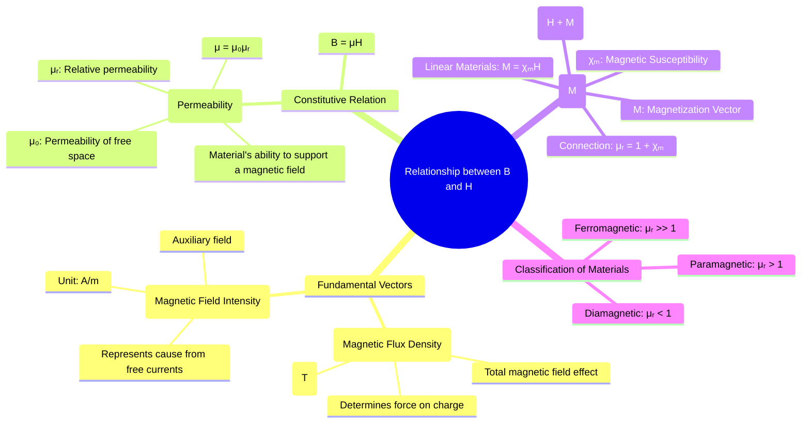

---
tags:
  - magnetostatics
  - magnetic-materials
  - permeability
  - constitutive-relation
  - electromagnetic-fields
created: 2025-10-17
aliases:
  - B-H Relationship
  - Constitutive Relation for Magnetic Fields
  - Relationship between B and H (B = μH)
subject: "[[Electromagnetic Fields]]"
parent:
  - Magnetostatics
modified: 2026-08-04T10:24:27
---
### Relationship between B and H ($\vec{B} = \mu\vec{H}$)
#magnetostatics/constitutive-relation #permeability

> The relationship between the magnetic flux density $\vec{B}$ and the magnetic field intensity $\vec{H}$ is called the **constitutive relation** for magnetic fields. It describes how a material responds to and modifies a magnetic field. While $\vec{H}$ can be seen as the magnetic field "cause" produced by external free currents, $\vec{B}$ is the total resulting "effect" or net magnetic field within the material.

---
#### The Constitutive Relation
#B-H-relation

For a large class of materials, particularly **linear, isotropic, and homogeneous (LIH)** materials, the magnetic flux density $\vec{B}$ is directly proportional to the magnetic field intensity $\vec{H}$.
$$\boxed{\quad \vec{B} = \mu \vec{H} \quad}$$
The constant of proportionality, $\mu$, is the **permeability** of the material, a measure of how easily a magnetic field can be established in that material. It is measured in **Henrys per meter (H/m)**.
Permeability is often expressed as:
$$\mu = \mu_0 \mu_r$$
-   $\mu_0$ is the **permeability of free space**, a fundamental constant: $\mu_0 = 4\pi \times 10^{-7}$ H/m.
-   $\mu_r$ is the dimensionless **relative permeability**, which indicates the magnetic nature of the material relative to a vacuum.

---
#### The Role of Magnetization ($\vec{M}$)
#magnetization #magnetic-susceptibility

The simple relation $\vec{B}=\mu\vec{H}$ is a macroscopic approximation. The underlying physics involves the material's response to the $\vec{H}$-field. When a material is placed in a magnetic field, its atoms can form microscopic magnetic dipoles. The volume density of these magnetic dipole moments is called the **Magnetization vector** $\vec{M}$.

The more general relationship between the fields is:
$$\boxed{\quad \vec{B} = \mu_0(\vec{H} + \vec{M}) \quad}$$
For linear materials, the magnetization is proportional to the applied field intensity:
$$\boxed{\quad \vec{M} = \chi_m \vec{H} \quad}$$
where $\chi_m$ is the dimensionless **magnetic susceptibility**. Substituting this into the general relation:
$$\begin{align}
\vec{B} &= \mu_0(\vec{H} + \chi_m \vec{H}) \\
&= \mu_0(1 + \chi_m)\vec{H}
\end{align}$$
Comparing this with $\vec{B} = \mu_0 \mu_r \vec{H}$, we find the connection between relative permeability and susceptibility:
$$\boxed{\quad \mu_r = 1 + \chi_m \quad}$$

---
#### Classification of Magnetic Materials

| Material Type   | Magnetic Susceptibility ($\chi_m$) | Relative Permeability ($\mu_r$) | Behavior                                   | Examples                  |
| --------------- | ---------------------------------- | ------------------------------- | ------------------------------------------ | ------------------------- |
| **Diamagnetic** | Small, negative                    | Slightly < 1                    | Weakly repelled by magnetic fields.        | Copper, Water, Gold       |
| **Paramagnetic**| Small, positive                    | Slightly > 1                    | Weakly attracted by magnetic fields.       | Aluminum, Oxygen, Platinum|
| **Ferromagnetic**| Large, positive                    | $\gg 1$                         | Strongly attracted; non-linear (hysteresis). | Iron, Nickel, Cobalt      |
| **Free Space**  | $0$                                | $1$                             | No magnetic response.                      | Vacuum                    |

---
#### Analogy with Electrostatics
#electrostatic-analogy
The relationship between $\vec{B}$ and $\vec{H}$ is directly analogous to the relationship between the electric flux density $\vec{D}$ and the electric field intensity $\vec{E}$.

| Magnetostatics                          | Electrostatics                               | Description                             |
| --------------------------------------- | -------------------------------------------- | --------------------------------------- |
| $\vec{H}$ (from free current $\vec{J}_f$)  | $\vec{D}$ (from free charge $\rho_f$)          | Auxiliary field from free sources       |
| $\vec{B}$ (total field)                 | $\vec{E}$ (total field)                      | Fundamental field defining force        |
| $\vec{M}$ (Magnetization)               | $\vec{P}$ (Polarization)                     | Material's response (dipole density)    |
| $\mu$ (Permeability)                    | $\varepsilon$ (Permittivity)                 | Macroscopic material property           |
| $\vec{B} = \mu\vec{H}$                     | $\vec{D} = \varepsilon\vec{E}$                  | Constitutive Relation (Linear Media)    |

---
### Related Concepts
#topic/related-concepts

> [[Magnetic Flux Density (B)]]
> [[Magnetic Field Intensity (H)]]

[[Magnetic Boundary Conditions]]
[[Inductance and Mutual Inductance]]
[[Dielectric Materials and Polarization]]
[[Maxwell's Equations in Final Form]]
[[Biot-Savart's Law]]