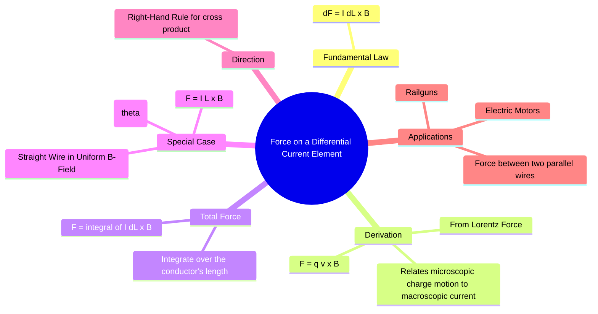

---
tags:
  - magnetostatics
  - lorentz-force
  - magnetic-force
  - electromagnetic-fields
created: 2025-10-17
aliases:
  - Magnetic Force on a Current Element
  - Force on a Wire
subject: "[[Electromagnetic Fields]]"
parent:
  - Magnetostatics
modified: 2026-08-04T09:42:50
---
### Force on a Differential Current Element
#magnetostatics/force #current-element

> This principle extends the microscopic [[Lorentz Force Equation|Lorentz force]] on a single moving charge to the macroscopic, measurable force exerted by a magnetic field on a current-carrying conductor. It provides the fundamental expression for the force on an infinitesimal segment of a wire.

---
#### The Fundamental Law
#magnetic-force/law

The differential force $d\vec{F}$ exerted on a differential current element $I d\vec{l}$ by an external magnetic field $\vec{B}$ is given by:
$$\boxed{\quad d\vec{F} = I (d\vec{l} \times \vec{B}) \quad}$$
where:
-   $d\vec{F}$ is the differential force vector (in Newtons).
-   $I$ is the steady current in the conductor (in Amperes).
-   $d\vec{l}$ is the differential length vector, pointing in the direction of the current flow.
-   $\vec{B}$ is the external magnetic flux density vector (in Tesla).

The direction of the force is perpendicular to both the current element and the magnetic field, as determined by the right-hand rule for the cross product.

---
#### Derivation from the Lorentz Force
#derivation #lorentz-force

This macroscopic law can be derived from the force on a single charge. Consider a small segment of wire of length $dl$ and cross-sectional area $A$.
-   Let $n$ be the number of charge carriers per unit volume.
-   The total number of charge carriers in the volume element $dv = A dl$ is $n A dl$.
-   The total charge in this element is $dQ = q(n A dl)$, where $q$ is the charge of each carrier.
-   The force on this total charge moving at the drift velocity $\vec{v}_d$ is given by the Lorentz force:
$$\begin{align}
d\vec{F} &= dQ (\vec{v}_d \times \vec{B}) \\
&= (n A dl q) (\vec{v}_d \times \vec{B})
\end{align}$$
-   We know that current density is $\vec{J} = n q \vec{v}_d$, and total current is $I = JA = nq v_d A$.
-   Since $\vec{v}_d$ and $d\vec{l}$ are in the same direction, we can write $v_d d\vec{l} = dl \vec{v}_d$.
$$\begin{align}
d\vec{F} &= (n q v_d A) (d\vec{l} \times \vec{B}) \\
&= I (d\vec{l} \times \vec{B})
\end{align}$$
This confirms the relationship between the microscopic and macroscopic forces.

---
#### Total Force on a Conductor
#total-force

To find the total magnetic force on a conductor of a given shape, we must integrate the differential force over the entire length of the wire through which the current flows.
$$\vec{F} = \int_L I (d\vec{l} \times \vec{B})$$
If the current $I$ is constant along the wire, it can be taken out of the integral:
$$\vec{F} = I \int_L (d\vec{l} \times \vec{B})$$

---
#### Special Case: Straight Wire in a Uniform Field
#special-case #uniform-field

For the common case of a straight wire of length $L$ carrying a current $I$ in a uniform magnetic field $\vec{B}$, the integral simplifies significantly.
$$\begin{align}
\vec{F} &= I \left( \left(\int_L d\vec{l}\right) \times \vec{B} \right) \\
&= I (\vec{L} \times \vec{B})
\end{align}$$
where $\vec{L}$ is the vector directed from the starting point to the ending point of the wire segment.
The magnitude of the force is:
$$\boxed{\quad F = I L B \sin\theta \quad}$$
where $\theta$ is the angle between the wire and the magnetic field.

---
### Related Concepts
#topic/related-concepts

> [[Lorentz Force Equation]]

[[Force on a Moving Charge]]
[[Force between Differential Current Elements]]
[[Magnetic Flux Density (B)]]
[[Biot-Savart's Law]]
[[Ampere's Circuital Law]]
[[Motional EMF]]