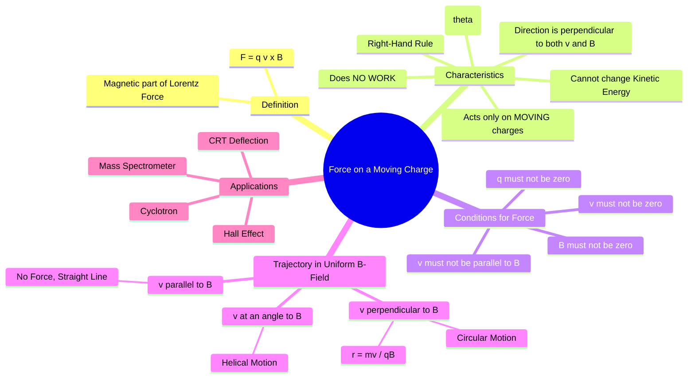

---
tags:
  - magnetostatics
  - lorentz-force
  - magnetic-force
  - electromagnetic-fields
created: 2025-10-17
aliases:
  - Magnetic Force on a Charge
subject: "[[Electromagnetic Fields]]"
parent:
  - Magnetostatics
modified: 2026-08-04T09:43:16
---
### Force on a Moving Charge
#magnetostatics/force #lorentz-force

> The force on a moving charge is the magnetic component of the **[[Lorentz Force Equation]]**. It describes the force experienced by a charged particle when it moves through a magnetic field. This force is non-intuitive because it acts perpendicularly to the direction of motion, causing deflection rather than acceleration in the direction of motion.

---
#### The Magnetic Force Law
The magnetic force $\vec{F}_m$ on a charge $q$ moving with velocity $\vec{v}$ in a magnetic field $\vec{B}$ is given by:
$$\boxed{\quad \vec{F}_m = q (\vec{v} \times \vec{B}) \quad}$$
This equation reveals several key conditions for a magnetic force to exist:
1.  The particle must have a **charge** ($q \neq 0$).
2.  The particle must be **moving** ($\vec{v} \neq 0$).
3.  There must be a **magnetic field** ($\vec{B} \neq 0$).
4.  The velocity vector must not be parallel or anti-parallel to the magnetic field vector.

---
#### Magnitude and Direction
#right-hand-rule

*   **Magnitude**: The magnitude of the force is given by the definition of the cross product:
    $$\boxed{\quad F_m = |q| v B \sin\theta \quad}$$
    where $\theta$ is the angle between the velocity $\vec{v}$ and the magnetic field $\vec{B}$. The force is maximum when the charge moves perpendicular to the field ($\theta=90^\circ$) and is zero when it moves parallel to it ($\theta=0^\circ$ or $180^\circ$).

*   **Direction**: The direction of $\vec{F}_m$ is perpendicular to the plane formed by $\vec{v}$ and $\vec{B}$, determined by the **right-hand rule**. For a positive charge, point your fingers in the direction of $\vec{v}$, curl them towards $\vec{B}$, and your thumb will point in the direction of the force $\vec{F}_m$. For a negative charge, the force is in the opposite direction.

---
#### Key Characteristics of Magnetic Force

1.  **Work Done is Zero**: The magnetic force is always perpendicular to the velocity $\vec{v}$, and therefore perpendicular to the particle's displacement $d\vec{l}$. The work done is $dW = \vec{F}_m \cdot d\vec{l} = 0$.
2.  **Kinetic Energy is Constant**: Since no work is done on the particle, its kinetic energy cannot change. The magnetic force can change the *direction* of the particle's velocity, but not its *speed*.

---
#### Trajectory in a Uniform Magnetic Field
#particle-trajectory

The path of a charged particle in a uniform $\vec{B}$-field depends on the initial angle between $\vec{v}$ and $\vec{B}$.

*   **Case 1: $\vec{v}$ is perpendicular to $\vec{B}$ ($\theta = 90^\circ$)**
    The force has a constant magnitude $F_m = qvB$ and is always directed perpendicular to the velocity, acting as a centripetal force. The particle undergoes uniform **circular motion**.
    $$\begin{align}
    \text{Centripetal Force} &= \text{Magnetic Force} \\
    \frac{mv^2}{r} &= qvB
    \end{align}$$
    The radius of the circular path is:
    $$\boxed{\quad r = \frac{mv}{qB} \quad}$$
    The radius is proportional to the particle's momentum ($p=mv$).

*   **Case 2: $\vec{v}$ is at an angle $\theta$ to $\vec{B}$**
    We resolve the velocity into two components:
    -   $v_{||} = v \cos\theta$ (parallel to $\vec{B}$)
    -   $v_{\perp} = v \sin\theta$ (perpendicular to $\vec{B}$)
    The parallel component experiences no force, so the particle moves with constant velocity along the B-field direction. The perpendicular component causes circular motion. The combination of these two motions results in a **helical path**.

---
### Related Concepts
#topic/related-concepts

> [[Lorentz Force Equation]]

[[Magnetic Flux Density (B)]]
[[Force on a Differential Current Element]]
[[Hall Effect]]
[[Motional EMF]]
[[Faraday's Law of Induction]]
[[Biot-Savart's Law]]
