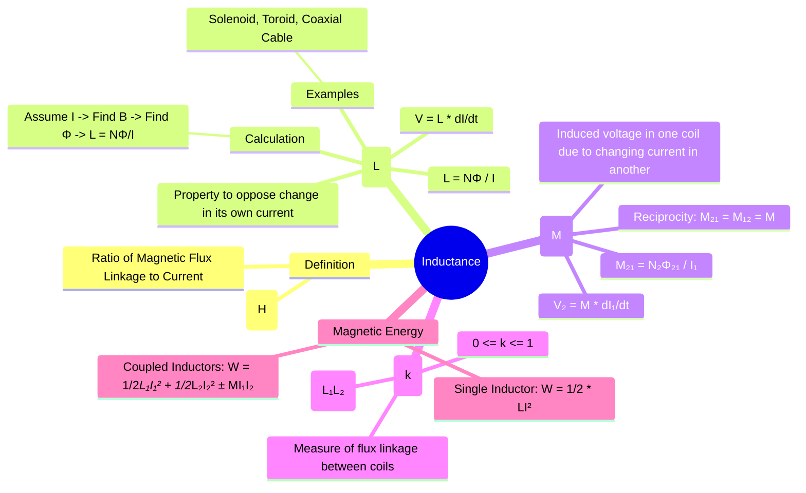

---
tags:
  - magnetostatics
  - inductance
  - energy-storage
  - circuit-elements
  - electromagnetic-fields
created: 2025-10-17
aliases:
  - Inductance
  - Self-Inductance
  - Mutual Inductance
subject: "[[Electromagnetic Fields]]"
parent:
  - Magnetostatics
modified: 2026-08-04T09:48:52
---
### Inductance and Mutual Inductance
#magnetostatics/inductance #flux-linkage

> **Inductance** is the property of an electrical conductor or circuit that causes an electromotive force (EMF) to be generated by a change in the current flowing through it (self-inductance) or by a change in the current of a nearby circuit (mutual inductance). It is fundamentally a measure of the magnetic flux linkage produced per unit of current. The unit of inductance is the **Henry (H)**.

---
#### Self-Inductance ($L$)
#self-inductance

Self-inductance, or simply inductance, is the ratio of the total magnetic flux linkage ($\lambda = N\Phi$) through a circuit to the current ($I$) that creates it.
$$\boxed{\quad L = \frac{\lambda}{I} = \frac{N\Phi}{I} \quad}$$
where:
-   $L$ is the self-inductance in Henrys (H).
-   $\lambda$ is the total flux linkage in Weber-turns (Wb-t).
-   $N$ is the number of turns in the coil.
-   $\Phi$ is the magnetic flux per turn in Webers (Wb).
-   $I$ is the current in Amperes (A).

From [[Faraday's Law of Induction]], the induced voltage (back EMF) across an inductor is given by $V = -\frac{d\lambda}{dt}$. Assuming L is constant, this becomes:
$$\boxed{\quad V = -L \frac{dI}{dt} \quad}$$
The negative sign (Lenz's Law) signifies that the induced EMF opposes the change in current. Inductance is thus the electrical equivalent of inertia.

##### General Procedure for Calculating Inductance

1.  Assume a steady current $I$ flows in the conductor.
2.  Determine the magnetic field $\vec{B}$ produced by this current using [[Biot-Savart's Law|Biot-Savart's Law]] or [[Ampere's Circuital Law|Ampere's Law]].
3.  Calculate the total magnetic flux $\Phi$ passing through the surface enclosed by the conductor path: $\Phi = \int_S \vec{B} \cdot d\vec{S}$.
4.  Calculate the total flux linkage, $\lambda = N\Phi$.
5.  Find the inductance using $L = \lambda/I$.

##### Standard Formulas

-   **Solenoid** (length $l$, area $A$, $N$ turns): $L \approx \frac{\mu N^2 A}{l} = \mu n^2 A l$ where $n=N/l$.
-   **Toroid** (rectangular cross-section, height $h$, inner/outer radii $a, b$): $L = \frac{\mu N^2 h}{2\pi} \ln\left(\frac{b}{a}\right)$.
-   **Coaxial Cable** (length $L$, inner/outer radii $a, b$): $L = \frac{\mu L}{2\pi} \ln\left(\frac{b}{a}\right)$.

---
#### Mutual Inductance ($M$)
#mutual-inductance

Mutual inductance describes the induction between two separate circuits. The mutual inductance $M_{21}$ is the ratio of the magnetic flux linkage in circuit 2 ($\lambda_{21}$) to the current in circuit 1 ($I_1$) that produces the flux.
$$\boxed{\quad M_{21} = \frac{\lambda_{21}}{I_1} = \frac{N_2\Phi_{21}}{I_1} \quad}$$
where $\Phi_{21}$ is the flux produced by $I_1$ that passes through circuit 2. The induced voltage in circuit 2 is:
$$\boxed{\quad V_2 = -M_{21} \frac{dI_1}{dt} \quad}$$
A key property is **reciprocity**: $M_{21} = M_{12} = M$.

> [!important]- Secondary Open-Circuit (OC) Transformer Insight
> **Condition:** Secondary load $Z_L \to \infty$ (open-circuit)
>
> **Secondary current**
> $$I_s = \frac{V_s}{Z_L} \xrightarrow{Z_L \to \infty} 0$$
>
> **Reflected effect on primary**
> - Reflected *admittance* is the correct loading indicator:
> $$Y_{\text{ref}} = \left(\frac{N_s}{N_p}\right)^2 Y_L \xrightarrow{Z_L \to \infty} 0$$
> - Hence, no load current is reflected from secondary to primary.
>
> **Primary current**
> $$I_p \approx I_m \quad (\text{only magnetizing + leakage components})$$
> Secondary OC does **not** alter primary current via loading.
>
> **Secondary voltage (open-circuit)**
> - Induced purely by mutual coupling:
> $$V_s = j\omega M I_p$$
> - Exists even when $I_s = 0$; voltage does **not** imply power transfer.
>
> **Power transfer**
> $$P_s = V_s I_s = 0$$
>
> **Revision takeaway**
> > Open secondary $\Rightarrow$ zero $I_s$, zero reflected loading, but finite induced $V_s$ due to mutual inductance.

---
#### Coefficient of Coupling ($k$)
#coupling-coefficient

The coefficient of coupling, $k$, is a measure of the degree of magnetic coupling between two circuits. It is defined as:
$$\boxed{\quad k = \frac{M}{\sqrt{L_1 L_2}}, \quad \text{where } 0 \le k \le 1 \quad}$$
-   $k=0$: No flux from one coil links the other.
-   $k=1$: All flux from one coil links the other (perfect coupling, as in an ideal transformer).

---
#### Magnetic Energy
#magnetic-energy

Inductors store energy in their magnetic field.
-   **Energy in a Single Inductor**:
    $$\boxed{\quad W_m = \frac{1}{2} L I^2 \quad}$$
    The energy density of the magnetic field is $w_m = \frac{1}{2}\mu H^2 = \frac{1}{2}\frac{B^2}{\mu}$ (J/m³).

-   **Energy in Coupled Inductors**:
    $$\boxed{\quad W_m = \frac{1}{2} L_1 I_1^2 + \frac{1}{2} L_2 I_2^2 \pm M I_1 I_2 \quad}$$
    The sign of the mutual term depends on the relative direction of the currents and the winding (dot convention).
    -   **'+' sign**: When both currents enter or both leave the dotted terminals (fluxes aid each other).
    -   **'-' sign**: When one current enters and the other leaves the dotted terminal (fluxes oppose each other).

---
### Related Concepts
#topic/related-concepts

> [[Faraday's Law of Induction]]

[[Magnetic Flux Density (B)]]
[[Ampere's Circuital Law]]
[[Magnetic Boundary Conditions]]
[[Relationship between B and H]]
[[Energy Density in an Electrostatic Field]]
[[Capacitance and Calculation of Capacitance]]