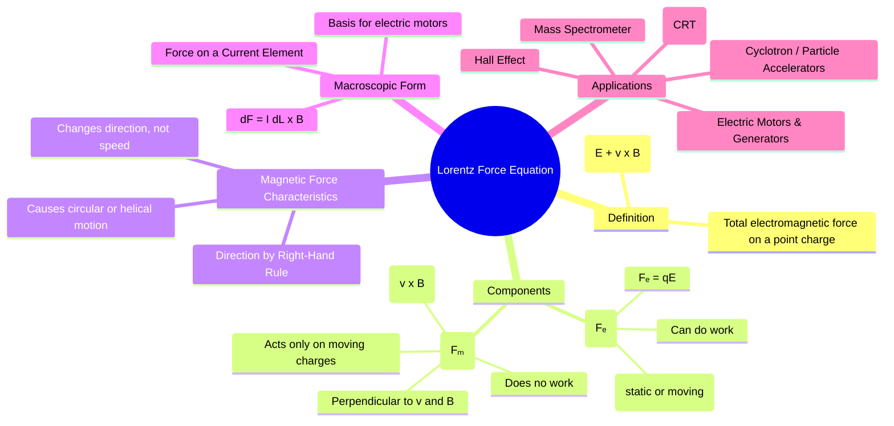

---
tags:
  - electrostatics
  - magnetostatics
  - lorentz-force
  - maxwells-equations
  - electromagnetic-fields
created: 2025-10-17
aliases:
  - Lorentz Force
  - Electromagnetic Force
subject: "[[Electromagnetic Fields]]"
parent:
  - Magnetostatics
formula:
  - "Lorentz Force Equation : $$\\vec{F} = q(\\vec{E} + \\vec{v} \\times \\vec{B})$$"
  - "Force on a Current Element : $$\\vec{F} = I (\\vec{L} \\times \\vec{B})$$"
  - "Electric Force : $$\\vec{F}_e = q\\vec{E}$$"
  - "Magnetic Force : $$\\vec{F}_m = q(\\vec{v} \\times \\vec{B})$$"
modified: 2026-08-04T09:56:03
---
### Lorentz Force Equation
#lorentz-force #electromagnetic-force

> The **Lorentz Force Equation** is the fundamental law that describes the total force experienced by a point charge moving through a region containing both electric and magnetic fields. It is the cornerstone that connects electromagnetism to classical mechanics, defining how fields exert forces on matter.

> [!prerequisite] Prerequisites
> [[Electric Field Intensity (E)]]
> [[Magnetic Flux Density (B)]]

---
#### The Complete Equation
#lorentz-force-equation

==The total force $\vec{F}$ on a charge $q$ moving with velocity $\vec{v}$ in the presence of an [[Electric Field Intensity (E)|electric field]] $\vec{E}$ and a [[Magnetic Flux Density (B)|magnetic field]] $\vec{B}$ is given by:==
$$\boxed{\quad \vec{F} = q(\vec{E} + \vec{v} \times \vec{B}) \quad}$$
This total force is the vector sum of two distinct components: the electric force and the magnetic force.

---
#### Electric and Magnetic Force Components
#electric-force-components #magnetic-force-components 

##### 1. Electric Force ($\vec{F}_e$)
#electric-force 

The electric component of the force is independent of the charge's motion.
$$\vec{F}_e = q\vec{E}$$
-   It acts on both stationary and moving charges.
-   Its direction is parallel to $\vec{E}$ for a positive charge and anti-parallel for a negative charge.
-   The electric force can do work on the charge, changing its kinetic energy.

---
##### 2. Magnetic Force ($\vec{F}_m$)
#magnetic-force 

The magnetic component of the force acts only on moving charges.
$$\vec{F}_m = q(\vec{v} \times \vec{B})$$

This force on free electrons in a moving conductor is the physical basis for [[Motional EMF]].

-   **Acts only on moving charges**: If $\vec{v} = 0$, the magnetic force is zero.
-   **Direction**: The force is always perpendicular to both the velocity vector $\vec{v}$ and the magnetic field vector $\vec{B}$, as determined by the right-hand rule.
-   **Does No Work**: Since the force is always perpendicular to the direction of motion (displacement), the work done by the magnetic force is always zero ($W = \int \vec{F}_m \cdot d\vec{l} = 0$). Consequently, the magnetic force can change the *direction* of a particle's velocity, but it cannot change its *speed* or its kinetic energy.

---
#### Force on a Current Element
#force-on-current

The Lorentz force law can be extended from a single point charge to the macroscopic force on a current-carrying conductor. For a differential current element $I d\vec{l}$, the force exerted on it by a magnetic field $\vec{B}$ is:
$$\boxed{\quad d\vec{F} = I d\vec{l} \times \vec{B} \quad}$$
The total force on a wire is found by integrating this expression over the entire length of the wire:
$$\vec{F} = \int_L I (d\vec{l} \times \vec{B})$$
For a straight wire of length $L$ in a uniform magnetic field, this simplifies to:
$$\boxed{\quad \vec{F} = I (\vec{L} \times \vec{B}) \quad}$$
where $\vec{L}$ is a vector pointing along the wire in the direction of the current. This principle is the basis for all electric motors.

---
### Related Concepts
#topic/related-concepts

> [[Magnetic Flux Density (B)]]
> [[Electric Field Intensity (E)]]

[[Force on a Moving Charge]]
[[Force on a Differential Current Element]]
[[Force between Differential Current Elements]]
[[Motional EMF]]
[[Faraday's Law of Induction]]
[[Biot-Savart's Law]]
