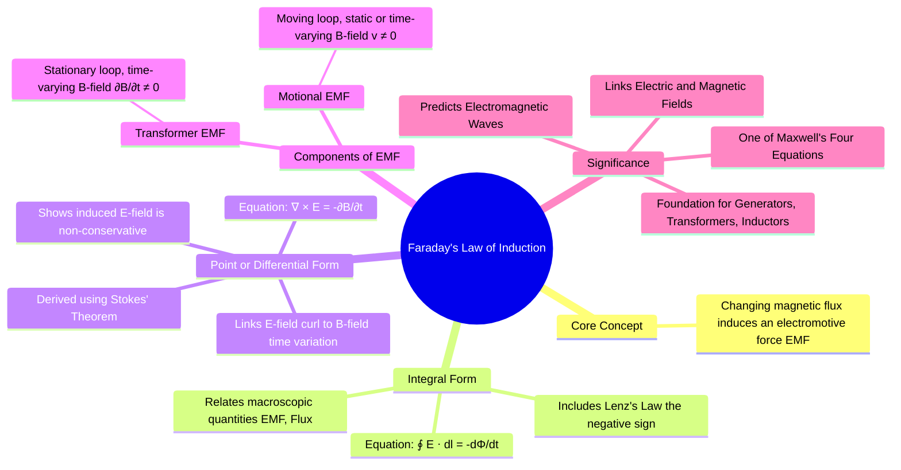

---
tags:
  - electromagnetic-fields
  - maxwells-equations
  - faradays-law
  - gate
created: 2025-10-17
aliases:
  - Faraday's Law
  - Faraday's Law of Induction
  - Maxwell's Equations (Point Form)
subject: "[[Electromagnetic Fields]]"
parent:
  - Time-Varying Fields and Maxwell's Equations
modified: 2026-07-16
---
### Faraday's Law in Integral and Point Form
#faradays-law #induced-emf #maxwells-equations #time-varying-fields

> **Faraday's Law of Induction** is a fundamental law of electromagnetism that describes how a time-varying magnetic field creates an electric field. ==It states that the electromotive force (EMF) induced in any closed circuit is equal to the negative of the time rate of change of the magnetic flux through the circuit.== This law is the operating principle behind transformers, inductors, and many types of electric motors and generators.

> [!prerequisite] Prerequisites
> [[Stokes' Theorem]]
> [[Curl of a Vector Field]]
> [[Magnetic Flux Density (B)]]
> [[Electric Field Intensity (E)]]

---
#### Integral Form of Faraday's Law
#faradays-law/integral-form

The integral form relates the macroscopic quantities of EMF around a closed loop to the magnetic flux passing through the surface bounded by that loop.

The ==induced EMF ($V_{emf}$)== is defined as the work done per unit charge in moving a charge around a closed path $L$:
$$V_{emf} = \oint_L \mathbf{E} \cdot d\mathbf{l}$$
==Faraday's Law states this EMF is proportional to the rate of change of magnetic flux ($\Phi$):==
$$\boxed{\quad V_{emf} = \oint_L \mathbf{E} \cdot d\mathbf{l} = -\frac{d\Phi}{dt} \quad}$$
where:
- $\mathbf{E}$ is the induced [[Electric Field Intensity (E)|electric field]] (which is non-conservative).
- $\Phi = \int_S \mathbf{B} \cdot d\mathbf{S}$ is the magnetic flux through the surface $S$ enclosed by the path $L$.
- The derivative $d/dt$ is a total time derivative, accounting for both changes in the magnetic field and motion of the loop.

---
#### Lenz's Law and the Negative Sign
#lenzs-law

The negative sign in Faraday's Law is a representation of **Lenz's Law**, which is a consequence of the conservation of energy.

> [!definition] Lenz's Law states
> The direction of the induced current is such that it creates a magnetic field that opposes the change in magnetic flux that produced it.

If the induced current created a field that *aided* the change, it would lead to a runaway effect, violating the principle of energy conservation.

---
#### Point (Differential) Form of Faraday's Law
#faradays-law/point-form #curl

The point, or differential, form of Faraday's Law describes the relationship between the electric and magnetic fields at a specific point in space. It is derived from the integral form using [[Stokes' Theorem]].

For a stationary loop, the total time derivative $d/dt$ becomes a partial derivative $\partial/\partial t$ since the surface $S$ is fixed.
$$ \oint_L \mathbf{E} \cdot d\mathbf{l} = -\int_S \frac{\partial \mathbf{B}}{\partial t} \cdot d\mathbf{S} $$
Applying [[Stokes' Theorem]] to the left side ($\oint_L \mathbf{A} \cdot d\mathbf{l} = \int_S (\nabla \times \mathbf{A}) \cdot d\mathbf{S}$):
$$ \int_S (\nabla \times \mathbf{E}) \cdot d\mathbf{S} = -\int_S \frac{\partial \mathbf{B}}{\partial t} \cdot d\mathbf{S} $$
Since this equation must hold for any arbitrary surface $S$, the integrands must be equal:
$$\boxed{\quad \nabla \times \mathbf{E} = -\frac{\partial \mathbf{B}}{\partial t} \quad}$$
This is Maxwell's third equation.
- **Physical Meaning**: A time-varying magnetic field ($\partial \mathbf{B} / \partial t$) acts as a source for a circulating or "curling" electric field ($\nabla \times \mathbf{E} \neq 0$).
- **Non-Conservative Field**: This equation proves that an induced electric field is **non-conservative**. Unlike an electrostatic field where $\nabla \times \mathbf{E} = 0$, the line integral of an induced E-field around a closed path is not zero.

---
#### Decomposition into Transformer and Motional EMF
#transformer-emf #motional-emf

The total time derivative of flux, $d\Phi/dt$, can be expanded to account for both a time-varying field and a moving circuit. This leads to two distinct physical mechanisms for the induced EMF:
$$V_{emf} = \underbrace{-\int_S \frac{\partial \mathbf{B}}{\partial t} \cdot d\mathbf{S}}_{\text{Transformer EMF}} + \underbrace{\oint_L (\mathbf{v} \times \mathbf{B}) \cdot d\mathbf{l}}_{\text{Motional EMF}}$$
1.  **[[Transformer EMF]]**: Induced in a stationary loop by a time-varying magnetic field.
2.  **[[Motional EMF]]**: Induced in a conductor moving through a magnetic field (which can be static or time-varying).

---
### Related Concepts
#topic/related-concepts

> [[Maxwell's Equations in Final Form]]

[[Transformer EMF]]
[[Motional EMF]]
[[Lorentz Force Equation]]
[[Stokes' Theorem]]
[[Curl of a Vector Field]]
[[Magnetic Flux Density (B)]]
[[Electric Field Intensity (E)]]
