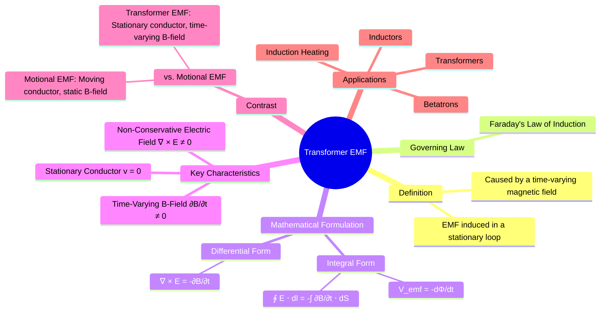

---
tags:
  - electromagnetic-fields
  - faradays-law
  - time-varying-fields
  - gate
created: 2025-10-17
aliases:
  - Transformer EMF
  - Transformer Electromotive Force
subject: "[[Electromagnetic Fields]]"
parent:
  - Faraday's Law of Induction
modified: 2026-08-04T10:43:09
---
### Transformer EMF
#transformer-emf #faradays-law #induced-emf

> **Transformer EMF** is the electromotive force (voltage) induced in a **stationary** conducting loop by a **time-varying magnetic field** passing through it. This is one of the two mechanisms described by Faraday's Law of Induction, the other being [[Motional EMF]].

The fundamental principle is that a changing magnetic flux creates a non-conservative electric field whose line integral around a closed path is non-zero. This non-zero integral is the induced EMF.

---
#### Faraday's Law for Transformer EMF
#faradays-law/transformer-emf #maxwells-equations

For a stationary loop (where velocity $\mathbf{v}=0$), the total induced EMF is solely the transformer EMF. It is defined by the integral form of Faraday's Law:
$$\boxed{\quad V_{emf} = \oint_L \mathbf{E} \cdot d\mathbf{l} = -\frac{d\Phi}{dt} \quad}$$
where:
- $V_{emf}$ is the induced electromotive force (in Volts).
- $\mathbf{E}$ is the induced non-conservative electric field.
- $L$ is the closed contour of the stationary loop.
- $\Phi = \int_S \mathbf{B} \cdot d\mathbf{S}$ is the magnetic flux through the surface $S$ bounded by the loop.

Since the loop and its surface $S$ are stationary, the time derivative operates only on the magnetic flux density $\mathbf{B}$:
$$\begin{align}
V_{emf} &= -\frac{d}{dt} \int_S \mathbf{B} \cdot d\mathbf{S} \\
 &= - \int_S \frac{\partial \mathbf{B}}{\partial t} \cdot d\mathbf{S}
\end{align}$$
This equation directly links the induced EMF in a stationary loop to the rate of change of the magnetic field.

---
#### Curl of Electric Field (Point/Differential Form)
#non-conservative-field #curl

By applying [[Stokes' Theorem]] to the left-hand side of the integral form of Faraday's law, we can derive its point (or differential) form.
Stokes' Theorem states:
$$\oint_L \mathbf{E} \cdot d\mathbf{l} = \int_S (\nabla \times \mathbf{E}) \cdot d\mathbf{S}$$
Comparing this with the expression for transformer EMF:
$$\int_S (\nabla \times \mathbf{E}) \cdot d\mathbf{S} = - \int_S \frac{\partial \mathbf{B}}{\partial t} \cdot d\mathbf{S}$$
Since this equality must hold for any arbitrary surface $S$, the integrands must be equal. This gives Maxwell's third equation:
$$\boxed{\quad \nabla \times \mathbf{E} = -\frac{\partial \mathbf{B}}{\partial t} \quad}$$
*   **Significance**: This equation is a cornerstone of electromagnetism. It shows that a time-varying magnetic field produces a circulating, or "curling," electric field.
*   **Non-Conservative Field**: Unlike an electrostatic field which is irrotational ($\nabla \times \mathbf{E} = 0$), the electric field induced by a changing magnetic field is **non-conservative**. This means the work done in moving a charge around a closed path is not zero; it is equal to the induced EMF.

---
#### Comparison with Motional EMF
#motional-emf #lorentz-force

It is crucial to distinguish between the two types of induced EMF covered by Faraday's Law.

| Feature             | Transformer EMF                                        | Motional EMF                                               |
| ------------------- | ------------------------------------------------------ | ---------------------------------------------------------- |
| **Cause**           | Time-varying magnetic field ($\partial\mathbf{B}/\partial t \neq 0$) | Conductor moving in a magnetic field ($\mathbf{v} \neq 0$)         |
| **Conductor State** | Stationary ($\mathbf{v}=0$)                             | Moving ($\mathbf{v} \neq 0$)                                     |
| **Governing Term**  | $-\int_S \frac{\partial \mathbf{B}}{\partial t} \cdot d\mathbf{S}$ | $\oint_L (\mathbf{v} \times \mathbf{B}) \cdot d\mathbf{l}$             |
| **Physical Basis**  | A changing B-field creates a circulating E-field.      | Magnetic force ($\mathbf{F} = q(\mathbf{v} \times \mathbf{B})$) on charges in the conductor. |

The total induced EMF in a general scenario (moving conductor in a time-varying field) is the sum of both:
$$V_{emf} = \underbrace{-\int_S \frac{\partial \mathbf{B}}{\partial t} \cdot d\mathbf{S}}_{\text{Transformer EMF}} + \underbrace{\oint_L (\mathbf{v} \times \mathbf{B}) \cdot d\mathbf{l}}_{\text{Motional EMF}}$$

---
#### Applications
#transformer-emf/applications

The principle of transformer EMF is fundamental to the operation of many electrical devices:
1.  **Transformers**: The core application. A time-varying current in the primary coil generates a time-varying magnetic flux, which induces a voltage (transformer EMF) in the stationary secondary coil.
2.  **Inductors**: Self-inductance ($V = L \frac{di}{dt}$) is a manifestation of transformer EMF, where the changing current in a coil induces a back-EMF in the same coil.
3.  **Betatrons**: A type of cyclic particle accelerator that uses a time-varying magnetic field to both accelerate charged particles and keep them in a circular orbit.
4.  **Induction Heating**: A changing magnetic field induces eddy currents (which are driven by transformer EMF) inside a conductive material, causing resistive heating.

---
### Related Concepts
#topic/related-concepts

> [[Faraday's Law of Induction]]

[[Motional EMF]]
[[Maxwell's Equations in Final Form]]
[[Inductance and Mutual Inductance]]
[[Curl of a Vector Field]]
[[Stokes' Theorem]]
[[Electrical Machines - Transformers]]
