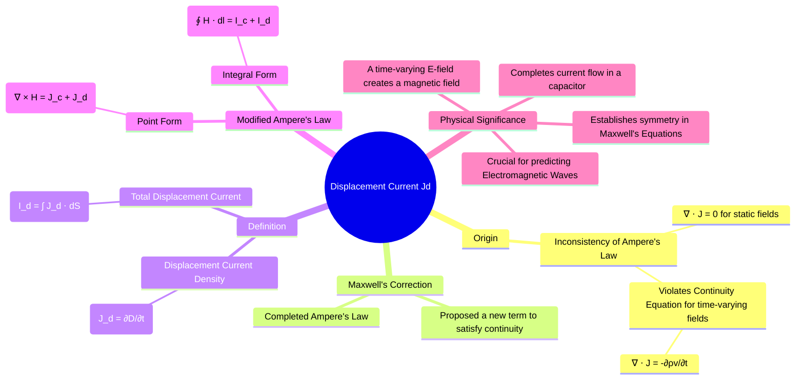

---
tags:
  - electromagnetic-fields
  - maxwells-equations
  - displacement-current
  - gate
created: 2025-10-17
aliases:
  - Displacement Current
  - Jd
subject: "[[Electromagnetic Fields]]"
parent: "Displacement Current and Maxwell's Equations"
modified: 2026-07-16
---
### Concept of Displacement Current (Jd)
#displacement-current #maxwells-equations #amperes-law #time-varying-fields

> The **Displacement Current** is a quantity introduced by James Clerk Maxwell to generalize Ampere's Circuital Law for time-varying fields. It is not a current of moving charges, but rather an equivalent current density that arises from a **time-varying electric flux density**. Its inclusion was a crucial theoretical step that unified electricity and magnetism and led to the prediction of electromagnetic waves.

---
#### Inconsistency of Ampere's Law for Static Fields
#amperes-law/inconsistency #equation-of-continuity

For magnetostatics, [[Ampere's Circuital Law|Ampere's Circuital Law]] is given in point form as:
$$\nabla \times \mathbf{H} = \mathbf{J}$$
A fundamental identity of vector calculus states that the divergence of the curl of any vector field is identically zero ($\nabla \cdot (\nabla \times \mathbf{A}) = 0$). Applying this to Ampere's Law:
$$\nabla \cdot (\nabla \times \mathbf{H}) = \nabla \cdot \mathbf{J} = 0$$
However, the **Equation of Continuity** relates current density divergence to the rate of change of charge density:
$$\nabla \cdot \mathbf{J} = -\frac{\partial \rho_v}{\partial t}$$
This creates a contradiction. The original Ampere's Law is only valid for steady-state conditions where charge density is constant ($\partial \rho_v / \partial t = 0$), implying $\nabla \cdot \mathbf{J} = 0$. It fails for time-varying scenarios, such as a charging capacitor where current flows but no charge crosses the dielectric gap.

---
#### Maxwell's Correction
#maxwells-correction

To resolve this inconsistency, Maxwell proposed modifying Ampere's Law by adding a new term, which we call the **displacement current density**, $\mathbf{J}_d$. The total current density becomes $\mathbf{J}_{total} = \mathbf{J}_c + \mathbf{J}_d$, where $\mathbf{J}_c$ is the conventional conduction current density due to moving charges.

The modified Ampere's Law is $\nabla \times \mathbf{H} = \mathbf{J}_c + \mathbf{J}_d$. For this to be universally valid, its divergence must be zero:
$$\nabla \cdot (\nabla \times \mathbf{H}) = \nabla \cdot \mathbf{J}_c + \nabla \cdot \mathbf{J}_d = 0$$
$$\implies \nabla \cdot \mathbf{J}_d = -\nabla \cdot \mathbf{J}_c$$
From the continuity equation, we substitute $-\nabla \cdot \mathbf{J}_c = \frac{\partial \rho_v}{\partial t}$:
$$\nabla \cdot \mathbf{J}_d = \frac{\partial \rho_v}{\partial t}$$
Using Maxwell's first equation (Gauss's Law), $\nabla \cdot \mathbf{D} = \rho_v$, we can write:
$$\nabla \cdot \mathbf{J}_d = \frac{\partial}{\partial t} (\nabla \cdot \mathbf{D}) = \nabla \cdot \left( \frac{\partial \mathbf{D}}{\partial t} \right)$$
By comparing terms, Maxwell brilliantly identified the form of the displacement current density.

---
#### Definition of Displacement Current Density
#displacement-current/definition

The **Displacement Current Density**, $\mathbf{J}_d$, is defined as the time rate of change of the electric flux density $\mathbf{D}$.
$$\boxed{\quad \mathbf{J}_d = \frac{\partial \mathbf{D}}{\partial t} \quad}$$
For a linear, isotropic medium where $\mathbf{D} = \varepsilon \mathbf{E}$, this becomes $\mathbf{J}_d = \varepsilon \frac{\partial \mathbf{E}}{\partial t}$.
The total displacement current, $I_d$, flowing through a surface $S$ is the flux of $\mathbf{J}_d$ through that surface:
$$I_d = \int_S \mathbf{J}_d \cdot d\mathbf{S} = \int_S \frac{\partial \mathbf{D}}{\partial t} \cdot d\mathbf{S}$$

---
#### Maxwell's Equation (Modified Ampere's Law)
#maxwells-equations #amperes-law

With the inclusion of displacement current, Ampere's Law becomes one of the final four Maxwell's Equations, valid for all classical electromagnetic phenomena.

**Point Form:**
$$\boxed{\quad \nabla \times \mathbf{H} = \mathbf{J}_c + \mathbf{J}_d = \mathbf{J}_c + \frac{\partial \mathbf{D}}{\partial t} \quad}$$
**Integral Form:**
$$\boxed{\quad \oint_L \mathbf{H} \cdot d\mathbf{l} = I_c + I_d = \int_S (\mathbf{J}_c + \frac{\partial \mathbf{D}}{\partial t}) \cdot d\mathbf{S} \quad}$$

---
#### Physical Significance
#displacement-current/significance

1.  **Completes the Circuit in Capacitors**: In a charging capacitor, conduction current $I_c$ flows in the wires. Between the plates, the electric field is increasing, creating a displacement current $I_d$. Maxwell's correction shows that $I_c$ (in the wire) is equal to $I_d$ (in the gap), allowing Ampere's law to be applied consistently and preserving the concept of a continuous current.

2.  **Symmetry in Maxwell's Equations**: The displacement current term reveals a profound symmetry between electric and magnetic fields.
    *   **Faraday's Law**: A changing **B**-field creates a curling **E**-field ($\nabla \times \mathbf{E} = -\partial\mathbf{B}/\partial t$).
    *   **Ampere's Law**: A changing **E**-field creates a curling **H**-field ($\nabla \times \mathbf{H} = \partial\mathbf{D}/\partial t$ in source-free regions).

3.  **Prediction of Electromagnetic Waves**: This mutual generation of electric and magnetic fields is the mechanism for the propagation of self-sustaining electromagnetic waves through space. Without the displacement current term, wave solutions to Maxwell's equations would not exist.

---
### Related Concepts
#topic/related-concepts

> [[Inconsistency of Ampere's Law for Time-Varying Fields]]

[[Maxwell's Equations in Final Form]]
[[Faraday's Law in Integral and Point Form (∇ × E = -∂B/∂t)]]
[[Equation of Continuity]]
[[Ampere's Circuital Law]]
[[Wave Equation Derived from Maxwell's Equations]]
[[Electric Flux Density (D)]]
