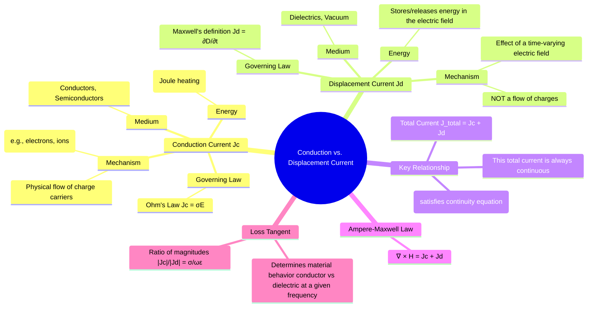

---
tags:
  - electromagnetic-fields
  - maxwells-equations
  - current-density
  - gate
created: 2025-10-17
aliases:
  - Jc vs Jd
  - Conduction vs Displacement Current
subject: "[[Electromagnetic Fields]]"
parent:
  - Displacement Current and Maxwell's Equations
modified: 2026-08-04T09:24:50
---
### Conduction Current vs. Displacement Current
#current-density #conduction-current #displacement-current

> In electromagnetism, the concept of current is generalized into two components: **conduction current**, which represents the physical flow of charges, and **displacement current**, which is an equivalent current arising from a time-varying electric field. The **total current** is the sum of these two, and it is this total current that is always conserved and acts as a source for the magnetic field in the Ampere-Maxwell Law.

---
#### Conduction Current ($J_c$)
#conduction-current #ohms-law

**Conduction current** is the familiar type of current resulting from the drift of free charge carriers (like electrons in a metal or ions in an electrolyte) under the influence of an electric field.

-   **Physical Basis**: Actual movement of charges.
-   **Formula (Point Form)**: It is governed by Ohm's Law at a microscopic level:
    $$\boxed{\quad \mathbf{J}_c = \sigma \mathbf{E} \quad}$$
    where $\sigma$ is the conductivity of the material.
-   **Medium**: Exists primarily in conductive or semi-conductive materials ($\sigma \neq 0$).
-   **Energy**: This current involves collisions of charge carriers with the lattice, leading to energy dissipation in the form of heat (Joule heating).

---
#### Displacement Current ($J_d$)
#displacement-current #maxwells-equations

**Displacement current** is a term introduced by Maxwell. It is not a current of moving charges but rather a quantity that has the units of current density and is associated with a time-varying electric flux density.

-   **Physical Basis**: The effect of a changing electric field.
-   **Formula (Point Form)**: It is defined as the rate of change of the electric flux density $\mathbf{D}$:
    $$\boxed{\quad \mathbf{J}_d = \frac{\partial \mathbf{D}}{\partial t} = \varepsilon \frac{\partial \mathbf{E}}{\partial t} \quad}$$
    (for a linear, isotropic medium).
-   **Medium**: Exists wherever an electric field can change with time, including in perfect dielectrics and even in a vacuum ($\varepsilon \neq 0$).
-   **Energy**: It is associated with the rate of change of energy stored in the electric field. It does not dissipate energy.

---
#### Summary of Key Differences

| Feature                 | Conduction Current ($J_c$)                                | Displacement Current ($J_d$)                               |
| ----------------------- | --------------------------------------------------------- | ---------------------------------------------------------- |
| **Origin**              | Flow of free charge carriers.                             | Time-varying electric field.                               |
| **Formula**             | $\mathbf{J}_c = \sigma \mathbf{E}$                        | $\mathbf{J}_d = \frac{\partial \mathbf{D}}{\partial t}$    |
| **Required Medium**     | Conductive medium ($\sigma \neq 0$)                       | Dielectric or Vacuum ($\varepsilon \neq 0$)                  |
| **Energy Effect**       | Dissipates power (Joule heat)                             | Stores/releases energy in the electric field               |
| **Example**             | Current in a resistor or copper wire.                     | "Current" between the plates of a charging capacitor.      |

---
#### Total Current and the Ampere-Maxwell Law
#total-current #ampere-maxwell-law

The crucial insight from Maxwell was that both types of current produce a magnetic field. The total current density $\mathbf{J}_{total}$ is the sum of the two:
$$\mathbf{J}_{total} = \mathbf{J}_c + \mathbf{J}_d$$
This total current density is what appears in the final form of Ampere's Law:
$$\nabla \times \mathbf{H} = \mathbf{J}_c + \frac{\partial \mathbf{D}}{\partial t}$$
This ensures that the concept of current is continuous. In a capacitor circuit, the conduction current in the wire "becomes" displacement current in the dielectric gap, ensuring a continuous loop of total current.

---
#### Ratio of Magnitudes: Loss Tangent
#loss-tangent #material-classification

For time-harmonic (sinusoidal) fields, we can compare the magnitudes of the two currents to classify a material's behavior at a specific frequency $\omega$. In phasor form:
-   $\mathbf{J}_{cs} = \sigma \mathbf{E}_s$
-   $\mathbf{J}_{ds} = j\omega\varepsilon \mathbf{E}_s$

The ratio of their magnitudes is a dimensionless quantity called the **loss tangent**:
$$\boxed{\quad \tan \delta = \frac{|\mathbf{J}_{cs}|}{|\mathbf{J}_{ds}|} = \frac{\sigma}{\omega \varepsilon} \quad}$$
-   If $\tan \delta \gg 1$: The material is a **good conductor** at that frequency, as conduction current dominates.
-   If $\tan \delta \ll 1$: The material is a **good dielectric** (or low-loss dielectric), as displacement current dominates.
-   If $\tan \delta \approx 1$: The material is **quasi-conductive**, exhibiting properties of both.

The loss tangent is a critical parameter in analyzing [[Wave Propagation in Lossy Dielectrics]].

---
### Related Concepts
#topic/related-concepts

> [[Concept of Displacement Current (Jd)]]
> [[Inconsistency of Ampere's Law for Time-Varying Fields]]

[[Maxwell's Equations in Final Form]]
[[Ampere's Circuital Law]]
[[Equation of Continuity]]
[[Wave Propagation in Lossy Dielectrics]]
[[Ohm's Law]]
