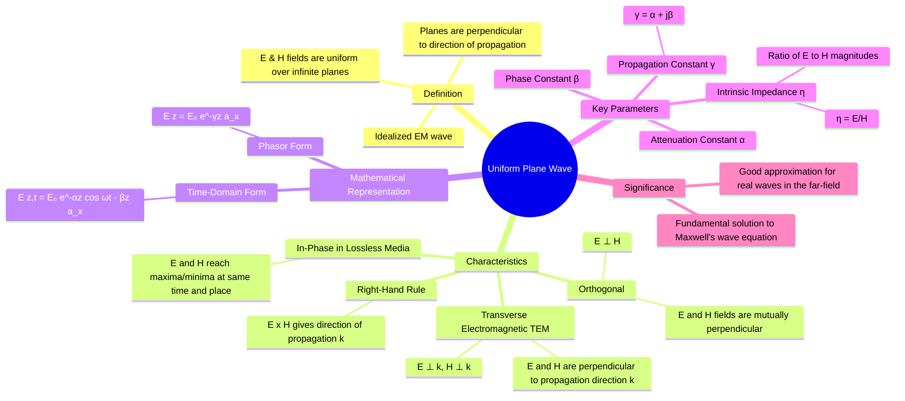

---
tags:
  - electromagnetic-fields
  - electromagnetic-waves
  - plane-waves
  - gate
created: 2025-10-17
aliases:
  - UPW
  - Plane Wave
  - Transverse Electromagnetic Wave
  - TEM Wave
subject: "[[Electromagnetic Fields]]"
parent:
  - Electromagnetic Waves
modified: 2026-08-04T10:46:06
---
### Uniform Plane Waves
#uniform-plane-wave #tem-wave #electromagnetic-waves

> A **Uniform Plane Wave (UPW)** is an idealization of an electromagnetic wave where the electric field ($\mathbf{E}$) and magnetic field ($\mathbf{H}$) have constant amplitude and direction in an infinite plane perpendicular to the direction of wave propagation. At any point on this plane, the fields are uniform. This is the simplest and most fundamental solution to the [[Wave Equation Derived from Maxwell's Equations|electromagnetic wave equation]].

---
#### Characteristics of a Uniform Plane Wave
#upw/characteristics #transverse-wave

1.  **Transverse Electromagnetic (TEM) Nature**: The electric field $\mathbf{E}$ and magnetic field $\mathbf{H}$ are entirely transverse to the direction of wave propagation (let's say $\mathbf{\hat{a}}_k$). This means:
    $$\mathbf{E} \cdot \mathbf{\hat{a}}_k = 0 \quad \text{and} \quad \mathbf{H} \cdot \mathbf{\hat{a}}_k = 0$$

2.  **Orthogonality of Fields**: The electric and magnetic fields are mutually perpendicular to each other at all points.
    $$\mathbf{E} \cdot \mathbf{H} = 0$$

3.  **Right-Hand Rule**: The direction of propagation $\mathbf{\hat{a}}_k$ is given by the cross product of the electric and magnetic fields.
    $$\mathbf{E} \times \mathbf{H} \text{ points in the direction of propagation.}$$

4.  **Constant Ratio of E to H**: The ratio of the magnitudes of the electric field to the magnetic field is constant throughout the medium and is determined by the medium's properties. This ratio is the [[Intrinsic Impedance of a Medium|intrinsic impedance]], $\eta$.
    $$\frac{|\mathbf{E}|}{|\mathbf{H}|} = \eta$$

5.  **In-Phase Relationship (in Lossless Media)**: For wave propagation in a lossless medium (like free space or a perfect dielectric), the $\mathbf{E}$ and $\mathbf{H}$ fields are in time phase, meaning they reach their maximum and minimum values at the same instant in time and space.

---
#### Mathematical Representation
#upw/mathematical-form

Consider a wave propagating in the $+z$ direction with its electric field polarized in the $x$ direction.

**Phasor Form:**
The most common representation in engineering is the phasor form, which describes the spatial variation of the field's amplitude and phase.
$$\boxed{\quad \mathbf{E}(z) = E_0 e^{-\gamma z} \mathbf{\hat{a}}_x \quad}$$
where:
- $E_0$ is the complex amplitude of the electric field at $z=0$.
- $\gamma = \alpha + j\beta$ is the complex [[Propagation Constant, Attenuation Constant, and Phase Constant|propagation constant]].
    - $\alpha$ is the attenuation constant (in Np/m).
    - $\beta$ is the phase constant (in rad/m).

**Time-Domain Form:**
The instantaneous, real-world field is found by taking the real part of the phasor multiplied by $e^{j\omega t}$:
$$\begin{align}
\mathbf{E}(z,t) &= \text{Re}\{ \mathbf{E}(z) e^{j\omega t} \} \\
&= \text{Re}\{ E_0 e^{-(\alpha+j\beta)z} e^{j\omega t} \} \\
&= \text{Re}\{ E_0 e^{-\alpha z} e^{j(\omega t - \beta z)} \} \\
\mathbf{E}(z,t) &= |E_0| e^{-\alpha z} \cos(\omega t - \beta z + \phi) \mathbf{\hat{a}}_x
\end{align}$$
where $\phi$ is the phase of the complex amplitude $E_0$.

---
#### Relationship between E and H
#upw/e-h-relation

The magnetic field $\mathbf{H}$ is uniquely determined by the electric field $\mathbf{E}$ (and vice versa) through the intrinsic impedance $\eta$ and the direction of propagation $\mathbf{\hat{a}}_k$.
$$\boxed{\quad \mathbf{H} = \frac{1}{\eta} (\mathbf{\hat{a}}_k \times \mathbf{E}) \quad}$$
$$\boxed{\quad \mathbf{E} = -\eta (\mathbf{\hat{a}}_k \times \mathbf{H}) \quad}$$
For our example wave where $\mathbf{E}$ is in the $\mathbf{\hat{a}}_x$ direction and propagation is in the $\mathbf{\hat{a}}_z$ direction:
$$\begin{align}
\mathbf{H}(z) &= \frac{1}{\eta} (\mathbf{\hat{a}}_z \times E_0 e^{-\gamma z} \mathbf{\hat{a}}_x) \\
&= \frac{E_0}{\eta} e^{-\gamma z} (\mathbf{\hat{a}}_z \times \mathbf{\hat{a}}_x) \\
\mathbf{H}(z) &= \frac{E_0}{\eta} e^{-\gamma z} \mathbf{\hat{a}}_y
\end{align}$$
This confirms that if $\mathbf{E}$ is along x and propagation is along z, then $\mathbf{H}$ must be along y.

---
#### Significance and Application
#upw/significance

-   **Fundamental Solution**: Uniform plane waves are the most basic solution to Maxwell's equations in unbounded, source-free regions.
-   **Far-Field Approximation**: While truly uniform plane waves do not exist (as they would require an infinite energy source), waves generated by any finite-sized source (like an antenna) behave approximately as uniform plane waves at a large distance from the source. This is known as the **far-field approximation** and is crucial in antenna theory and radio communications.

---
### Related Concepts
#topic/related-concepts

> [[Wave Equation Derived from Maxwell's Equations]]

[[Intrinsic Impedance of a Medium]]
[[Propagation Constant, Attenuation Constant, and Phase Constant]]
[[Wave Polarization]]
[[Wave Propagation in Free Space]]
[[Wave Propagation in Lossy Dielectrics]]
[[Poynting Vector]]
