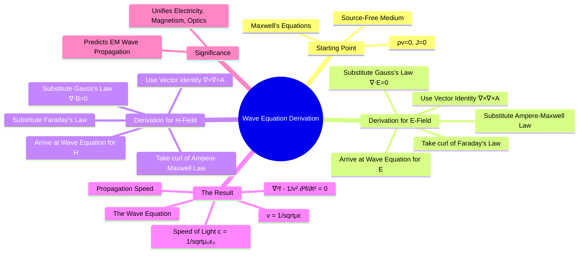

---
tags:
  - electromagnetic-fields
  - maxwells-equations
  - wave-equation
  - electromagnetic-waves
  - gate
created: 2025-10-17
aliases:
  - Electromagnetic Wave Equation
  - EM Wave Equation
subject: "[[Electromagnetic Fields]]"
parent:
  - Electromagnetic Waves
modified: 2026-08-04T10:48:10
---
### Wave Equation Derived from Maxwell's Equations
#wave-equation #maxwells-equations #electromagnetic-waves

> The electromagnetic wave equation is a second-order partial differential equation that describes the propagation of electromagnetic waves. It is derived directly from Maxwell's equations in a source-free medium and was a monumental achievement of Maxwell's theory, as it demonstrated that electric and magnetic fields can propagate as self-sustaining waves at the speed of light.

---
#### Starting Point: Maxwell's Equations in a Source-Free Medium
#maxwells-equations/source-free

We begin by considering a medium that is **source-free**, meaning it has no free charges ($\rho_v = 0$) and no free currents ($\mathbf{J} = 0$). For a linear, homogeneous, and isotropic medium, Maxwell's equations in point form become:

1.  $\nabla \cdot \mathbf{D} = 0 \implies \nabla \cdot \mathbf{E} = 0$
2.  $\nabla \cdot \mathbf{B} = 0$
3.  $\nabla \times \mathbf{E} = -\frac{\partial \mathbf{B}}{\partial t}$
4.  $\nabla \times \mathbf{H} = \frac{\partial \mathbf{D}}{\partial t}$

We also use the constitutive relations: $\mathbf{D} = \varepsilon \mathbf{E}$ and $\mathbf{B} = \mu \mathbf{H}$.

---
#### Derivation for the Electric Field (E)
#wave-equation/derivation-E

1.  **Take the curl of Faraday's Law (Eq. 3):**
    $$\nabla \times (\nabla \times \mathbf{E}) = \nabla \times \left(-\frac{\partial \mathbf{B}}{\partial t}\right) = -\frac{\partial}{\partial t}(\nabla \times \mathbf{B})$$

2.  **Apply the vector identity** $\nabla \times (\nabla \times \mathbf{A}) = \nabla(\nabla \cdot \mathbf{A}) - \nabla^2\mathbf{A}$ to the left side:
    $$\nabla(\nabla \cdot \mathbf{E}) - \nabla^2\mathbf{E} = -\frac{\partial}{\partial t}(\nabla \times \mathbf{B})$$

3.  **Substitute from the source-free equations:**
    -   From Eq. 1, $\nabla \cdot \mathbf{E} = 0$.
    -   From Eq. 4, using constitutive relations, $\nabla \times \mathbf{B} = \mu(\nabla \times \mathbf{H}) = \mu \frac{\partial \mathbf{D}}{\partial t} = \mu\varepsilon \frac{\partial \mathbf{E}}{\partial t}$.

4.  **Insert these substitutions into the equation from step 2:**
    $$\begin{align}
    \nabla(0) - \nabla^2\mathbf{E} &= -\frac{\partial}{\partial t}\left(\mu\varepsilon \frac{\partial \mathbf{E}}{\partial t}\right) \\
    -\nabla^2\mathbf{E} &= -\mu\varepsilon \frac{\partial^2 \mathbf{E}}{\partial t^2}
    \end{align}$$

5.  **Rearrange to get the final form:**
    This gives the **homogeneous vector wave equation for the electric field**:
    $$\boxed{\quad \nabla^2\mathbf{E} - \mu\varepsilon \frac{\partial^2 \mathbf{E}}{\partial t^2} = 0 \quad}$$

---
#### Derivation for the Magnetic Field (H)
#wave-equation/derivation-H

The derivation for the magnetic field is analogous.

1.  **Take the curl of the Ampere-Maxwell Law (Eq. 4):**
    $$\nabla \times (\nabla \times \mathbf{H}) = \nabla \times \left(\frac{\partial \mathbf{D}}{\partial t}\right) = \frac{\partial}{\partial t}(\nabla \times \mathbf{D})$$

2.  **Apply the vector identity** to the left side:
    $$\nabla(\nabla \cdot \mathbf{H}) - \nabla^2\mathbf{H} = \frac{\partial}{\partial t}(\nabla \times \mathbf{D})$$

3.  **Substitute from the source-free equations:**
    -   From Eq. 2, $\nabla \cdot \mathbf{B} = 0 \implies \nabla \cdot \mathbf{H} = 0$.
    -   From Eq. 3, using constitutive relations, $\nabla \times \mathbf{D} = \varepsilon(\nabla \times \mathbf{E}) = \varepsilon \left(-\frac{\partial \mathbf{B}}{\partial t}\right) = -\mu\varepsilon \frac{\partial \mathbf{H}}{\partial t}$.

4.  **Insert these substitutions:**
    $$\begin{align}
    \nabla(0) - \nabla^2\mathbf{H} &= \frac{\partial}{\partial t}\left(-\mu\varepsilon \frac{\partial \mathbf{H}}{\partial t}\right) \\
    -\nabla^2\mathbf{H} &= -\mu\varepsilon \frac{\partial^2 \mathbf{H}}{\partial t^2}
    \end{align}$$

5.  **Rearrange to get the final form:**
    This is the **homogeneous vector wave equation for the magnetic field**:
    $$\boxed{\quad \nabla^2\mathbf{H} - \mu\varepsilon \frac{\partial^2 \mathbf{H}}{\partial t^2} = 0 \quad}$$

---
#### Wave Propagation Speed
#wave-equation/form #speed-of-light

Both derived equations are in the standard form of the 3D wave equation:
$$\nabla^2 f - \frac{1}{v^2}\frac{\partial^2 f}{\partial t^2} = 0$$
By comparing terms, we can identify the phase velocity $v$ of the wave propagation:
$$\boxed{\quad v = \frac{1}{\sqrt{\mu\varepsilon}} \quad}$$
For propagation in a vacuum (free space), we use $\mu = \mu_0$ and $\varepsilon = \varepsilon_0$:
$$c = \frac{1}{\sqrt{\mu_0\varepsilon_0}} = \frac{1}{\sqrt{(4\pi \times 10^{-7})(8.854 \times 10^{-12})}} \approx 2.998 \times 10^8 \text{ m/s}$$
This value is precisely the measured speed of light, providing the conclusive evidence that light is an electromagnetic wave.

---
### Related Concepts
#topic/related-concepts

> [[Maxwell's Equations in Final Form]]

[[Uniform Plane Waves]]
[[Wave Propagation in Free Space]]
[[Faraday's Law in Integral and Point Form (∇ × E = -∂B/∂t)]]
[[Curl of a Vector Field]]
[[Laplacian of a Scalar Field]]
[[Constitutive Relations]]
